# Building MiniOS

This guide covers the complete process for building MiniOS, including system builds, module development, and advanced configuration options.

## Overview

MiniOS uses a modular build system where the operating system is constructed from individual modules in SquashFS format. Each module contains specific software packages or components, and they are loaded in a sequential order to form the complete system.

## Getting Started

### Prerequisites

- Latest version of Debian or Ubuntu for building
- Sufficient disk space (recommended: 20GB+ free space)
- Internet connection for downloading packages
- Required packages listed in `linux-live/prerequisites.list`

### Installing Prerequisites

The `prerequisites.list` file uses condinapt format with conditional markers. Install the required packages manually:

```bash
sudo apt-get update
sudo apt-get install sudo binutils debootstrap squashfs-tools xz-utils lz4 zstd xorriso mtools rsync
sudo apt-get install grub-efi-amd64-bin grub-pc-bin
```

Alternatively, you can use condinapt to process the prerequisites list if available on your system.

## Build Tools

MiniOS provides two main tools for building:

### minios-cmd (Recommended)

A command-line utility that simplifies configuration and initiation of builds. It provides a user-friendly interface for setting various build parameters:

- Target distribution (buster, bookworm, trixie, etc.)
- Architecture (amd64, i386)
- Desktop environment (core, flux, xfce, lxqt)
- Package variant (minimum, standard, toolbox, ultra)
- Kernel options
- Locale and timezone settings

**Usage:**
```bash
# Build with default configuration
minios-cmd -d bookworm -a amd64 -de xfce -pv standard

# Build with custom options
minios-cmd -d bookworm -a amd64 -de xfce -pv toolbox -c zstd -l en_US -tz "Europe/Prague"
```

For detailed usage information, see the [minios-cmd documentation](https://github.com/minios-linux/minios-live/blob/master/docs/minios-cmd.md).

### minios-live (Advanced)

The core build script that orchestrates the step-by-step build process:

- Setting up the build environment
- Installing the base system
- Integrating the chosen desktop environment
- Creating the SquashFS filesystem
- Configuring the boot process
- Generating the bootable ISO image

**Usage:**
```bash
# Complete build
./minios-live -

# Specific stages
./minios-live build-bootstrap
./minios-live build-chroot - build-live
```

For detailed usage information, see the [minios-live documentation](https://github.com/minios-linux/minios-live/blob/master/docs/minios-live.md).

## Project Structure

The MiniOS build system is organized as follows:

```plaintext
minios-live/
├── linux-live/                 # Core scripts and build libraries
│   ├── bootfiles/              # Files and templates for booting (GRUB, ISOLINUX, EFI, etc.)
│   ├── environments/           # Environment descriptions and settings
│   ├── initramfs/              # Scripts for creating initramfs
│   ├── scripts/                # Module scripts and templates
│   ├── build-initramfs         # Script for separate initramfs build
│   ├── build.conf              # Main build configuration file
│   ├── condinapt               # Script/tool for working with package lists
│   ├── install-chroot          # Script for installing into the chroot environment
│   ├── minioslib               # Core Bash function library
│   └── prerequisites.list      # List of required packages for installation on the host for building
├── tools/                      # Auxiliary build scripts
├── minios-cmd                  # CLI utility for setting build parameters
└── minios-live                 # Main script for building MiniOS
```

## Build Process

The build process follows a structured sequence of stages:

```mermaid
flowchart TD
    Start([Start Build]) --> Choice{Choose Tool}
    
    Choice -->|Easy Setup| A([minios-cmd<br/>Configure Parameters])
    Choice -->|Advanced Control| B([minios-live<br/>Direct Execution])
    
    A --> A1[Generate build.conf]
    A1 --> B
    
    B --> PreCheck{🌐 Internet Check<br/>Network Required}
    PreCheck -->|❌ No Internet| NetworkFail[❌ Build Cannot Start<br/>• Check network connection<br/>• Verify DNS resolution<br/>• Configure proxy if needed]
    PreCheck -->|✅ Connected| C1
    
    NetworkFail --> PreCheck
    
    C1[build-bootstrap<br/>📦 Create Base System<br/>• Run debootstrap<br/>• Install core packages<br/>• Setup chroot environment]
    
    C1 --> C2[build-chroot<br/>🔧 Configure System<br/>• Install base packages<br/>• Configure settings]
    
    C2 --> C3[build-live<br/>🗜️ Create Core SquashFS<br/>• Compress base system<br/>• Create 00-core.sb module<br/>• Prepare live environment]
    
    C3 --> C4[build-modules<br/>📚 Build Environment Modules<br/>• Process linked modules<br/>• Create SquashFS files<br/>• Apply conditional packages]
    
    C4 --> C5[build-boot<br/>🥾 Prepare Boot System<br/>• Setup GRUB & ISOLINUX<br/>• Create initramfs<br/>• Configure boot parameters]
    
    C5 --> C6[build-config<br/>⚙️ Generate Boot Configs<br/>• Create menu entries<br/>• Configure live options]
    
    C6 --> C7[build-iso<br/>💿 Create Final ISO<br/>• Combine all components<br/>• Generate bootable image]
    
    C7 --> Success([✅ Final ISO Ready<br/>📁 build/iso/])
    
    %% Alternative paths
    C1 -.->|Skip to specific stage| C4
    C3 -.->|Rebuild modules only| C4
    C4 -.->|Update boot only| C5
    C6 -.->|Repack ISO only| C7
    
    %% Error handling
    C1 --> Error1{Bootstrap Failed?}
    Error1 -->|Yes| Fix1[Check network<br/>Verify repositories<br/>Install prerequisites]
    Error1 -->|No| C2
    Fix1 --> C1
    
    C4 --> Error2{Module Build Failed?}
    Error2 -->|Yes| Fix2[Check package availability<br/>Verify conditions<br/>Review install scripts]
    Error2 -->|No| C5
    Fix2 --> C4
    
    %% Styling
    classDef processBox fill:#e1f5fe,stroke:#0277bd,stroke-width:2px
    classDef choiceBox fill:#fff3e0,stroke:#f57c00,stroke-width:2px
    classDef errorBox fill:#ffebee,stroke:#d32f2f,stroke-width:2px
    classDef successBox fill:#e8f5e8,stroke:#388e3c,stroke-width:2px
    classDef criticalBox fill:#fce4ec,stroke:#c2185b,stroke-width:3px
    
    class C1,C2,C3,C4,C5,C6,C7 processBox
    class Choice,PreCheck,Error1,Error2 choiceBox
    class Fix1,Fix2 errorBox
    class Success successBox
    class NetworkFail criticalBox
```



### Build Stages Explained

1. **`build-bootstrap`** - Creates the minimal base system using debootstrap
2. **`build-chroot`** - Installs packages and configures the system in chroot environment
3. **`build-live`** - Creates the main SquashFS image with core system
4. **`build-modules`** - Builds additional SquashFS modules for extra software
5. **`build-boot`** - Prepares bootloader and kernel files
6. **`build-config`** - Generates boot configuration files
7. **`build-iso`** - Creates the final bootable ISO image

### Build Options

#### Complete System Build

```bash
# Full automated build
./minios-live -
# or
./minios-live build-bootstrap - build-iso
```

#### Incremental Builds

```bash
# Run only bootstrap stage
./minios-live build-bootstrap

# Run from chroot to live stages
./minios-live build-chroot - build-live

# Run from modules to completion
./minios-live build-modules -

# Build only ISO from existing data
./minios-live build-iso
```

## Configuration System

### Build Configuration Files

#### Main Configuration: `linux-live/build.conf`

This is the primary configuration file that defines:
- **Distribution settings**: Target distribution (buster, bookworm, trixie, sid)
- **Architecture**: amd64, i386, i386-pae (bookworm and earlier only; trixie and sid support amd64 only)
- **Desktop environment**: core, flux, xfce, lxqt
- **Package variant**: minimum, standard, toolbox, ultra
- **Compression**: xz, lzo, gz, lz4, zstd
- **Kernel settings**: type, AUFS support, DKMS compilation
- **Locale settings**: language, timezone, keyboard layout

#### Runtime Configuration: `minios_build.conf`

Generated automatically during the build process and contains runtime-specific settings for the chroot environment.

### Package Variants

MiniOS supports different package variants that determine which software is included:

- **minimum**: Essential packages only
- **standard**: Standard desktop applications
- **toolbox**: Development tools and advanced utilities
- **ultra**: Complete software suite with additional applications

Package selection is controlled using conditional markers in `packages.list` files:
```
# Install only in toolbox and ultra variants
firefox +pv=toolbox +pv=ultra

# Install only in minimum variant
basic-tool +pv=minimum
```

## Module System

### Module Structure

The build system uses a numbered module structure located in `linux-live/scripts/`:

```
00-core/          # Base system packages
01-kernel/        # Linux kernel
02-firmware/      # Hardware firmware
03-gui-base/      # Basic GUI libraries
04-xfce-desktop/  # Desktop environment
05-apps/          # Desktop applications
10-example/       # Example module template
```

### Module Components

Each module directory contains:

- **`packages.list`**: List of packages to install with conditional markers
- **`install`**: Bash script executed during module build
- **`rootcopy-install/`**: Files copied to the system during build
- **`rootcopy-postinstall/`**: Files copied after package installation
- **`skip_conditions.conf`**: Conditions for skipping module build
- **`patches/`**: Patches applied before building (not available for 00-core)

### Example Module Template

The **`10-example/`** module serves as a template for creating new modules. It contains:

- A complete `packages.list` with conditional markers examples
- A basic `install` script showing proper condinapt usage
- Example `rootcopy-install/` and `rootcopy-postinstall/` directories
- Documentation comments explaining each component

**To create a new module**: Copy the `10-example` directory and modify it for your needs:
```bash
cp -r linux-live/scripts/10-example linux-live/scripts/06-my-module
```

This template is used throughout this documentation and provides the best starting point for custom modules.

### Environment-Based Module Loading

The module system works through environment configurations in `linux-live/environments/`. Each environment directory contains symbolic links to the modules that should be included for that specific desktop environment and package variant.

#### Available Environments

```bash
linux-live/environments/
├── core/          # Core system (no desktop)
├── flux/          # Flux desktop environment  
├── lxqt/          # LXQt desktop environment
├── xfce/          # XFCE desktop environment
└── xfce-debug/    # XFCE with debug modules
```

Each environment directory contains symbolic links to module directories in `linux-live/scripts/`:

```bash
# Example: XFCE environment
linux-live/environments/xfce/
├── 01-kernel -> ../../scripts/01-kernel
├── 02-firmware -> ../../scripts/02-firmware  
├── 03-gui-base -> ../../scripts/03-gui-base
├── 04-xfce-desktop -> ../../scripts/04-xfce-desktop
├── 05-apps -> ../../scripts/05-apps
└── 06-firefox -> ../../scripts/10-firefox
```

#### Building Modules

To build modules, use the `build-modules` command:

```bash
# Build all unbuilt modules for the current environment
./minios-live build-modules

# This will build all modules that:
# 1. Are linked in the current environment directory
# 2. Haven't been built yet
# 3. Meet the skip conditions (if any)
```

### Module Install Scripts

The `install` script in each module:
- Sources `/minioslib` for common functions
- Sources `/minios_build.conf` for build configuration
- Sets up debconf selections for automated package configuration
- Performs custom configuration and file modifications
- Uses console colors for output formatting

Example structure:
```bash
#!/bin/bash
set -e          # exit on error
set -o pipefail # exit on pipeline error
set -u          # treat unset variable as error

. /minioslib
. /minios_build.conf

SCRIPT_DIR="$(dirname "$(readlink -f "$0")")"
console_colors

# Debconf pre-configurations
DEBCONF_SETTINGS=(
    "package-name package-name/option boolean true"
)

# Apply debconf settings
for SETTING in "${DEBCONF_SETTINGS[@]}"; do
    echo "${SETTING}" | debconf-set-selections -v
done

# Custom installation and configuration logic
# ...
```

## Package Management with CondinAPT

CondinAPT is MiniOS's package list management system that handles conditional package installation based on build parameters.

### Package List Syntax

The `packages.list` files support various conditional markers:

```bash
# Package variants
package-name +pv=minimum +pv=standard
another-package +pv=toolbox +pv=ultra

# Distribution-specific
ubuntu-specific-package +d=jammy +d=noble
debian-package +d=bookworm +d=trixie

# Desktop environment
xfce-package +de=xfce
lxqt-package +de=lxqt

# Alternative packages (OR condition)
preferred-package || alternative-package

# Multiple packages with AND condition
package1 && package2 && package3
```

### Using CondinAPT in Module Scripts

Within module install scripts, condinapt is called to process the `packages.list`:

```bash
# Example from 10-example/install
/condinapt -l "${SCRIPT_DIR}/packages.list" -c "${SCRIPT_DIR}/minios_build.conf" -m "${SCRIPT_DIR}/condinapt.conf"
if [ $? -ne 0 ]; then
    echo "Failed to install packages."
    exit 1
fi
```

### CondinAPT Configuration Files

- **`packages.list`**: Contains package names with conditional markers
- **`minios_build.conf`**: Build configuration (automatically generated and copied to chroot)
- **`condinapt.conf`**: Additional condinapt-specific settings (optional)

### Advanced CondinAPT Syntax

As documented in [linux-live/condinapt.list.md](https://github.com/minios-linux/minios-live/blob/master/linux-live/condinapt.list.md), condinapt supports:

- **Basic packages**: `package-name`
- **Version specifications**: 
  - `package=version` (flexible version requirement)
  - `package==version` (strict version requirement)
- **Target release**: `package@release` (e.g., `telegram@bookworm-backports`)
- **Conditional installation**: `package +condition=value`
- **Negative conditions**: `package -condition=value`
- **Alternative packages**: `package1 || package2`
- **Package groups**: `package1 && package2`
- **Mandatory packages**: `!package` (build fails if unavailable)
- **Comments**: Lines starting with `#`

#### Complex Examples

```bash
# Install different file managers based on desktop environment
nautilus +de=gnome || thunar +de=xfce || pcmanfm +de=lxqt

# Install network managers with exclusions
network-manager -de=flux || connman +de=flux

# Install packages for specific distributions and variants
netplan.io +d=jammy +d=noble +pv=standard +pv=toolbox

# Group conditions with OR logic
firefox +{de=gnome|de=xfce|de=lxqt} +pv=standard

# Mandatory package with strict version and conditions
!curl==7.68.0 +da=amd64 -de=flux
```

### Supported Conditions

- `+pv=variant` - Package variant (minimum, standard, toolbox, ultra)
- `+d=distribution` - Distribution (buster, bookworm, trixie, jammy, noble)
- `+de=desktop` - Desktop environment (core, flux, xfce, lxqt)
- `+da=architecture` - Architecture (amd64, i386)
- `+arch=architecture` - Alternative architecture syntax

## Building Your First ISO

### Quick Start

1. **Clone the repository and prepare:**
```bash
git clone https://github.com/minios-linux/minios-live.git
cd minios-live
```

2. **Install prerequisites:**
```bash
sudo apt-get update
sudo apt-get install sudo binutils debootstrap squashfs-tools xz-utils lz4 zstd xorriso mtools rsync grub-efi-amd64-bin grub-pc-bin
```

3. **Build with minios-cmd (recommended):**
```bash
./minios-cmd -d bookworm -a amd64 -de xfce -pv standard
```

4. **Or build with minios-live:**
```bash
./minios-live -
```

### Customizing Your Build

1. **Copy and edit the configuration:**
```bash
cp linux-live/build.conf linux-live/build-custom.conf
# Edit build-custom.conf with your preferences
```

2. **Build with custom configuration:**
```bash
BUILD_CONF=linux-live/build-custom.conf ./minios-live -
```

## Advanced Customization

### Creating Custom Environments

You can create entirely new desktop environments by creating a new environment directory and configuring the appropriate modules. Here's how to create a GNOME environment as an example:

1. **Create the environment directory:**
```bash
mkdir -p linux-live/environments/gnome
```

2. **Create the base desktop module (04-gnome-desktop):**
```bash
# Start with the example template for a clean base
cp -r linux-live/scripts/10-example linux-live/scripts/04-gnome-desktop

# Configure GNOME-specific packages
cat > linux-live/scripts/04-gnome-desktop/packages.list << EOF
# Base GNOME desktop packages
gdm3
gnome-shell
gnome-session
gnome-settings-daemon
gnome-control-center
nautilus
gnome-terminal

# Standard GNOME applications
gnome-calculator +pv=standard +pv=toolbox +pv=ultra
gnome-text-editor +pv=standard +pv=toolbox +pv=ultra
eog +pv=standard +pv=toolbox +pv=ultra
evince +pv=standard +pv=toolbox +pv=ultra

# Additional GNOME tools
gnome-tweaks +pv=toolbox +pv=ultra
gnome-extensions-app +pv=toolbox +pv=ultra
dconf-editor +pv=toolbox +pv=ultra
EOF

# Create a custom install script for GNOME-specific configuration
cat > linux-live/scripts/04-gnome-desktop/install << 'EOF'
#!/bin/bash
set -e
set -o pipefail  
set -u

. /minioslib
. /minios_build.conf

SCRIPT_DIR="$(dirname "$(readlink -f "$0")")"

# Install packages using condinapt
/condinapt -l "${SCRIPT_DIR}/packages.list" -c "${SCRIPT_DIR}/minios_build.conf" -m "${SCRIPT_DIR}/condinapt.conf"
if [ $? -ne 0 ]; then
    echo "Failed to install packages."
    exit 1
fi

# Set GNOME as default session
echo 'gnome' > /etc/skel/.dmrc
echo '[Desktop]' > /etc/skel/.dmrc
echo 'Session=gnome' >> /etc/skel/.dmrc

EOF
chmod +x linux-live/scripts/04-gnome-desktop/install
```

3. **Create GNOME applications module (05-gnome-apps):**
```bash
cp -r linux-live/scripts/10-example linux-live/scripts/05-gnome-apps

cat > linux-live/scripts/05-gnome-apps/packages.list << EOF
# GNOME Applications
gnome-software +pv=standard +pv=toolbox +pv=ultra
gnome-system-monitor +pv=standard +pv=toolbox +pv=ultra
gnome-disk-utility +pv=standard +pv=toolbox +pv=ultra
gnome-screenshot +pv=standard +pv=toolbox +pv=ultra
gnome-calendar +pv=toolbox +pv=ultra
gnome-weather +pv=toolbox +pv=ultra
gnome-maps +pv=ultra
rhythmbox +pv=toolbox +pv=ultra
totem +pv=toolbox +pv=ultra
EOF

# Create a custom install script for GNOME applications
cat > linux-live/scripts/05-gnome-apps/install << 'EOF'
#!/bin/bash
set -e
set -o pipefail  
set -u

. /minioslib
. /minios_build.conf

SCRIPT_DIR="$(dirname "$(readlink -f "$0")")"

# Install packages using condinapt
/condinapt -l "${SCRIPT_DIR}/packages.list" -c "${SCRIPT_DIR}/minios_build.conf" -m "${SCRIPT_DIR}/condinapt.conf"
if [ $? -ne 0 ]; then
    echo "Failed to install packages."
    exit 1
fi

# Configure default applications for GNOME
mkdir -p /etc/skel/.config

# Set default applications
cat > /etc/skel/.config/mimeapps.list << 'MIME_EOF'
[Default Applications]
text/plain=gnome-text-editor.desktop
image/jpeg=eog.desktop
image/png=eog.desktop
application/pdf=evince.desktop
video/mp4=totem.desktop
audio/mpeg=rhythmbox.desktop
MIME_EOF

EOF
chmod +x linux-live/scripts/05-gnome-apps/install
```

4. **Link modules to the GNOME environment:**
```bash
# Link base system modules (same for all environments)
ln -s ../../scripts/01-kernel linux-live/environments/gnome/01-kernel
ln -s ../../scripts/02-firmware linux-live/environments/gnome/02-firmware
ln -s ../../scripts/03-gui-base linux-live/environments/gnome/03-gui-base

# Link GNOME-specific modules
ln -s ../../scripts/04-gnome-desktop linux-live/environments/gnome/04-gnome-desktop
ln -s ../../scripts/05-gnome-apps linux-live/environments/gnome/05-gnome-apps

# Link additional modules as needed
ln -s ../../scripts/10-firefox linux-live/environments/gnome/06-firefox
```

5. **Configure build for GNOME environment:**
```bash
# Copy and modify build configuration
cp linux-live/build.conf linux-live/build-gnome.conf
sed -i 's/DESKTOP_ENVIRONMENT=".*"/DESKTOP_ENVIRONMENT="gnome"/' linux-live/build-gnome.conf
sed -i 's/PACKAGE_VARIANT=".*"/PACKAGE_VARIANT="standard"/' linux-live/build-gnome.conf

# Build the GNOME system
BUILD_CONF=linux-live/build-gnome.conf ./minios-live -
```

### Environment Structure Best Practices

When creating custom environments:

- **Base modules** (01-03): Usually the same across all environments
- **Desktop module** (04): Contains the core desktop environment packages and configuration
- **Apps module** (05): Desktop-specific applications
- **Optional modules** (06+): Additional software packages

**Module naming convention:**
- Use the format `04-{desktop}-desktop` for the main desktop module
- Use `05-{desktop}-apps` or `05-apps` for applications
- Number additional modules sequentially (06, 07, 08, etc.)

**Configuration considerations:**
- Each environment needs appropriate skip conditions in modules
- Desktop-specific packages should use `+de={environment}` conditions
- Test thoroughly with different package variants (minimum, standard, toolbox, ultra)

### Adding Custom Modules

1. **Create a new module using the template:**
```bash
cp -r linux-live/scripts/10-example linux-live/scripts/06-custom-module
```

2. **Edit the packages.list:**
```bash
# Edit linux-live/scripts/06-custom-module/packages.list
# Add your packages with appropriate conditional markers
```

3. **Customize the install script:**
```bash
# Edit linux-live/scripts/06-custom-module/install
# Add custom configuration and setup commands
```

4. **Link the module to your environment:**
```bash
ln -s ../../scripts/06-custom-module linux-live/environments/xfce/06-custom-module
```

5. **Build the modules:**
```bash
./minios-live build-modules
```

## Troubleshooting

### Common Issues

1. **Build fails to start - Internet connectivity required:**
   - **Issue**: `minios-live` performs mandatory internet connectivity check on startup
   - **Solution**: Ensure stable internet connection before starting build
   - **Check**: Verify DNS resolution: `nslookup deb.debian.org`
   - **Proxy**: Configure proxy settings if behind corporate firewall
   - **Note**: Build cannot proceed without internet access

2. **Build fails during bootstrap:**
   - Verify target distribution repositories are available
   - Ensure prerequisites are installed
   - Test: `wget -q --spider http://deb.debian.org`

3. **Module build errors:**
   - Check package availability in target distribution
   - Verify conditional markers syntax
   - Review install script for errors

4. **Missing packages:**
   - Check condinapt conditions
   - Verify package names for target distribution
   - Review package variant settings

5. **Boot issues:**
   - Check GRUB configuration
   - Verify kernel and initramfs generation
   - Review bootloader files

### Debug Mode

Enable debug output by setting the verbosity level in your build configuration:

**Option 1: Edit build.conf**
```bash
# Edit linux-live/build.conf and set:
VERBOSITY_LEVEL=2   # Very verbose output with detailed tracing
# or
VERBOSITY_LEVEL=1   # Verbose output (default)
# or 
VERBOSITY_LEVEL=0   # Minimal output
```

**Option 2: Create custom config with debug settings**
```bash
cp linux-live/build.conf linux-live/build-debug.conf
sed -i 's/VERBOSITY_LEVEL=.*/VERBOSITY_LEVEL=2/' linux-live/build-debug.conf

# Enable additional debug options
sed -i 's/DEBUG_SSH_KEYS="false"/DEBUG_SSH_KEYS="true"/' linux-live/build-debug.conf
sed -i 's/DEBUG_SET_ROOT_PASSWORD="false"/DEBUG_SET_ROOT_PASSWORD="true"/' linux-live/build-debug.conf

# Build with debug configuration
BUILD_CONF=linux-live/build-debug.conf ./minios-live -
```

**Verbosity levels:**
- `0`: Minimal output - only essential messages
- `1`: Verbose output - standard build information (default)
- `2`: Very verbose output - detailed tracing with bash debugging enabled

### Log Files

Build logs are stored in:
- `build/log/` - General build logs

### Getting Help

- Check the [official wiki](https://github.com/minios-linux/minios-live/wiki)
- Review existing issues on GitHub
- Join the community forums at [minios.dev](https://minios.dev)
