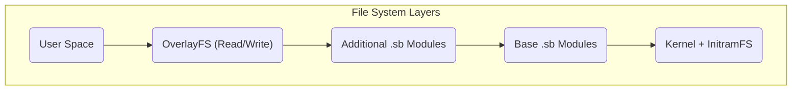

# MiniOS System Architecture

This document provides a technical overview of the MiniOS architecture. It explains how system components interact to create a portable Live Linux distribution.

## Overview

MiniOS is based on a modular architecture using a multi-layered file system and SquashFS modules. This structure ensures flexibility, portability, and the ability to preserve data when working from removable media.

## Key Components

### 1. Boot System

- **Bootloaders:** ISOLINUX/SYSLINUX for Legacy BIOS and GRUB for UEFI.
- **Boot Process:** The bootloader launches the kernel and `initramfs`, which initializes hardware and mounts file systems, after which the graphical environment starts.

### 2. File System Architecture

The system uses a multi-layered structure, where each layer performs its function.



**Layer Description:**
1.  **Boot Layer:** Contains the Linux kernel and `initramfs`.
2.  **Base Layer:** The core of MiniOS in the form of compressed SquashFS modules.
3.  **Module Layers:** Additional software in the form of separate SquashFS files.
4.  **Overlay Layer:** Allows saving user changes.

### 3. Modular System

**SquashFS Modules (.sb):**
- **01-kernel.sb:** Linux kernel and drivers.
- **02-firmware.sb:** Firmware for hardware.
- **03-gui-base.sb:** Basic graphical interface components.
- **04-desktop.sb:** Desktop environment.
- **05-apps.sb:** Application suite.

**Module Loading:**
- Modules are loaded in order of their numbering.
- Each module is mounted as a "read-only" layer.
- Modules with a higher number can override files from modules with a lower number.

## Runtime Architecture

### Live System Components
- **`live-config`:** Responsible for initial hardware setup and creating the `live` user.
- **Persistence System:** Allows data to be saved between sessions.

**Storage Structure on USB Drive:**
```text
/minios/
├── boot/      # Kernel and boot files
├── modules/   # SquashFS modules
└── changes/   # Storage for persistent data
```
