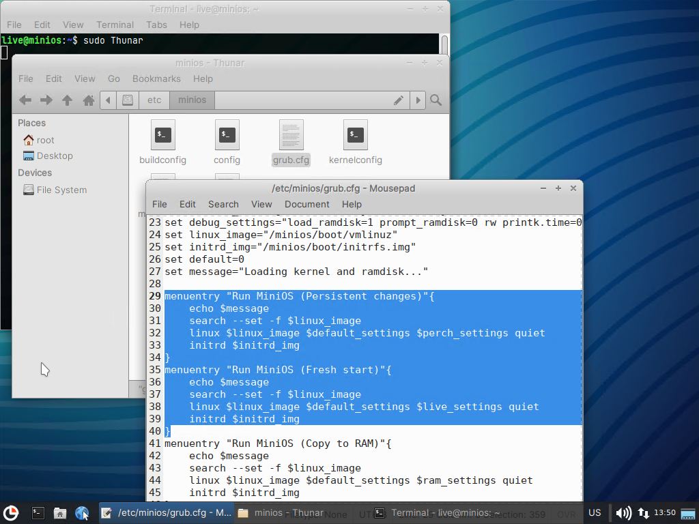
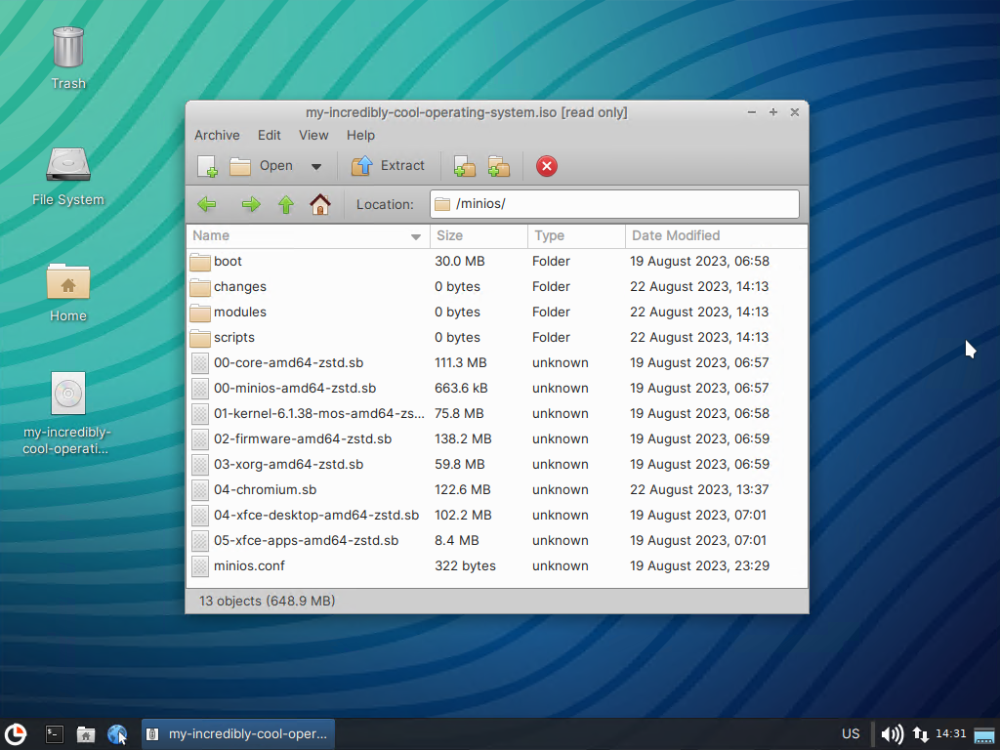
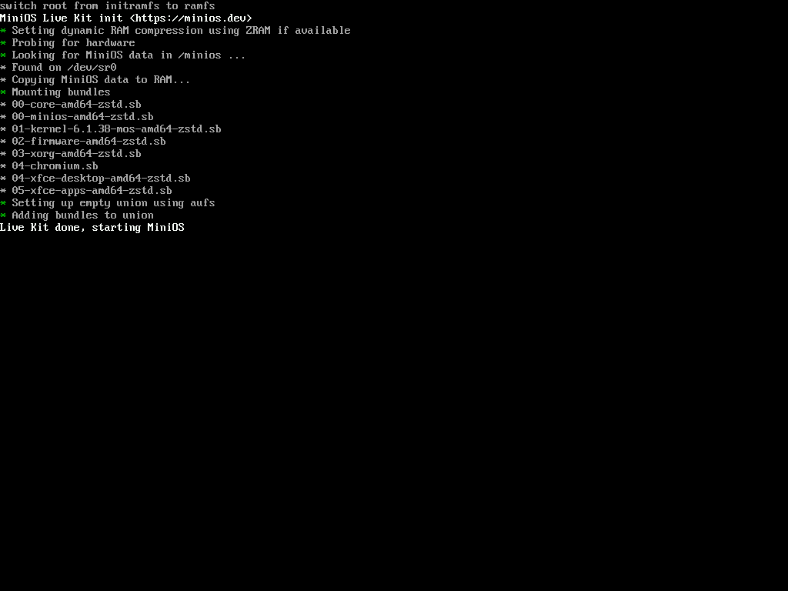
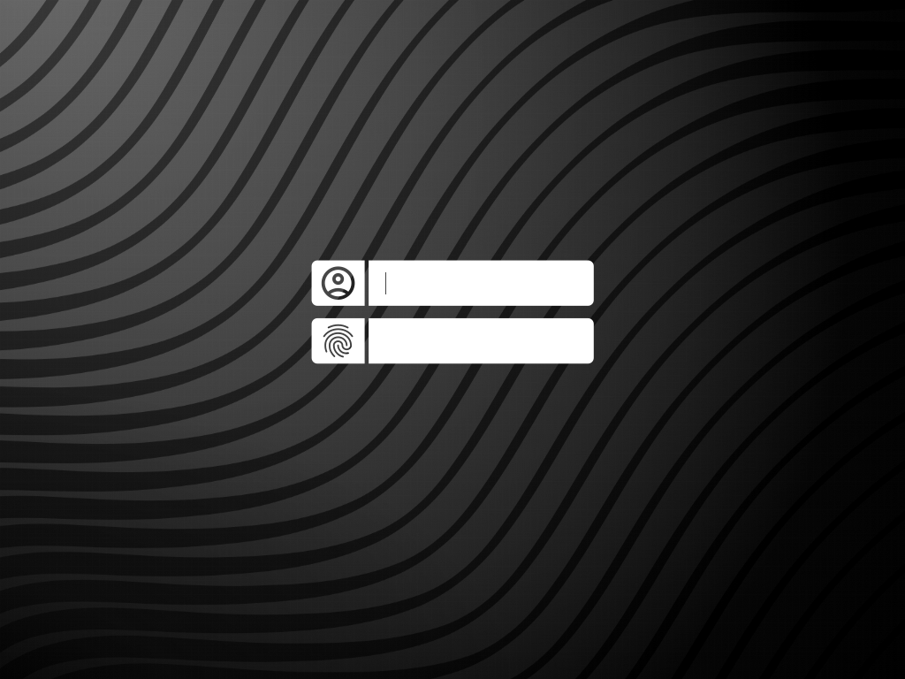
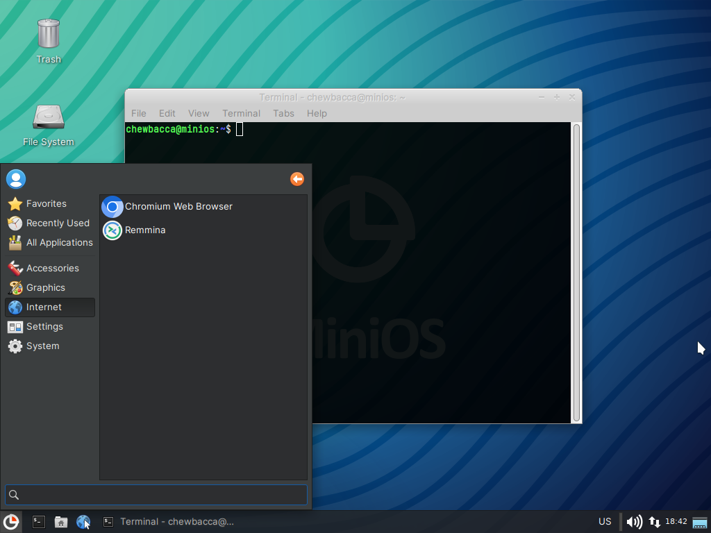

# Пересборка ISO

### minios-geniso

Для пересборки ISO в MiniOS предусмотрена утилита `minios-geniso`. Фактически, это модифицированный под нужды MiniOS скрипт `genslaxiso` из дистрибутива [Slax](https://www.slax.org/), в котором скрыто чуть больше возможностей. Для чего может понадобиться пересобирать ISO? В первую очередь, для создания своего образа для загрузки системы из ISO на виртуальных машинах, CD/DVD, либо для загрузки с помощью [Ventoy](https://www.ventoy.net/en/index.html). Помимо генерации ISO с изменённым набором модулей, `minios-geniso` позволяет изменить в образе так же некоторые файлы конфигурации.


При запуске команды мы можем указать имена исключаемых модулей, используя опцию `-e`/`--exclude=,` имя итогового ISO, используя опцию `-f`/`--file=`, а так же указать добавляемые модули, указав пути к ним в параметрах к команде. Все опции и параметры являются необязательными, при запуске команды без параметров сгенерируется ISO из содержимого директории minios на носителе, с которого запущена система. По этой причине не рекомендуется удалять что-либо, что находится в этой директории на флешке, помимо модулей.

_К сожалению, в утилите `minios-geniso` в MiniOS 3.2 в справке нет примеров с добавлением модулей и отсутствует автоподстановка имён файлов из текущей директории, это будет исправлено в будущих версиях._

Для примера того, как работает утилита, мы соберём модуль с браузером Chromium с помощью `apt2sb` и заменим им стандартный Firefox (о том, как собирать модули с помощью apt2sb вы можете почитать в статье [Создание модулей](https://telegra.ph/Sozdanie-modulej-08-19).). Помимо этого, мы оставим в меню загрузки только загрузку в оперативную память и изменим некоторые параметры `minios.conf`.
```
sudo apt2sb chromium chromium-sandbox -l 3
```

Чтобы `minios-geniso` при запуске от имени обычного пользователя (live) имела возможность добавить созданный модуль, необходимо сделать этого пользователя владельцем (вы можете всё выполнять от имени root, тогда изменять права не потребуется):
```
chown live:live 04-chromium.sb
```

Откроем Thunar от имени суперпользователя (вы можете использовать любой другой удобный вам способ редактирования файлов от имени пользователя root) и внесём изменения в `grub.cfg` и `syslinux.cfg` из папки `/etc/minios`, удалив строки, которые нам не нужны:



Аналогично представленному выше скриншоту нужно удалить строки из `syslinux.conf`. Далее внесём изменения в `minios.conf`, приведя его к такому виду:
```
USER_NAME="chewbacca"
USER_PASSWORD="HC2mktEV8pqB"
ROOT_PASSWORD="m3k8a9votrhP"
HOST_NAME="minios"
DEFAULT_TARGET="graphical"
ENABLE_SERVICES=""
DISABLE_SERVICES="ssh"
SSH_KEY="authorized_keys"
CLOUD="false"
SCRIPTS="true"
HIDE_CREDENTIALS="true"
AUTOLOGIN="false"
SYSTEM_TYPE="puzzle"
CORE_BUNDLE_PREFIX="00-core"
BEXT="sb"
EXPORT_LOGS="false"
```

_Подробнее о назначении переменных в minios.conf можно почитать в статье_ [_Файл конфигурации_](configuration-file)_._

Мы изменили имя обычного пользователя в переменной `USER_NAME,` его пароль и пароль суперпользователя со стандартных на сложные в переменных `USER_PASSWORD` и `ROOT_PASSWORD`, чтобы злоумышленники не смогли подобрать пароль. Помимо этого, мы отключили автозапуск службы `ssh`, указав её в переменной `DISABLE_SERVICES`, отключили отображение паролей в консоли в переменной `HIDE_CREDENTIALS` и запретили автоматический вход в систему в `AUTOLOGIN`. Так как мы собрали модуль поверх модулей 00-03, который сможет работать как при наличии модулей 04 и выше, а так же без них (отключить модули при загрузке можно с использованием [опции noload](command-line-parameters) в параметрах ядра), нам необходимо переключить `SYSTEM_TYPE` в значение `puzzle` (о типах системы и о том, когда нужно их переключать можно почитать в статье [Типы системы в MiniOS](https://telegra.ph/Tipy-sistemy-v-MiniOS-08-16)).

Сохранив изменённые файлы конфигурации необходимо выполнить команду
```
minios-geniso -e 06 -f my-incredibly-cool-operating-system.iso 04-chromium.sb
```

В данном примере опцией `--exclude` исключается модуль с номером 06 (данный фильтр сработает на все модули с номером 06, если их несколько), можно так же указать полное имя модуля или часть его названия.



### Итог

На скриншотах вы можете видеть как изменилась система.
Меню загрузки с единственным пунктом


Модуль 04-chromium загружается вместо 06-firefox


Поля ввода имени и пароля вместо автоматического входа в систему


В консольном режиме скрыты подсказки имён и паролей пользователей


Рабочий стол после ввода указанного в конфиге имени и пароля пользователя с установленным Chromium
