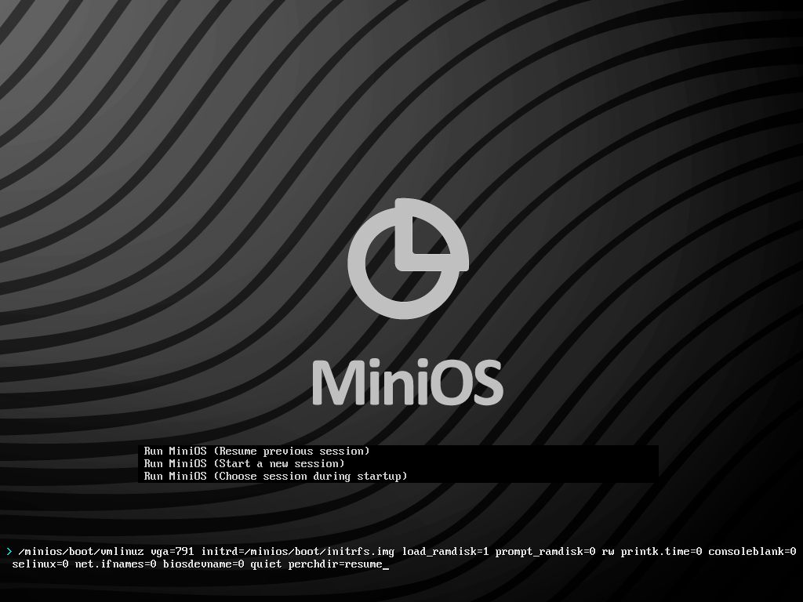

# Использование профилей постоянных изменений

В MiniOS 3.3, как и в Slax, при использовании initrd MiniOS LiveKit, либо при использовании Slax LiveKit, поддерживается создание множества профилей изменений с возможностью переключения между ними.

<!--more-->

## Управление профилями

Управление профилями осуществляется с помощью параметров ядра, которые можно изменить в интерактивном режиме при загрузке системы, либо изменить в конфигурации загрузчика (Syslinux или GRUB).

Для изменения параметров ядра в интерактивном режиме в загрузчике Syslinux нажмите клавишу `Tab` при нахождении на экране загрузки:

Для изменения параметров ядра в интерактивном режиме в загрузчике GRUB нажмите клавишу `E` при нахождении на экране загрузки:

Основная опция для работы с профилями - `perchdir`. Она может принимать значения `new`, `resume` или `ask`. Дополнительно, в связке с `perchdir`, может применяться опция `perchsize` для файловых систем, несовместимых с POSIX (FAT32, NTFS), которая может принимать в качестве значения число в мегабайтах.

Если система только установлена, то независимо от значения `perchdir` будет выполняться действие new, которое создаст новый профиль изменений. Для файловых систем, несовместимых с POSIX, по умолчанию, максимальный размер пространства для хранения изменений равен **16000 МБ**, он не создаётся сразу, а заполняется динамически, по мере роста использования файловой системы. Данный объём разбит на файлы по **4000 МБ** каждый для совместимости с FAT32, где максимальный размер файла ограничен 4 ГБ.

Для того, чтобы получить пространство для хранения меньшего размера, необходимо использовать опцию `perchsize`. Например, указание `perchsize=2000` создаст пространство для хранения, ограниченное 2000 МБ. Изменить максимальный размер пространства после его создания можно только в большую сторону. Если вы создали профиль размером, допустим, 2000 МБ, то если вы не зафиксировали данное изменения в файле конфигурации загрузчика, то при следующей загрузке системы он будет увеличен до стандартных 16000 МБ.

Для создания нового профиля постоянных изменений выберите в меню загрузчика Start a new session, либо измените значение `perchdir` в параметрах ядра на `perchdir=new`. Для переключения между существующими профилями используйте Choose session during startup, либо измените значение `perchdir` в параметрах ядра на `perchdir=ask`, либо укажите параметром опции `perchdir` номер профиля. Например, `perchdir=2`.

