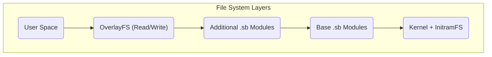

# MiniOS Systemarchitektur

Dieses Dokument bietet einen technischen Überblick über die MiniOS-Architektur. Es erklärt, wie die Systemkomponenten zusammenarbeiten, um eine portable Live-Linux-Distribution bereitzustellen.

## Überblick

MiniOS basiert auf einer modularen Architektur mit einem mehrschichtigen Dateisystem und SquashFS-Modulen. Diese Struktur gewährleistet Flexibilität, Portabilität und die Möglichkeit, Daten beim Arbeiten von Wechseldatenträgern zu erhalten.

## Hauptkomponenten

### 1. Boot-System

- **Bootloader:** ISOLINUX/SYSLINUX für Legacy BIOS und GRUB für UEFI.
- **Bootvorgang:** Der Bootloader startet den Kernel und das `initramfs`, welches die Hardware initialisiert und Dateisysteme einbindet. Danach wird die grafische Umgebung gestartet.

### 2. Dateisystem-Architektur

Das System verwendet eine mehrschichtige Struktur, wobei jede Schicht ihre eigene Funktion erfüllt.



**Schichtbeschreibung:**
1.  **Boot-Schicht:** Enthält den Linux-Kernel und das `initramfs`.
2.  **Basis-Schicht:** Der Kern von MiniOS in Form von komprimierten SquashFS-Modulen.
3.  **Modul-Schichten:** Zusätzliche Software in Form separater SquashFS-Dateien.
4.  **Overlay-Schicht:** Ermöglicht das Speichern von Benutzeränderungen.

### 3. Modulares System

**SquashFS-Module (.sb):**
- **01-kernel.sb:** Linux-Kernel und Treiber.
- **02-firmware.sb:** Firmware für Hardware.
- **03-gui-base.sb:** Grundlegende Komponenten der grafischen Oberfläche.
- **04-desktop.sb:** Desktop-Umgebung.
- **05-apps.sb:** Anwendungssuite.

**Modulladung:**
- Module werden in der Reihenfolge ihrer Nummerierung geladen.
- Jedes Modul wird als "read-only"-Schicht eingebunden.
- Module mit einer höheren Nummer können Dateien von Modulen mit einer niedrigeren Nummer überschreiben.

## Laufzeitarchitektur

### Komponenten des Live-Systems

- **`live-config`:** Verantwortlich für die initiale Hardwarekonfiguration und das Anlegen des Benutzers `live`.
- **Persistenzsystem:** Ermöglicht das Speichern von Daten zwischen den Sitzungen.

**Speicherstruktur auf dem USB-Laufwerk:**
```text
/minios/
├── boot/      # Kernel and boot files
├── modules/   # SquashFS modules
└── changes/   # Storage for persistent data
```
