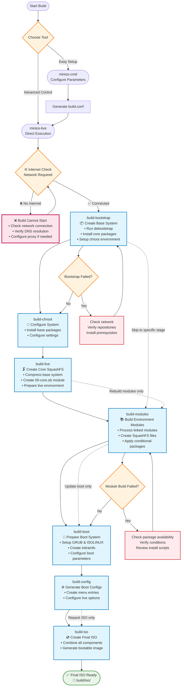

# MiniOS erstellen

Diese Anleitung beschreibt den vollständigen Prozess zum Erstellen von MiniOS, einschließlich System-Builds, Modulentwicklung und erweiterten Konfigurationsoptionen.

## Übersicht

MiniOS verwendet ein modulares Build-System, bei dem das Betriebssystem aus einzelnen Modulen im SquashFS-Format zusammengesetzt wird. Jedes Modul enthält spezifische Softwarepakete oder Komponenten und wird in einer festgelegten Reihenfolge geladen, um das vollständige System zu bilden.

## Erste Schritte

### Voraussetzungen

- Neueste Version von Debian oder Ubuntu zum Erstellen
- Ausreichend freier Speicherplatz (empfohlen: 20GB+)
- Internetverbindung zum Herunterladen von Paketen
- Benötigte Pakete, aufgelistet in `linux-live/prerequisites.list`

### Installation der Voraussetzungen

Die Datei `prerequisites.list` verwendet das condinapt-Format mit bedingten Markierungen. Installieren Sie die benötigten Pakete manuell:

```bash
sudo apt-get update
sudo apt-get install sudo binutils debootstrap squashfs-tools xz-utils lz4 zstd xorriso mtools rsync curl
sudo apt-get install grub-efi-amd64-bin grub-pc-bin
```

Alternativ können Sie condinapt verwenden, um die Voraussetzungenliste zu verarbeiten, falls dies auf Ihrem System verfügbar ist.

## Build-Tools

MiniOS stellt zwei Hauptwerkzeuge für den Build-Prozess bereit:

### minios-cmd (Empfohlen)

Ein Kommandozeilen-Tool, das die Konfiguration und den Start des Build-Prozesses vereinfacht. Es bietet eine benutzerfreundliche Oberfläche zur Einstellung verschiedener Build-Parameter:

- Ziel-Distribution (buster, bookworm, trixie, etc.)
- Architektur (amd64, i386)
- Desktop-Umgebung (core, flux, xfce, lxqt)
- Paketvariante (minimum, standard, toolbox, ultra)
- Kernel-Optionen
- Locale- und Zeitzoneneinstellungen

**Verwendung:**
```bash
# Build with default configuration
minios-cmd -d bookworm -a amd64 -de xfce -pv standard

# Build with custom options
minios-cmd -d bookworm -a amd64 -de xfce -pv toolbox -c zstd -l en_US -tz "Europe/Prague"
```

Detaillierte Informationen zur Nutzung finden Sie in der [minios-cmd Dokumentation](https://github.com/minios-linux/minios-live/blob/master/docs/minios-cmd.md).

### minios-live (Fortgeschritten)

Das zentrale Build-Skript, das den schrittweisen Build-Prozess steuert:

- Aufbau der Build-Umgebung
- Installation des Basissystems
- Integration der gewählten Desktop-Umgebung
- Erstellung des SquashFS-Dateisystems
- Konfiguration des Boot-Prozesses
- Generierung des bootfähigen ISO-Abbilds

**Verwendung:**
```bash
# Complete build
./minios-live -

# Specific stages
./minios-live build-bootstrap
./minios-live build-chroot - build-live
```

Detaillierte Informationen zur Nutzung finden Sie in der [minios-live Dokumentation](https://github.com/minios-linux/minios-live/blob/master/docs/minios-live.md).

### Offline-Hilfedokumentation

`submodules/docs/` ist die zentrale, bearbeitbare Quelle für die Dokumentation von MiniOS. Vor der Veröffentlichung von `minios-help` sollte die enthaltene Offline-Kopie wie folgt aktualisiert werden:

```bash
submodules/minios-help/tools/sync-from-docs.sh
```

Der generierte `submodules/minios-help/share/docs/`-Baum wird zusammen mit der Anwendung ausgeliefert und direkt vom Debian-Quellpaket verwendet. Für reguläre MiniOS-Image-Builds werden VitePress, Node.js oder der Dokumentations-Synchronisierer nicht ausgeführt; stattdessen wird das bereits veröffentlichte `minios-help`-Paket wie jedes andere Desktop-Paket installiert.

## Projektstruktur

Das Build-System von MiniOS ist wie folgt organisiert:

```plaintext
minios-live/
├── linux-live/                 # Core scripts and build libraries
│   ├── bootfiles/              # Files and templates for booting (GRUB, ISOLINUX, EFI, etc.)
│   ├── environments/           # Environment descriptions and settings
│   ├── initramfs/              # Scripts for creating initramfs
│   ├── scripts/                # Module scripts and templates
│   ├── build-initramfs         # Script for separate initramfs build
│   ├── build.conf              # Main build configuration file
│   ├── condinapt               # Script/tool for working with package lists
│   ├── install-chroot          # Script for installing into the chroot environment
│   ├── minioslib               # Core Bash function library
│   └── prerequisites.list      # List of required packages for installation on the host for building
├── tools/                      # Auxiliary build scripts
├── minios-cmd                  # CLI utility for setting build parameters
└── minios-live                 # Main script for building MiniOS
```

## Build-Prozess

Der Build-Prozess folgt einer strukturierten Abfolge von Phasen:



### Erklärung der Build-Phasen

1. **`build-bootstrap`** – Erstellt das minimale Basissystem mit debootstrap
2. **`build-chroot`** – Installiert Pakete und konfiguriert das System in der Chroot-Umgebung
3. **`build-live`** – Erstellt das Haupt-SquashFS-Image mit dem Kernsystem
4. **`build-modules`** – Baut zusätzliche SquashFS-Module für weitere Software
5. **`build-boot`** – Bereitet Bootloader- und Kernel-Dateien vor
6. **`build-config`** – Generiert Boot-Konfigurationsdateien
7. **`build-iso`** – Erstellt das finale, bootfähige ISO-Image

### Build-Optionen

#### Komplettsystem-Build

```bash
# Full automated build
./minios-live -
# or
./minios-live build-bootstrap - build-iso
```

#### Inkrementelle Builds

```bash
# Run only bootstrap stage
./minios-live build-bootstrap

# Run from chroot to live stages
./minios-live build-chroot - build-live

# Run from modules to completion
./minios-live build-modules -

# Build only ISO from existing data
./minios-live build-iso
```

## Konfigurationssystem

### Build-Konfigurationsdateien

#### Hauptkonfiguration: `linux-live/build.conf`

Dies ist die primäre Konfigurationsdatei, die Folgendes definiert:
- **Distributionseinstellungen**: Ziel-Distribution (buster, bookworm, trixie, sid)
- **Architektur**: amd64, i386, i386-pae (nur bookworm und älter; trixie und sid unterstützen nur amd64)
- **Desktop-Umgebung**: core, flux, xfce, lxqt
- **Paketvariante**: minimum, standard, toolbox, ultra
- **Kompression**: xz, lzo, gz, lz4, zstd
- **Kernel-Einstellungen**: Typ, AUFS-Unterstützung, DKMS-Kompilierung
- **Locale-Einstellungen**: Sprache, Zeitzone, Tastaturbelegung

#### Laufzeitkonfiguration: `minios_build.conf`

Wird während des Build-Prozesses automatisch generiert und enthält laufzeitspezifische Einstellungen für die Chroot-Umgebung.

### Paketvarianten

MiniOS unterstützt verschiedene Paketvarianten, die bestimmen, welche Software enthalten ist:

- **minimum**: Nur essentielle Pakete
- **standard**: Standard-Desktop-Anwendungen
- **toolbox**: Entwicklungstools und erweiterte Utilities
- **ultra**: Vollständige Software-Suite mit zusätzlichen Anwendungen

Die Paketauswahl wird über bedingte Marker in `packages.list`-Dateien gesteuert:
```
# Install only in toolbox and ultra variants
firefox +pv=toolbox +pv=ultra

# Install only in minimum variant
basic-tool +pv=minimum
```

## Modulsystem

### Modulstruktur

Das Build-System verwendet eine nummerierte Modulstruktur, die sich in `linux-live/scripts/` befindet:

```
00-core/          # Base system packages
01-kernel/        # Linux kernel
02-firmware/      # Hardware firmware
03-gui-base/      # Basic GUI libraries
04-xfce-desktop/  # Desktop environment
05-apps/          # Desktop applications
10-example/       # Example module template
```

### Modulkomponenten

Jedes Modulverzeichnis enthält:

- **`packages.list`**: Paketliste mit bedingten Markern
- **`install`**: Bash-Skript, das während des Modul-Builds ausgeführt wird
- **`rootcopy-install/`**: Dateien, die während des Builds ins System kopiert werden
- **`rootcopy-postinstall/`**: Dateien, die nach der Paketinstallation kopiert werden
- **`.minios-ownership`**: Optionales Besitz-Manifest im `rootcopy-*`-Verzeichnis für Dateien, die einen Nicht-Root-Besitzer benötigen
- **`skip_conditions.conf`**: Bedingungen zum Überspringen des Modul-Builds
- **`patches/`**: Patches, die vor dem Build angewendet werden (nicht verfügbar für 00-core)

Dateien in `rootcopy-install/` und `rootcopy-postinstall/` werden als Build-Vorlagen kopiert. Die Besitzrechte des Host-Checkouts werden nicht übernommen; Dateien werden im Zielsystem standardmäßig zu `root:root`. Wenn eine Datei oder ein Verzeichnis einen Nicht-Root-Besitzer benötigt, erstellen Sie `.minios-ownership` im entsprechenden rootcopy-Verzeichnis:

```text
owner:group relative/path
```

Die Pfade sind relativ zu diesem rootcopy-Verzeichnis. Absolute Pfade und Pfade mit `../` werden abgelehnt. Besitzer und Gruppe müssen beim Anwenden des Manifests bereits existieren. Werden sie erst durch ein später installiertes Paket erstellt, nutzen Sie `rootcopy-postinstall/` oder setzen Sie den Besitz in `install`/`postinstall`.

### Beispiel-Modulvorlage

Das **`10-example/`**-Modul dient als Vorlage für neue Module. Es enthält:

- Eine vollständige `packages.list` mit Beispielen für bedingte Marker
- Ein einfaches `install`-Skript, das die korrekte Verwendung von condinapt zeigt
- Beispielverzeichnisse `rootcopy-install/` und `rootcopy-postinstall/`
- Dokumentationskommentare zu allen Komponenten

**So erstellen Sie ein neues Modul:** Kopieren Sie das Verzeichnis `10-example` und passen Sie es nach Bedarf an:
```bash
cp -r linux-live/scripts/10-example linux-live/scripts/06-my-module
```

Diese Vorlage wird in der gesamten Dokumentation verwendet und ist der beste Ausgangspunkt für eigene Module.

### Umgebungsbasiertes Modul-Laden

Das Modulsystem arbeitet über Umgebungs-Konfigurationen in `linux-live/environments/`. Jedes Umgebungsverzeichnis enthält symbolische Links zu den Modulen, die für die jeweilige Desktop-Umgebung und Paketvariante eingebunden werden sollen.

#### Verfügbare Umgebungen

```bash
linux-live/environments/
├── core/          # Core system (no desktop)
├── flux/          # Flux desktop environment
├── lxqt/          # LXQt desktop environment
├── xfce/          # XFCE desktop environment
└── xfce-debug/    # XFCE with debug modules
```

Jedes Umgebungsverzeichnis enthält symbolische Links zu Modulverzeichnissen in `linux-live/scripts/`:

```bash
# Example: XFCE environment
linux-live/environments/xfce/
├── 01-kernel -> ../../scripts/01-kernel
├── 02-firmware -> ../../scripts/02-firmware
├── 03-gui-base -> ../../scripts/03-gui-base
├── 04-xfce-desktop -> ../../scripts/04-xfce-desktop
├── 05-apps -> ../../scripts/05-apps
└── 06-firefox -> ../../scripts/10-firefox
```

#### Module bauen

Um Module zu bauen, verwenden Sie den Befehl `build-modules`:

```bash
# Build all unbuilt modules for the current environment
./minios-live build-modules

# This will build all modules that:
# 1. Are linked in the current environment directory
# 2. Haven't been built yet
# 3. Meet the skip conditions (if any)
```

### Modul-Installationsskripte

Das Skript `install` in jedem Modul:
- Lädt `/minioslib` für gemeinsame Funktionen
- Lädt `/minios_build.conf` für die Build-Konfiguration
- Setzt debconf-Auswahlen für die automatisierte Paketkonfiguration
- Führt eigene Konfigurationen und Dateianpassungen durch
- Nutzt Konsolenfarben für die Ausgabeformatierung

Beispielstruktur:
```bash
#!/bin/bash
set -e          # exit on error
set -o pipefail # exit on pipeline error
set -u          # treat unset variable as error

. /minioslib
. /minios_build.conf

SCRIPT_DIR="$(dirname "$(readlink -f "$0")")"
console_colors

# Debconf pre-configurations
DEBCONF_SETTINGS=(
    "package-name package-name/option boolean true"
)

# Apply debconf settings
for SETTING in "${DEBCONF_SETTINGS[@]}"; do
    echo "${SETTING}" | debconf-set-selections -v
done

# Custom installation and configuration logic
# ...
```

## Paketverwaltung mit CondinAPT

CondinAPT ist das System zur bedingten Paketinstallation von MiniOS, das die Paketauswahl anhand von Build-Parametern wie Desktop-Umgebung, Distribution und Paketvariante steuert.

### Grundlegende Nutzung

Jedes Modul enthält eine `packages.list`-Datei mit bedingten Paketspezifikationen:

```bash
# Basic syntax examples
package-name                    # Always install
package-name +pv=toolbox       # Install only for toolbox variant
package-name +de=xfce          # Install only for XFCE desktop
package-name -pv=minimum       # Install except for minimum variant
preferred-pkg || fallback-pkg  # Try first, use second if unavailable
```

### Verwendung von CondinAPT in Modulskripten

Standardanwendung in Modul-Installationsskripten:

```bash
# Load MiniOS library and install packages
. /minioslib || exit 1
/linux-live/condinapt \
    -l "$CWD/packages.list" \
    -c /linux-live/build.conf \
    -m /linux-live/condinapt.map
```

### Vollständige Dokumentation

Umfassende CondinAPT-Dokumentation mit fortgeschrittener Syntax, Filtern, Prioritätswarteschlangen, Debugging-Modi und Praxisbeispielen finden Sie unter: **[CondinAPT.md](/development/CondinAPT.md)**

### Häufige Bedingungsfilter

- `+pv=variant` – Paketvariante (minimum, standard, toolbox, ultra)
- `+d=distribution` – Distribution (bookworm, trixie, jammy, noble)
- `+de=desktop` – Desktop-Umgebung (core, flux, xfce, lxqt)
- `+da=architecture` – Architektur (amd64, i386)
- `+dt=type` – Distributionstyp (debian, ubuntu)

## Ihr erstes ISO erstellen

### Schnellstart

1. **Repository klonen und vorbereiten:**
```bash
git clone https://github.com/minios-linux/minios-live.git
cd minios-live
```

2. **Voraussetzungen installieren:**
```bash
sudo apt-get update
sudo apt-get install sudo binutils debootstrap squashfs-tools xz-utils lz4 zstd xorriso mtools rsync grub-efi-amd64-bin grub-pc-bin
```

3. **Build mit minios-cmd (empfohlen):**
```bash
./minios-cmd -d bookworm -a amd64 -de xfce -pv standard
```

4. **Oder Build mit minios-live:**
```bash
./minios-live -
```

### Eigene Builds anpassen

1. **Konfiguration kopieren und bearbeiten:**
```bash
cp linux-live/build.conf linux-live/build-custom.conf
# Edit build-custom.conf with your preferences
```

2. **Build mit eigener Konfiguration:**
```bash
BUILD_CONF=linux-live/build-custom.conf ./minios-live -
```

## Erweiterte Anpassung

### Eigene Umgebungen erstellen

Sie können völlig neue Desktop-Umgebungen erstellen, indem Sie ein neues Umgebungsverzeichnis anlegen und die passenden Module konfigurieren. Hier ein Beispiel für die Erstellung einer GNOME-Umgebung:

1. **Umgebungsverzeichnis anlegen:**
```bash
mkdir -p linux-live/environments/gnome
```

2. **Basis-Desktop-Modul erstellen (04-gnome-desktop):**
```bash
# Start with the example template for a clean base
cp -r linux-live/scripts/10-example linux-live/scripts/04-gnome-desktop

# Configure GNOME-specific packages
cat > linux-live/scripts/04-gnome-desktop/packages.list << EOF
# Base GNOME desktop packages
gdm3
gnome-shell
gnome-session
gnome-settings-daemon
gnome-control-center
nautilus
gnome-terminal

# Standard GNOME applications
gnome-calculator +pv=standard +pv=toolbox +pv=ultra
gnome-text-editor +pv=standard +pv=toolbox +pv=ultra
eog +pv=standard +pv=toolbox +pv=ultra
evince +pv=standard +pv=toolbox +pv=ultra

# Additional GNOME tools
gnome-tweaks +pv=toolbox +pv=ultra
gnome-extensions-app +pv=toolbox +pv=ultra
dconf-editor +pv=toolbox +pv=ultra
EOF

# Create a custom install script for GNOME-specific configuration
cat > linux-live/scripts/04-gnome-desktop/install << 'EOF'
#!/bin/bash
set -e
set -o pipefail
set -u

. /minioslib
. /minios_build.conf

SCRIPT_DIR="$(dirname "$(readlink -f "$0")")"

# Install packages using condinapt
/condinapt -l "${SCRIPT_DIR}/packages.list" -c "${SCRIPT_DIR}/minios_build.conf" -m "${SCRIPT_DIR}/condinapt.conf"
if [ $? -ne 0 ]; then
    echo "Failed to install packages."
    exit 1
fi

# Set GNOME as default session
echo 'gnome' > /etc/skel/.dmrc
echo '[Desktop]' > /etc/skel/.dmrc
echo 'Session=gnome' >> /etc/skel/.dmrc

EOF
chmod +x linux-live/scripts/04-gnome-desktop/install
```

3. **GNOME-Anwendungsmodul erstellen (05-gnome-apps):**
```bash
cp -r linux-live/scripts/10-example linux-live/scripts/05-gnome-apps

cat > linux-live/scripts/05-gnome-apps/packages.list << EOF
# GNOME Applications
gnome-software +pv=standard +pv=toolbox +pv=ultra
gnome-system-monitor +pv=standard +pv=toolbox +pv=ultra
gnome-disk-utility +pv=standard +pv=toolbox +pv=ultra
gnome-screenshot +pv=standard +pv=toolbox +pv=ultra
gnome-calendar +pv=toolbox +pv=ultra
gnome-weather +pv=toolbox +pv=ultra
gnome-maps +pv=ultra
rhythmbox +pv=toolbox +pv=ultra
totem +pv=toolbox +pv=ultra
EOF

# Create a custom install script for GNOME applications
cat > linux-live/scripts/05-gnome-apps/install << 'EOF'
#!/bin/bash
set -e
set -o pipefail
set -u

. /minioslib
. /minios_build.conf

SCRIPT_DIR="$(dirname "$(readlink -f "$0")")"

# Install packages using condinapt
/condinapt -l "${SCRIPT_DIR}/packages.list" -c "${SCRIPT_DIR}/minios_build.conf" -m "${SCRIPT_DIR}/condinapt.conf"
if [ $? -ne 0 ]; then
    echo "Failed to install packages."
    exit 1
fi

# Configure default applications for GNOME
mkdir -p /etc/skel/.config

# Set default applications
cat > /etc/skel/.config/mimeapps.list << 'MIME_EOF'
[Default Applications]
text/plain=gnome-text-editor.desktop
image/jpeg=eog.desktop
image/png=eog.desktop
application/pdf=evince.desktop
video/mp4=totem.desktop
audio/mpeg=rhythmbox.desktop
MIME_EOF

EOF
chmod +x linux-live/scripts/05-gnome-apps/install
```

4. **Module mit der GNOME-Umgebung verknüpfen:**
```bash
# Link base system modules (same for all environments)
ln -s ../../scripts/01-kernel linux-live/environments/gnome/01-kernel
ln -s ../../scripts/02-firmware linux-live/environments/gnome/02-firmware
ln -s ../../scripts/03-gui-base linux-live/environments/gnome/03-gui-base

# Link GNOME-specific modules
ln -s ../../scripts/04-gnome-desktop linux-live/environments/gnome/04-gnome-desktop
ln -s ../../scripts/05-gnome-apps linux-live/environments/gnome/05-gnome-apps

# Link additional modules as needed
ln -s ../../scripts/10-firefox linux-live/environments/gnome/06-firefox
```

5. **Build für die GNOME-Umgebung konfigurieren:**
```bash
# Copy and modify build configuration
cp linux-live/build.conf linux-live/build-gnome.conf
sed -i 's/DESKTOP_ENVIRONMENT=".*"/DESKTOP_ENVIRONMENT="gnome"/' linux-live/build-gnome.conf
sed -i 's/PACKAGE_VARIANT=".*"/PACKAGE_VARIANT="standard"/' linux-live/build-gnome.conf

# Build the GNOME system
BUILD_CONF=linux-live/build-gnome.conf ./minios-live -
```

### Best Practices für die Umgebungsstruktur

Beim Erstellen eigener Umgebungen gilt:

- **Basismodule** (01-03): In der Regel identisch für alle Umgebungen
- **Desktop-Modul** (04): Enthält die Kernpakete und Konfiguration der Desktop-Umgebung
- **Apps-Modul** (05): Desktop-spezifische Anwendungen
- **Optionale Module** (06+): Weitere Softwarepakete

**Namenskonvention für Module:**
- Verwenden Sie das Format `04-{desktop}-desktop` für das Haupt-Desktop-Modul
- Nutzen Sie `05-{desktop}-apps` oder `05-apps` für Anwendungen
- Nummerieren Sie weitere Module fortlaufend (06, 07, 08 usw.)

**Konfigurationshinweise:**
- Jede Umgebung benötigt passende Skip-Bedingungen in den Modulen
- Desktop-spezifische Pakete sollten `+de={environment}`-Bedingungen verwenden
- Testen Sie gründlich mit verschiedenen Paketvarianten (minimum, standard, toolbox, ultra)

### Eigene Module hinzufügen

1. **Neues Modul mit der Vorlage erstellen:**
```bash
cp -r linux-live/scripts/10-example linux-live/scripts/06-custom-module
```

2. **packages.list bearbeiten:**
```bash
# Edit linux-live/scripts/06-custom-module/packages.list
# Add your packages with appropriate conditional markers
```

3. **Installationsskript anpassen:**
```bash
# Edit linux-live/scripts/06-custom-module/install
# Add custom configuration and setup commands
```

4. **Modul mit Ihrer Umgebung verknüpfen:**
```bash
ln -s ../../scripts/06-custom-module linux-live/environments/xfce/06-custom-module
```

5. **Module bauen:**
```bash
./minios-live build-modules
```

## Fehlerbehebung

### Häufige Probleme

1. **Build startet nicht – Internetverbindung erforderlich:**
   - **Problem**: `minios-live` prüft beim Start zwingend die Internetverbindung
   - **Lösung**: Stellen Sie eine stabile Internetverbindung vor dem Build sicher
   - **Prüfung**: Überprüfen Sie die DNS-Auflösung: `nslookup deb.debian.org`
   - **Proxy**: Konfigurieren Sie ggf. Proxy-Einstellungen bei Firmen-Firewalls
   - **Hinweis**: Ohne Internetzugang kann der Build nicht fortgesetzt werden

2. **Build schlägt beim Bootstrap fehl:**
   - Prüfen Sie, ob die Ziel-Distributions-Repositories erreichbar sind
   - Stellen Sie sicher, dass alle Voraussetzungen installiert sind
   - Test: `wget -q --spider http://deb.debian.org`

3. **Fehler beim Modul-Build:**
   - Prüfen Sie die Paketverfügbarkeit in der Ziel-Distribution
   - Überprüfen Sie die Syntax der bedingten Marker
   - Kontrollieren Sie das Installationsskript auf Fehler

4. **Fehlende Pakete:**
   - Prüfen Sie die condinapt-Bedingungen
   - Überprüfen Sie die Paketnamen für die Ziel-Distribution
   - Kontrollieren Sie die Einstellungen der Paketvarianten

5. **Boot-Probleme:**
   - Prüfen Sie die GRUB-Konfiguration
   - Überprüfen Sie die Kernel- und Initramfs-Erstellung
   - Kontrollieren Sie die Bootloader-Dateien

### Debug-Modus

Aktivieren Sie die Debug-Ausgabe, indem Sie den Detailgrad in Ihrer Build-Konfiguration festlegen:

**Variante 1: build.conf bearbeiten**
```bash
# Edit linux-live/build.conf and set:
VERBOSITY_LEVEL=2   # Very verbose output with detailed tracing
# or
VERBOSITY_LEVEL=1   # Verbose output (default)
# or
VERBOSITY_LEVEL=0   # Minimal output
```

**Variante 2: Eigene Konfiguration mit Debug-Einstellungen anlegen**
```bash
cp linux-live/build.conf linux-live/build-debug.conf
sed -i 's/VERBOSITY_LEVEL=.*/VERBOSITY_LEVEL=2/' linux-live/build-debug.conf

# Enable additional debug options
sed -i 's/DEBUG_SSH_KEYS="false"/DEBUG_SSH_KEYS="true"/' linux-live/build-debug.conf
sed -i 's/DEBUG_SET_ROOT_PASSWORD="false"/DEBUG_SET_ROOT_PASSWORD="true"/' linux-live/build-debug.conf

# Build with debug configuration
BUILD_CONF=linux-live/build-debug.conf ./minios-live -
```

**Detailstufen:**
- `0`: Minimale Ausgabe – nur wichtige Meldungen
- `1`: Ausführliche Ausgabe – Standard-Build-Informationen (Standard)
- `2`: Sehr ausführliche Ausgabe – detailliertes Tracing mit aktiviertem Bash-Debugging

### Logdateien

Build-Logs werden gespeichert in:
- `build/log/` – Allgemeine Build-Protokolle

### Hilfe erhalten

- Schauen Sie ins [offizielle Wiki](https://github.com/minios-linux/minios-live/wiki)
- Prüfen Sie bestehende Issues auf GitHub
- Treten Sie den Community-Foren auf [minios.dev](https://minios.dev) bei

## Verwandte Dokumentation

- **[Module erstellen](/development/Creating-Modules.md)** – Erfahren Sie, wie Sie eigene SquashFS-Module mit zusätzlicher Software erstellen
- **[ISO-Images zusammenstellen](/development/Rebuilding-ISO.md)** – Remastern Sie ein bestehendes MiniOS-System mit `minios-image-compose`
- **[CondinAPT](/development/CondinAPT.md)** – Verstehen Sie das bedingte Paketmanagementsystem, das beim Build verwendet wird
