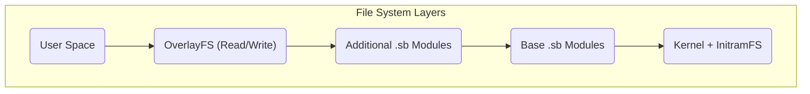

# Arquitectura del sistema MiniOS

Este documento ofrece una visión técnica general de la arquitectura de MiniOS. Explica cómo interactúan los componentes del sistema para crear una distribución Live de Linux portátil.

## Descripción general

MiniOS se basa en una arquitectura modular que utiliza un sistema de archivos multinivel y módulos SquashFS. Esta estructura garantiza flexibilidad, portabilidad y la capacidad de preservar datos al trabajar desde medios extraíbles.

## Componentes clave

### 1. Sistema de arranque

- **Gestores de arranque:** ISOLINUX/SYSLINUX para BIOS Legacy y GRUB para UEFI.
- **Proceso de arranque:** El gestor de arranque inicia el kernel y el `initramfs`, que inicializa el hardware y monta los sistemas de archivos, tras lo cual se inicia el entorno gráfico.

### 2. Arquitectura del sistema de archivos

El sistema utiliza una estructura multinivel, donde cada capa cumple su función.



**Descripción de las capas:**
1.  **Capa de arranque:** Contiene el kernel de Linux y el `initramfs`.
2.  **Capa base:** El núcleo de MiniOS en forma de módulos SquashFS comprimidos.
3.  **Capas de módulos:** Software adicional en forma de archivos SquashFS independientes.
4.  **Capa overlay:** Permite guardar los cambios del usuario.

### 3. Sistema modular

**Módulos SquashFS (.sb):**
- **01-kernel.sb:** Kernel de Linux y controladores.
- **02-firmware.sb:** Firmware para hardware.
- **03-gui-base.sb:** Componentes básicos de la interfaz gráfica.
- **04-desktop.sb:** Entorno de escritorio.
- **05-apps.sb:** Conjunto de aplicaciones.

**Carga de módulos:**
- Los módulos se cargan en el orden de su numeración.
- Cada módulo se monta como una capa "solo lectura".
- Los módulos con un número mayor pueden sobrescribir archivos de módulos con un número menor.

## Arquitectura en tiempo de ejecución

### Componentes del sistema Live

- **`live-config`:** Responsable de la configuración inicial del hardware y de crear el usuario `live`.
- **Sistema de persistencia:** Permite guardar datos entre sesiones.

**Estructura de almacenamiento en la unidad USB:**
```text
/minios/
├── boot/      # Kernel and boot files
├── modules/   # SquashFS modules
└── changes/   # Storage for persistent data
```
