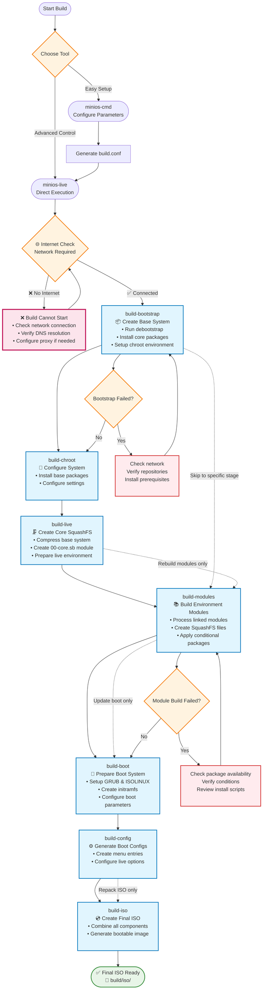

# Compilando MiniOS

Esta guía cubre el proceso completo para compilar MiniOS, incluyendo la construcción del sistema, el desarrollo de módulos y opciones avanzadas de configuración.

## Descripción general

MiniOS utiliza un sistema de compilación modular donde el sistema operativo se construye a partir de módulos individuales en formato SquashFS. Cada módulo contiene paquetes de software o componentes específicos, y se cargan en orden secuencial para formar el sistema completo.

## Primeros pasos

### Requisitos previos

- Última versión de Debian o Ubuntu para compilar
- Espacio suficiente en disco (recomendado: más de 20GB libres)
- Conexión a Internet para descargar paquetes
- Paquetes requeridos listados en `linux-live/prerequisites.list`

### Instalación de requisitos previos

El archivo `prerequisites.list` utiliza el formato condinapt con marcadores condicionales. Instala los paquetes necesarios manualmente:

```bash
sudo apt-get update
sudo apt-get install sudo binutils debootstrap squashfs-tools xz-utils lz4 zstd xorriso mtools rsync curl
sudo apt-get install grub-efi-amd64-bin grub-pc-bin
```

Alternativamente, puedes usar condinapt para procesar la lista de requisitos si está disponible en tu sistema.

## Herramientas de compilación

MiniOS proporciona dos herramientas principales para la construcción:

### minios-cmd (Recomendado)

Una utilidad de línea de comandos que simplifica la configuración e inicio de las compilaciones. Ofrece una interfaz amigable para establecer varios parámetros de compilación:

- Distribución objetivo (buster, bookworm, trixie, etc.)
- Arquitectura (amd64, i386)
- Entorno de escritorio (core, flux, xfce, lxqt)
- Variante de paquetes (minimum, standard, toolbox, ultra)
- Opciones del kernel
- Configuración de idioma y zona horaria

**Uso:**
```bash
# Build with default configuration
minios-cmd -d bookworm -a amd64 -de xfce -pv standard

# Build with custom options
minios-cmd -d bookworm -a amd64 -de xfce -pv toolbox -c zstd -l en_US -tz "Europe/Prague"
```

Para información detallada sobre el uso, consulta la [documentación de minios-cmd](https://github.com/minios-linux/minios-live/blob/master/docs/minios-cmd.md).

### minios-live (Avanzado)

El script principal que orquesta el proceso de compilación paso a paso:

- Preparación del entorno de compilación
- Instalación del sistema base
- Integración del entorno de escritorio elegido
- Creación del sistema de archivos SquashFS
- Configuración del proceso de arranque
- Generación de la imagen ISO booteable

**Uso:**
```bash
# Complete build
./minios-live -

# Specific stages
./minios-live build-bootstrap
./minios-live build-chroot - build-live
```

Para información detallada sobre el uso, consulta la [documentación de minios-live](https://github.com/minios-linux/minios-live/blob/master/docs/minios-live.md).

### Documentación de ayuda offline

`submodules/docs/` es la única fuente editable para la documentación de MiniOS. Antes de lanzar `minios-help`, actualiza su copia offline empaquetada con:

```bash
submodules/minios-help/tools/sync-from-docs.sh
```

El árbol generado `submodules/minios-help/share/docs/` se incorpora junto con la aplicación y es utilizado directamente por el paquete fuente Debian. Las compilaciones normales de imágenes de MiniOS no ejecutan VitePress, Node.js ni el sincronizador de documentación; simplemente instalan el paquete `minios-help` ya publicado como cualquier otro paquete de escritorio.

## Estructura del proyecto

El sistema de compilación de MiniOS está organizado de la siguiente manera:

```plaintext
minios-live/
├── linux-live/                 # Core scripts and build libraries
│   ├── bootfiles/              # Files and templates for booting (GRUB, ISOLINUX, EFI, etc.)
│   ├── environments/           # Environment descriptions and settings
│   ├── initramfs/              # Scripts for creating initramfs
│   ├── scripts/                # Module scripts and templates
│   ├── build-initramfs         # Script for separate initramfs build
│   ├── build.conf              # Main build configuration file
│   ├── condinapt               # Script/tool for working with package lists
│   ├── install-chroot          # Script for installing into the chroot environment
│   ├── minioslib               # Core Bash function library
│   └── prerequisites.list      # List of required packages for installation on the host for building
├── tools/                      # Auxiliary build scripts
├── minios-cmd                  # CLI utility for setting build parameters
└── minios-live                 # Main script for building MiniOS
```

## Proceso de compilación

El proceso de compilación sigue una secuencia estructurada de etapas:



### Explicación de las etapas de compilación

1. **`build-bootstrap`** - Crea el sistema base mínimo usando debootstrap
2. **`build-chroot`** - Instala paquetes y configura el sistema en el entorno chroot
3. **`build-live`** - Crea la imagen principal SquashFS con el sistema central
4. **`build-modules`** - Construye módulos SquashFS adicionales para software extra
5. **`build-boot`** - Prepara los archivos del gestor de arranque y kernel
6. **`build-config`** - Genera los archivos de configuración de arranque
7. **`build-iso`** - Crea la imagen ISO final arrancable

### Opciones de compilación

#### Compilación completa del sistema

```bash
# Full automated build
./minios-live -
# or
./minios-live build-bootstrap - build-iso
```

#### Compilaciones incrementales

```bash
# Run only bootstrap stage
./minios-live build-bootstrap

# Run from chroot to live stages
./minios-live build-chroot - build-live

# Run from modules to completion
./minios-live build-modules -

# Build only ISO from existing data
./minios-live build-iso
```

## Sistema de configuración

### Archivos de configuración de compilación

#### Configuración principal: `linux-live/build.conf`

Este es el archivo de configuración principal que define:
- **Parámetros de la distribución**: distribución objetivo (buster, bookworm, trixie, sid)
- **Arquitectura**: amd64, i386, i386-pae (solo bookworm y anteriores; trixie y sid solo admiten amd64)
- **Entorno de escritorio**: core, flux, xfce, lxqt
- **Variante de paquetes**: minimum, standard, toolbox, ultra
- **Compresión**: xz, lzo, gz, lz4, zstd
- **Parámetros del kernel**: tipo, soporte AUFS, compilación DKMS
- **Configuración regional**: idioma, zona horaria, distribución del teclado

#### Configuración de ejecución: `minios_build.conf`

Se genera automáticamente durante el proceso de compilación y contiene parámetros específicos de ejecución para el entorno chroot.

### Variantes de paquetes

MiniOS admite diferentes variantes de paquetes que determinan qué software se incluye:

- **minimum**: Solo paquetes esenciales
- **standard**: Aplicaciones de escritorio estándar
- **toolbox**: Herramientas de desarrollo y utilidades avanzadas
- **ultra**: Suite de software completa con aplicaciones adicionales

La selección de paquetes se controla mediante marcadores condicionales en los archivos `packages.list`:
```
# Install only in toolbox and ultra variants
firefox +pv=toolbox +pv=ultra

# Install only in minimum variant
basic-tool +pv=minimum
```

## Sistema de módulos

### Estructura de módulos

El sistema de compilación utiliza una estructura de módulos numerados ubicada en `linux-live/scripts/`:

```
00-core/          # Base system packages
01-kernel/        # Linux kernel
02-firmware/      # Hardware firmware
03-gui-base/      # Basic GUI libraries
04-xfce-desktop/  # Desktop environment
05-apps/          # Desktop applications
10-example/       # Example module template
```

### Componentes del módulo

Cada directorio de módulo contiene:

- **`packages.list`**: Lista de paquetes a instalar con marcadores condicionales
- **`install`**: Script Bash ejecutado durante la construcción del módulo
- **`rootcopy-install/`**: Archivos copiados al sistema durante la compilación
- **`rootcopy-postinstall/`**: Archivos copiados después de la instalación de paquetes
- **`.minios-ownership`**: Manifiesto de propiedad opcional dentro de un directorio `rootcopy-*` para archivos que requieren un propietario distinto a root
- **`skip_conditions.conf`**: Condiciones para omitir la construcción del módulo
- **`patches/`**: Parches aplicados antes de compilar (no disponible para 00-core)

Los archivos en `rootcopy-install/` y `rootcopy-postinstall/` se copian como plantillas de compilación. La propiedad del checkout del host no se conserva; los archivos normalmente pasan a ser `root:root` en el árbol de destino. Si un archivo o directorio necesita un propietario distinto a root, crea `.minios-ownership` en el directorio rootcopy correspondiente:

```text
owner:group relative/path
```

Las rutas son relativas a ese directorio rootcopy. Se rechazan rutas absolutas y rutas que contengan `../`. El propietario y grupo deben existir previamente cuando se aplique el manifiesto. Si se crean mediante un paquete instalado posteriormente, usa `rootcopy-postinstall/` o configura la propiedad en `install`/`postinstall`.

### Ejemplo de plantilla de módulo

El módulo **`10-example/`** sirve como plantilla para crear nuevos módulos. Contiene:

- Un archivo `packages.list` completo con ejemplos de marcadores condicionales
- Un script básico `install` que muestra el uso correcto de condinapt
- Ejemplo de directorios `rootcopy-install/` y `rootcopy-postinstall/`
- Comentarios de documentación explicando cada componente

**Para crear un nuevo módulo**: copia el directorio `10-example` y modifícalo según tus necesidades:
```bash
cp -r linux-live/scripts/10-example linux-live/scripts/06-my-module
```

Esta plantilla se utiliza a lo largo de esta documentación y es el mejor punto de partida para módulos personalizados.

### Carga de módulos basada en entornos

El sistema de módulos funciona mediante configuraciones de entorno en `linux-live/environments/`. Cada directorio de entorno contiene enlaces simbólicos a los módulos que deben incluirse para ese entorno de escritorio y variante de paquetes específicos.

#### Entornos disponibles

```bash
linux-live/environments/
├── core/          # Core system (no desktop)
├── flux/          # Flux desktop environment
├── lxqt/          # LXQt desktop environment
├── xfce/          # XFCE desktop environment
└── xfce-debug/    # XFCE with debug modules
```

Cada directorio de entorno contiene enlaces simbólicos a los directorios de módulos en `linux-live/scripts/`:

```bash
# Example: XFCE environment
linux-live/environments/xfce/
├── 01-kernel -> ../../scripts/01-kernel
├── 02-firmware -> ../../scripts/02-firmware
├── 03-gui-base -> ../../scripts/03-gui-base
├── 04-xfce-desktop -> ../../scripts/04-xfce-desktop
├── 05-apps -> ../../scripts/05-apps
└── 06-firefox -> ../../scripts/10-firefox
```

#### Compilación de módulos

Para compilar los módulos, utiliza el comando `build-modules`:

```bash
# Build all unbuilt modules for the current environment
./minios-live build-modules

# This will build all modules that:
# 1. Are linked in the current environment directory
# 2. Haven't been built yet
# 3. Meet the skip conditions (if any)
```

### Scripts de instalación de módulos

El script `install` en cada módulo:
- Incluye `/minioslib` para funciones comunes
- Incluye `/minios_build.conf` para la configuración de compilación
- Configura selecciones de debconf para la instalación automatizada de paquetes
- Realiza configuraciones personalizadas y modificaciones de archivos
- Utiliza colores de consola para el formato de salida

Estructura de ejemplo:
```bash
#!/bin/bash
set -e          # exit on error
set -o pipefail # exit on pipeline error
set -u          # treat unset variable as error

. /minioslib
. /minios_build.conf

SCRIPT_DIR="$(dirname "$(readlink -f "$0")")"
console_colors

# Debconf pre-configurations
DEBCONF_SETTINGS=(
    "package-name package-name/option boolean true"
)

# Apply debconf settings
for SETTING in "${DEBCONF_SETTINGS[@]}"; do
    echo "${SETTING}" | debconf-set-selections -v
done

# Custom installation and configuration logic
# ...
```

## Gestión de paquetes con CondinAPT

CondinAPT es el sistema de instalación condicional de paquetes de MiniOS, que gestiona la selección de paquetes según parámetros de compilación como entorno de escritorio, distribución y variante de paquetes.

### Uso básico

Cada módulo contiene un archivo `packages.list` con especificaciones condicionales de paquetes:

```bash
# Basic syntax examples
package-name                    # Always install
package-name +pv=toolbox       # Install only for toolbox variant
package-name +de=xfce          # Install only for XFCE desktop
package-name -pv=minimum       # Install except for minimum variant
preferred-pkg || fallback-pkg  # Try first, use second if unavailable
```

### Uso de CondinAPT en scripts de módulos

Uso estándar en los scripts de instalación de módulos:

```bash
# Load MiniOS library and install packages
. /minioslib || exit 1
/linux-live/condinapt \
    -l "$CWD/packages.list" \
    -c /linux-live/build.conf \
    -m /linux-live/condinapt.map
```

### Documentación completa

Para la documentación completa de CondinAPT, incluyendo sintaxis avanzada, filtros, colas de prioridad, modos de depuración y ejemplos reales, consulta: **[CondinAPT.md](/development/CondinAPT.md)**

### Filtros de condición comunes

- `+pv=variant` - Variante de paquetes (minimum, standard, toolbox, ultra)
- `+d=distribution` - Distribución (bookworm, trixie, jammy, noble)
- `+de=desktop` - Entorno de escritorio (core, flux, xfce, lxqt)
- `+da=architecture` - Arquitectura (amd64, i386)
- `+dt=type` - Tipo de distribución (debian, ubuntu)

## Compilando tu primera ISO

### Inicio rápido

1. **Clona el repositorio y prepárate:**
```bash
git clone https://github.com/minios-linux/minios-live.git
cd minios-live
```

2. **Instala los prerrequisitos:**
```bash
sudo apt-get update
sudo apt-get install sudo binutils debootstrap squashfs-tools xz-utils lz4 zstd xorriso mtools rsync grub-efi-amd64-bin grub-pc-bin
```

3. **Compila con minios-cmd (recomendado):**
```bash
./minios-cmd -d bookworm -a amd64 -de xfce -pv standard
```

4. **O compila con minios-live:**
```bash
./minios-live -
```

### Personalizando tu compilación

1. **Copia y edita la configuración:**
```bash
cp linux-live/build.conf linux-live/build-custom.conf
# Edit build-custom.conf with your preferences
```

2. **Compila con la configuración personalizada:**
```bash
BUILD_CONF=linux-live/build-custom.conf ./minios-live -
```

## Personalización avanzada

### Creación de entornos personalizados

Puedes crear entornos de escritorio completamente nuevos creando un nuevo directorio de entorno y configurando los módulos apropiados. Aquí tienes cómo crear un entorno GNOME como ejemplo:

1. **Crea el directorio del entorno:**
```bash
mkdir -p linux-live/environments/gnome
```

2. **Crea el módulo base de escritorio (04-gnome-desktop):**
```bash
# Start with the example template for a clean base
cp -r linux-live/scripts/10-example linux-live/scripts/04-gnome-desktop

# Configure GNOME-specific packages
cat > linux-live/scripts/04-gnome-desktop/packages.list << EOF
# Base GNOME desktop packages
gdm3
gnome-shell
gnome-session
gnome-settings-daemon
gnome-control-center
nautilus
gnome-terminal

# Standard GNOME applications
gnome-calculator +pv=standard +pv=toolbox +pv=ultra
gnome-text-editor +pv=standard +pv=toolbox +pv=ultra
eog +pv=standard +pv=toolbox +pv=ultra
evince +pv=standard +pv=toolbox +pv=ultra

# Additional GNOME tools
gnome-tweaks +pv=toolbox +pv=ultra
gnome-extensions-app +pv=toolbox +pv=ultra
dconf-editor +pv=toolbox +pv=ultra
EOF

# Create a custom install script for GNOME-specific configuration
cat > linux-live/scripts/04-gnome-desktop/install << 'EOF'
#!/bin/bash
set -e
set -o pipefail
set -u

. /minioslib
. /minios_build.conf

SCRIPT_DIR="$(dirname "$(readlink -f "$0")")"

# Install packages using condinapt
/condinapt -l "${SCRIPT_DIR}/packages.list" -c "${SCRIPT_DIR}/minios_build.conf" -m "${SCRIPT_DIR}/condinapt.conf"
if [ $? -ne 0 ]; then
    echo "Failed to install packages."
    exit 1
fi

# Set GNOME as default session
echo 'gnome' > /etc/skel/.dmrc
echo '[Desktop]' > /etc/skel/.dmrc
echo 'Session=gnome' >> /etc/skel/.dmrc

EOF
chmod +x linux-live/scripts/04-gnome-desktop/install
```

3. **Crea el módulo de aplicaciones GNOME (05-gnome-apps):**
```bash
cp -r linux-live/scripts/10-example linux-live/scripts/05-gnome-apps

cat > linux-live/scripts/05-gnome-apps/packages.list << EOF
# GNOME Applications
gnome-software +pv=standard +pv=toolbox +pv=ultra
gnome-system-monitor +pv=standard +pv=toolbox +pv=ultra
gnome-disk-utility +pv=standard +pv=toolbox +pv=ultra
gnome-screenshot +pv=standard +pv=toolbox +pv=ultra
gnome-calendar +pv=toolbox +pv=ultra
gnome-weather +pv=toolbox +pv=ultra
gnome-maps +pv=ultra
rhythmbox +pv=toolbox +pv=ultra
totem +pv=toolbox +pv=ultra
EOF

# Create a custom install script for GNOME applications
cat > linux-live/scripts/05-gnome-apps/install << 'EOF'
#!/bin/bash
set -e
set -o pipefail
set -u

. /minioslib
. /minios_build.conf

SCRIPT_DIR="$(dirname "$(readlink -f "$0")")"

# Install packages using condinapt
/condinapt -l "${SCRIPT_DIR}/packages.list" -c "${SCRIPT_DIR}/minios_build.conf" -m "${SCRIPT_DIR}/condinapt.conf"
if [ $? -ne 0 ]; then
    echo "Failed to install packages."
    exit 1
fi

# Configure default applications for GNOME
mkdir -p /etc/skel/.config

# Set default applications
cat > /etc/skel/.config/mimeapps.list << 'MIME_EOF'
[Default Applications]
text/plain=gnome-text-editor.desktop
image/jpeg=eog.desktop
image/png=eog.desktop
application/pdf=evince.desktop
video/mp4=totem.desktop
audio/mpeg=rhythmbox.desktop
MIME_EOF

EOF
chmod +x linux-live/scripts/05-gnome-apps/install
```

4. **Enlaza los módulos al entorno GNOME:**
```bash
# Link base system modules (same for all environments)
ln -s ../../scripts/01-kernel linux-live/environments/gnome/01-kernel
ln -s ../../scripts/02-firmware linux-live/environments/gnome/02-firmware
ln -s ../../scripts/03-gui-base linux-live/environments/gnome/03-gui-base

# Link GNOME-specific modules
ln -s ../../scripts/04-gnome-desktop linux-live/environments/gnome/04-gnome-desktop
ln -s ../../scripts/05-gnome-apps linux-live/environments/gnome/05-gnome-apps

# Link additional modules as needed
ln -s ../../scripts/10-firefox linux-live/environments/gnome/06-firefox
```

5. **Configura la compilación para el entorno GNOME:**
```bash
# Copy and modify build configuration
cp linux-live/build.conf linux-live/build-gnome.conf
sed -i 's/DESKTOP_ENVIRONMENT=".*"/DESKTOP_ENVIRONMENT="gnome"/' linux-live/build-gnome.conf
sed -i 's/PACKAGE_VARIANT=".*"/PACKAGE_VARIANT="standard"/' linux-live/build-gnome.conf

# Build the GNOME system
BUILD_CONF=linux-live/build-gnome.conf ./minios-live -
```

### Buenas prácticas en la estructura de entornos

Al crear entornos personalizados:

- **Módulos base** (01-03): Normalmente son los mismos en todos los entornos
- **Módulo de escritorio** (04): Contiene los paquetes y la configuración principal del entorno de escritorio
- **Módulo de aplicaciones** (05): Aplicaciones específicas del escritorio
- **Módulos opcionales** (06+): Paquetes de software adicionales

**Convención para nombrar módulos:**
- Usa el formato `04-{desktop}-desktop` para el módulo principal de escritorio
- Usa `05-{desktop}-apps` o `05-apps` para aplicaciones
- Numera los módulos adicionales de forma secuencial (06, 07, 08, etc.)

**Consideraciones de configuración:**
- Cada entorno necesita condiciones de omisión adecuadas en los módulos
- Los paquetes específicos de escritorio deben usar condiciones `+de={environment}`
- Prueba exhaustivamente con las diferentes variantes de paquetes (minimum, standard, toolbox, ultra)

### Agregar módulos personalizados

1. **Crea un nuevo módulo usando la plantilla:**
```bash
cp -r linux-live/scripts/10-example linux-live/scripts/06-custom-module
```

2. **Edita el packages.list:**
```bash
# Edit linux-live/scripts/06-custom-module/packages.list
# Add your packages with appropriate conditional markers
```

3. **Personaliza el script de instalación:**
```bash
# Edit linux-live/scripts/06-custom-module/install
# Add custom configuration and setup commands
```

4. **Enlaza el módulo a tu entorno:**
```bash
ln -s ../../scripts/06-custom-module linux-live/environments/xfce/06-custom-module
```

5. **Compila los módulos:**
```bash
./minios-live build-modules
```

## Resolución de problemas

### Problemas comunes

1. **La compilación no inicia - Se requiere conectividad a Internet:**
   - **Problema**: `minios-live` realiza una comprobación obligatoria de conectividad a Internet al iniciar
   - **Solución**: Asegúrate de tener una conexión a Internet estable antes de iniciar la compilación
   - **Comprobación**: Verifica la resolución DNS: `nslookup deb.debian.org`
   - **Proxy**: Configura los ajustes de proxy si estás detrás de un firewall corporativo
   - **Nota**: La compilación no puede continuar sin acceso a Internet

2. **La compilación falla durante el bootstrap:**
   - Verifica que los repositorios de la distribución objetivo estén disponibles
   - Asegúrate de que los prerrequisitos estén instalados
   - Prueba: `wget -q --spider http://deb.debian.org`

3. **Errores en la compilación de módulos:**
   - Revisa la disponibilidad de los paquetes en la distribución objetivo
   - Verifica la sintaxis de los marcadores condicionales
   - Revisa el script de instalación en busca de errores

4. **Paquetes faltantes:**
   - Revisa las condiciones de condinapt
   - Verifica los nombres de los paquetes para la distribución objetivo
   - Revisa la configuración de la variante de paquetes

5. **Problemas de arranque:**
   - Revisa la configuración de GRUB
   - Verifica la generación del kernel e initramfs
   - Revisa los archivos del gestor de arranque

### Modo de depuración

Activa la salida de depuración configurando el nivel de verbosidad en tu archivo de configuración de compilación:

**Opción 1: Edita build.conf**
```bash
# Edit linux-live/build.conf and set:
VERBOSITY_LEVEL=2   # Very verbose output with detailed tracing
# or
VERBOSITY_LEVEL=1   # Verbose output (default)
# or
VERBOSITY_LEVEL=0   # Minimal output
```

**Opción 2: Crea una configuración personalizada con ajustes de depuración**
```bash
cp linux-live/build.conf linux-live/build-debug.conf
sed -i 's/VERBOSITY_LEVEL=.*/VERBOSITY_LEVEL=2/' linux-live/build-debug.conf

# Enable additional debug options
sed -i 's/DEBUG_SSH_KEYS="false"/DEBUG_SSH_KEYS="true"/' linux-live/build-debug.conf
sed -i 's/DEBUG_SET_ROOT_PASSWORD="false"/DEBUG_SET_ROOT_PASSWORD="true"/' linux-live/build-debug.conf

# Build with debug configuration
BUILD_CONF=linux-live/build-debug.conf ./minios-live -
```

**Niveles de verbosidad:**
- `0`: Salida mínima - solo mensajes esenciales
- `1`: Salida detallada - información estándar de compilación (por defecto)
- `2`: Salida muy detallada - trazado completo con depuración bash habilitada

### Archivos de registro

Los registros de compilación se almacenan en:
- `build/log/` - Registros generales de compilación

### Obtener ayuda

- Consulta la [wiki oficial](https://github.com/minios-linux/minios-live/wiki)
- Revisa los issues existentes en GitHub
- Únete a los foros de la comunidad en [minios.dev](https://minios.dev)

## Documentación relacionada

- **[Creación de módulos](/development/Creating-Modules.md)** - Aprende a crear módulos SquashFS personalizados con software adicional
- **[Composición de imágenes ISO](/development/Rebuilding-ISO.md)** - Remasteriza un sistema MiniOS existente con `minios-image-compose`
- **[CondinAPT](/development/CondinAPT.md)** - Comprende el sistema de gestión condicional de paquetes utilizado en las compilaciones
