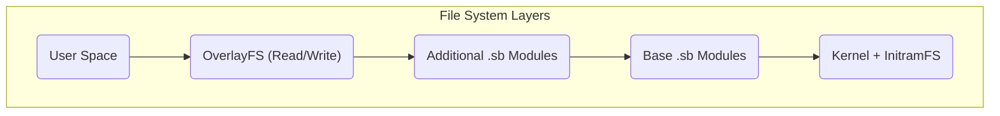

# Architecture du système MiniOS

Ce document fournit une vue d’ensemble technique de l’architecture de MiniOS. Il explique comment les composants du système interagissent pour créer une distribution Linux Live portable.

## Vue d’ensemble

MiniOS repose sur une architecture modulaire utilisant un système de fichiers multi-couches et des modules SquashFS. Cette structure garantit flexibilité, portabilité et la possibilité de conserver les données lors de l’utilisation sur des supports amovibles.

## Composants clés

### 1. Système de démarrage

- **Bootloaders :** ISOLINUX/SYSLINUX pour les BIOS Legacy et GRUB pour l’UEFI.
- **Processus de démarrage :** Le bootloader lance le noyau et `initramfs`, qui initialise le matériel et monte les systèmes de fichiers, après quoi l’environnement graphique démarre.

### 2. Architecture du système de fichiers

Le système utilise une structure multi-couches, où chaque couche remplit sa fonction.



**Description des couches :**
1.  **Couche de démarrage :** Contient le noyau Linux et `initramfs`.
2.  **Couche de base :** Le cœur de MiniOS sous forme de modules SquashFS compressés.
3.  **Couches de modules :** Logiciels additionnels sous forme de fichiers SquashFS séparés.
4.  **Couche overlay :** Permet de sauvegarder les modifications de l’utilisateur.

### 3. Système modulaire

**Modules SquashFS (.sb) :**
- **01-kernel.sb :** Noyau Linux et pilotes.
- **02-firmware.sb :** Microprogrammes pour le matériel.
- **03-gui-base.sb :** Composants de l’interface graphique de base.
- **04-desktop.sb :** Environnement de bureau.
- **05-apps.sb :** Suite d’applications.

**Chargement des modules :**
- Les modules sont chargés dans l’ordre de leur numérotation.
- Chaque module est monté comme une couche « en lecture seule ».
- Les modules avec un numéro supérieur peuvent écraser les fichiers des modules avec un numéro inférieur.

## Architecture à l’exécution

### Composants du système Live

- **`live-config` :** Responsable de la configuration initiale du matériel et de la création de l’utilisateur `live`.
- **Système de persistance :** Permet de sauvegarder les données entre les sessions.

**Structure de stockage sur la clé USB :**
```text
/minios/
├── boot/      # Kernel and boot files
├── modules/   # SquashFS modules
└── changes/   # Storage for persistent data
```
