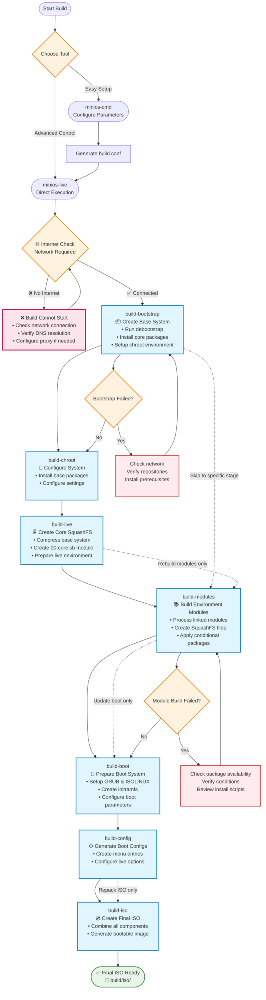

# Construction de MiniOS

Ce guide couvre l'ensemble du processus de construction de MiniOS, y compris la création du système, le développement de modules et les options de configuration avancées.

## Vue d'ensemble

MiniOS utilise un système de construction modulaire où le système d'exploitation est assemblé à partir de modules individuels au format SquashFS. Chaque module contient des paquets ou composants logiciels spécifiques, chargés dans un ordre séquentiel pour former le système complet.

## Premiers pas

### Prérequis

- Dernière version de Debian ou Ubuntu pour la construction
- Espace disque suffisant (recommandé : 20 Go ou plus d'espace libre)
- Connexion Internet pour télécharger les paquets
- Paquets requis listés dans `linux-live/prerequisites.list`

### Installation des prérequis

Le fichier `prerequisites.list` utilise le format condinapt avec des marqueurs conditionnels. Installez les paquets requis manuellement :

```bash
sudo apt-get update
sudo apt-get install sudo binutils debootstrap squashfs-tools xz-utils lz4 zstd xorriso mtools rsync curl
sudo apt-get install grub-efi-amd64-bin grub-pc-bin
```

Vous pouvez également utiliser condinapt pour traiter la liste des prérequis si celui-ci est disponible sur votre système.

## Outils de construction

MiniOS fournit deux outils principaux pour la construction :

### minios-cmd (Recommandé)

Un utilitaire en ligne de commande qui simplifie la configuration et le lancement des constructions. Il offre une interface conviviale pour définir divers paramètres de construction :

- Distribution cible (buster, bookworm, trixie, etc.)
- Architecture (amd64, i386)
- Environnement de bureau (core, flux, xfce, lxqt)
- Variante de paquets (minimum, standard, toolbox, ultra)
- Options du noyau
- Paramètres de langue et de fuseau horaire

**Utilisation :**
```bash
# Build with default configuration
minios-cmd -d bookworm -a amd64 -de xfce -pv standard

# Build with custom options
minios-cmd -d bookworm -a amd64 -de xfce -pv toolbox -c zstd -l en_US -tz "Europe/Prague"
```

Pour plus d'informations sur l'utilisation, consultez la [documentation minios-cmd](https://github.com/minios-linux/minios-live/blob/master/docs/minios-cmd.md).

### minios-live (Avancé)

Le script principal de construction qui orchestre le processus étape par étape :

- Préparation de l'environnement de construction
- Installation du système de base
- Intégration de l'environnement de bureau choisi
- Création du système de fichiers SquashFS
- Configuration du processus de démarrage
- Génération de l'image ISO amorçable

**Utilisation :**
```bash
# Complete build
./minios-live -

# Specific stages
./minios-live build-bootstrap
./minios-live build-chroot - build-live
```

Pour plus d'informations sur l'utilisation, consultez la [documentation minios-live](https://github.com/minios-linux/minios-live/blob/master/docs/minios-live.md).

## Structure du projet

Le système de construction MiniOS est organisé comme suit :

```plaintext
minios-live/
├── linux-live/                 # Core scripts and build libraries
│   ├── bootfiles/              # Files and templates for booting (GRUB, ISOLINUX, EFI, etc.)
│   ├── environments/           # Environment descriptions and settings
│   ├── initramfs/              # Scripts for creating initramfs
│   ├── scripts/                # Module scripts and templates
│   ├── build-initramfs         # Script for separate initramfs build
│   ├── build.conf              # Main build configuration file
│   ├── condinapt               # Script/tool for working with package lists
│   ├── install-chroot          # Script for installing into the chroot environment
│   ├── minioslib               # Core Bash function library
│   └── prerequisites.list      # List of required packages for installation on the host for building
├── tools/                      # Auxiliary build scripts
├── minios-cmd                  # CLI utility for setting build parameters
└── minios-live                 # Main script for building MiniOS
```

## Processus de construction

Le processus de construction suit une séquence structurée d'étapes :



### Explication des étapes de construction

1. **`build-bootstrap`** - Crée le système de base minimal avec debootstrap
2. **`build-chroot`** - Installe les paquets et configure le système dans un environnement chroot
3. **`build-live`** - Crée l'image SquashFS principale avec le système de base
4. **`build-modules`** - Construit des modules SquashFS supplémentaires pour des logiciels additionnels
5. **`build-boot`** - Prépare le chargeur d'amorçage et les fichiers du noyau
6. **`build-config`** - Génère les fichiers de configuration du démarrage
7. **`build-iso`** - Crée l'image ISO finale amorçable

### Options de construction

#### Construction complète du système

```bash
# Full automated build
./minios-live -
# or
./minios-live build-bootstrap - build-iso
```

#### Constructions incrémentielles

```bash
# Run only bootstrap stage
./minios-live build-bootstrap

# Run from chroot to live stages
./minios-live build-chroot - build-live

# Run from modules to completion
./minios-live build-modules -

# Build only ISO from existing data
./minios-live build-iso
```

## Système de configuration

### Fichiers de configuration de construction

#### Configuration principale : `linux-live/build.conf`

Il s'agit du fichier de configuration principal qui définit :
- **Paramètres de distribution** : Distribution cible (buster, bookworm, trixie, sid)
- **Architecture** : amd64, i386, i386-pae (bookworm et versions antérieures uniquement ; trixie et sid ne prennent en charge que amd64)
- **Environnement de bureau** : core, flux, xfce, lxqt
- **Variante de paquets** : minimum, standard, toolbox, ultra
- **Compression** : xz, lzo, gz, lz4, zstd
- **Paramètres du noyau** : type, support AUFS, compilation DKMS
- **Paramètres de langue** : langue, fuseau horaire, disposition du clavier

#### Configuration d'exécution : `minios_build.conf`

Généré automatiquement pendant le processus de construction et contient les paramètres spécifiques à l'exécution pour l'environnement chroot.

### Variantes de paquets

MiniOS prend en charge différentes variantes de paquets qui déterminent les logiciels inclus :

- **minimum** : Paquets essentiels uniquement
- **standard** : Applications bureautiques standards
- **toolbox** : Outils de développement et utilitaires avancés
- **ultra** : Suite logicielle complète avec applications supplémentaires

La sélection des paquets est contrôlée à l'aide de marqueurs conditionnels dans les fichiers `packages.list` :
```
# Install only in toolbox and ultra variants
firefox +pv=toolbox +pv=ultra

# Install only in minimum variant
basic-tool +pv=minimum
```

## Système de modules

### Structure des modules

Le système de construction utilise une structure de modules numérotés située dans `linux-live/scripts/` :

```
00-core/          # Base system packages
01-kernel/        # Linux kernel
02-firmware/      # Hardware firmware
03-gui-base/      # Basic GUI libraries
04-xfce-desktop/  # Desktop environment
05-apps/          # Desktop applications
10-example/       # Example module template
```

### Composants d'un module

Chaque dossier de module contient :

- **`packages.list`** : Liste des paquets à installer avec des marqueurs conditionnels
- **`install`** : Script Bash exécuté lors de la construction du module
- **`rootcopy-install/`** : Fichiers copiés dans le système pendant la construction
- **`rootcopy-postinstall/`** : Fichiers copiés après l'installation des paquets
- **`skip_conditions.conf`** : Conditions pour ignorer la construction du module
- **`patches/`** : Correctifs appliqués avant la construction (non disponible pour 00-core)

### Exemple de modèle de module

Le module **`10-example/`** sert de modèle pour créer de nouveaux modules. Il contient :

- Un fichier `packages.list` complet avec des exemples de marqueurs conditionnels
- Un script `install` basique montrant l'utilisation correcte de condinapt
- Des exemples de dossiers `rootcopy-install/` et `rootcopy-postinstall/`
- Des commentaires de documentation expliquant chaque composant

**Pour créer un nouveau module** : Copiez le dossier `10-example` et modifiez-le selon vos besoins :
```bash
cp -r linux-live/scripts/10-example linux-live/scripts/06-my-module
```

Ce modèle est utilisé tout au long de cette documentation et constitue le meilleur point de départ pour des modules personnalisés.

### Chargement des modules selon l'environnement

Le système de modules fonctionne via des configurations d'environnement dans `linux-live/environments/`. Chaque dossier d'environnement contient des liens symboliques vers les modules à inclure pour cet environnement de bureau et cette variante de paquets.

#### Environnements disponibles

```bash
linux-live/environments/
├── core/          # Core system (no desktop)
├── flux/          # Flux desktop environment
├── lxqt/          # LXQt desktop environment
├── xfce/          # XFCE desktop environment
└── xfce-debug/    # XFCE with debug modules
```

Chaque dossier d'environnement contient des liens symboliques vers les dossiers de modules dans `linux-live/scripts/` :

```bash
# Example: XFCE environment
linux-live/environments/xfce/
├── 01-kernel -> ../../scripts/01-kernel
├── 02-firmware -> ../../scripts/02-firmware
├── 03-gui-base -> ../../scripts/03-gui-base
├── 04-xfce-desktop -> ../../scripts/04-xfce-desktop
├── 05-apps -> ../../scripts/05-apps
└── 06-firefox -> ../../scripts/10-firefox
```

#### Construction des modules

Pour construire les modules, utilisez la commande `build-modules` :

```bash
# Build all unbuilt modules for the current environment
./minios-live build-modules

# This will build all modules that:
# 1. Are linked in the current environment directory
# 2. Haven't been built yet
# 3. Meet the skip conditions (if any)
```

### Scripts d'installation de module

Le script `install` de chaque module :
- Source `/minioslib` pour les fonctions communes
- Source `/minios_build.conf` pour la configuration de la construction
- Configure les sélections debconf pour l'installation automatisée des paquets
- Effectue la configuration personnalisée et les modifications de fichiers
- Utilise les couleurs de la console pour le formatage de la sortie

Structure d'exemple :
```bash
#!/bin/bash
set -e          # exit on error
set -o pipefail # exit on pipeline error
set -u          # treat unset variable as error

. /minioslib
. /minios_build.conf

SCRIPT_DIR="$(dirname "$(readlink -f "$0")")"
console_colors

# Debconf pre-configurations
DEBCONF_SETTINGS=(
    "package-name package-name/option boolean true"
)

# Apply debconf settings
for SETTING in "${DEBCONF_SETTINGS[@]}"; do
    echo "${SETTING}" | debconf-set-selections -v
done

# Custom installation and configuration logic
# ...
```

## Gestion des paquets avec CondinAPT

CondinAPT est le système d'installation conditionnelle de paquets de MiniOS qui gère la sélection des paquets selon les paramètres de construction comme l'environnement de bureau, la distribution et la variante de paquets.

### Utilisation de base

Chaque module contient un fichier `packages.list` avec des spécifications conditionnelles de paquets :

```bash
# Basic syntax examples
package-name                    # Always install
package-name +pv=toolbox       # Install only for toolbox variant
package-name +de=xfce          # Install only for XFCE desktop
package-name -pv=minimum       # Install except for minimum variant
preferred-pkg || fallback-pkg  # Try first, use second if unavailable
```

### Utilisation de CondinAPT dans les scripts de module

Utilisation standard dans les scripts d'installation de module :

```bash
# Load MiniOS library and install packages
. /minioslib || exit 1
/linux-live/condinapt \
    -l "$CWD/packages.list" \
    -c /linux-live/build.conf \
    -m /linux-live/condinapt.map
```

### Documentation complète

Pour une documentation complète de CondinAPT incluant la syntaxe avancée, les filtres, les files d'attente de priorité, les modes de débogage et des exemples concrets, consultez : **[CondinAPT.md](/development/CondinAPT.md)**

### Filtres de conditions courants

- `+pv=variant` - Variante de paquets (minimum, standard, toolbox, ultra)
- `+d=distribution` - Distribution (bookworm, trixie, jammy, noble)
- `+de=desktop` - Environnement de bureau (core, flux, xfce, lxqt)
- `+da=architecture` - Architecture (amd64, i386)
- `+dt=type` - Type de distribution (debian, ubuntu)

## Construire votre première ISO

### Démarrage rapide

1. **Clonez le dépôt et préparez-vous :**
```bash
git clone https://github.com/minios-linux/minios-live.git
cd minios-live
```

2. **Installez les prérequis :**
```bash
sudo apt-get update
sudo apt-get install sudo binutils debootstrap squashfs-tools xz-utils lz4 zstd xorriso mtools rsync grub-efi-amd64-bin grub-pc-bin
```

3. **Construisez avec minios-cmd (recommandé) :**
```bash
./minios-cmd -d bookworm -a amd64 -de xfce -pv standard
```

4. **Ou construisez avec minios-live :**
```bash
./minios-live -
```

### Personnaliser votre construction

1. **Copiez et éditez la configuration :**
```bash
cp linux-live/build.conf linux-live/build-custom.conf
# Edit build-custom.conf with your preferences
```

2. **Construisez avec la configuration personnalisée :**
```bash
BUILD_CONF=linux-live/build-custom.conf ./minios-live -
```

## Personnalisation avancée

### Création d'environnements personnalisés

Vous pouvez créer de nouveaux environnements de bureau en créant un nouveau dossier d'environnement et en configurant les modules appropriés. Voici comment créer un environnement GNOME en exemple :

1. **Créez le dossier d'environnement :**
```bash
mkdir -p linux-live/environments/gnome
```

2. **Créez le module de bureau de base (04-gnome-desktop) :**
```bash
# Start with the example template for a clean base
cp -r linux-live/scripts/10-example linux-live/scripts/04-gnome-desktop

# Configure GNOME-specific packages
cat > linux-live/scripts/04-gnome-desktop/packages.list << EOF
# Base GNOME desktop packages
gdm3
gnome-shell
gnome-session
gnome-settings-daemon
gnome-control-center
nautilus
gnome-terminal

# Standard GNOME applications
gnome-calculator +pv=standard +pv=toolbox +pv=ultra
gnome-text-editor +pv=standard +pv=toolbox +pv=ultra
eog +pv=standard +pv=toolbox +pv=ultra
evince +pv=standard +pv=toolbox +pv=ultra

# Additional GNOME tools
gnome-tweaks +pv=toolbox +pv=ultra
gnome-extensions-app +pv=toolbox +pv=ultra
dconf-editor +pv=toolbox +pv=ultra
EOF

# Create a custom install script for GNOME-specific configuration
cat > linux-live/scripts/04-gnome-desktop/install << 'EOF'
#!/bin/bash
set -e
set -o pipefail
set -u

. /minioslib
. /minios_build.conf

SCRIPT_DIR="$(dirname "$(readlink -f "$0")")"

# Install packages using condinapt
/condinapt -l "${SCRIPT_DIR}/packages.list" -c "${SCRIPT_DIR}/minios_build.conf" -m "${SCRIPT_DIR}/condinapt.conf"
if [ $? -ne 0 ]; then
    echo "Failed to install packages."
    exit 1
fi

# Set GNOME as default session
echo 'gnome' > /etc/skel/.dmrc
echo '[Desktop]' > /etc/skel/.dmrc
echo 'Session=gnome' >> /etc/skel/.dmrc

EOF
chmod +x linux-live/scripts/04-gnome-desktop/install
```

3. **Créez le module d'applications GNOME (05-gnome-apps) :**
```bash
cp -r linux-live/scripts/10-example linux-live/scripts/05-gnome-apps

cat > linux-live/scripts/05-gnome-apps/packages.list << EOF
# GNOME Applications
gnome-software +pv=standard +pv=toolbox +pv=ultra
gnome-system-monitor +pv=standard +pv=toolbox +pv=ultra
gnome-disk-utility +pv=standard +pv=toolbox +pv=ultra
gnome-screenshot +pv=standard +pv=toolbox +pv=ultra
gnome-calendar +pv=toolbox +pv=ultra
gnome-weather +pv=toolbox +pv=ultra
gnome-maps +pv=ultra
rhythmbox +pv=toolbox +pv=ultra
totem +pv=toolbox +pv=ultra
EOF

# Create a custom install script for GNOME applications
cat > linux-live/scripts/05-gnome-apps/install << 'EOF'
#!/bin/bash
set -e
set -o pipefail
set -u

. /minioslib
. /minios_build.conf

SCRIPT_DIR="$(dirname "$(readlink -f "$0")")"

# Install packages using condinapt
/condinapt -l "${SCRIPT_DIR}/packages.list" -c "${SCRIPT_DIR}/minios_build.conf" -m "${SCRIPT_DIR}/condinapt.conf"
if [ $? -ne 0 ]; then
    echo "Failed to install packages."
    exit 1
fi

# Configure default applications for GNOME
mkdir -p /etc/skel/.config

# Set default applications
cat > /etc/skel/.config/mimeapps.list << 'MIME_EOF'
[Default Applications]
text/plain=gnome-text-editor.desktop
image/jpeg=eog.desktop
image/png=eog.desktop
application/pdf=evince.desktop
video/mp4=totem.desktop
audio/mpeg=rhythmbox.desktop
MIME_EOF

EOF
chmod +x linux-live/scripts/05-gnome-apps/install
```

4. **Liez les modules à l'environnement GNOME :**
```bash
# Link base system modules (same for all environments)
ln -s ../../scripts/01-kernel linux-live/environments/gnome/01-kernel
ln -s ../../scripts/02-firmware linux-live/environments/gnome/02-firmware
ln -s ../../scripts/03-gui-base linux-live/environments/gnome/03-gui-base

# Link GNOME-specific modules
ln -s ../../scripts/04-gnome-desktop linux-live/environments/gnome/04-gnome-desktop
ln -s ../../scripts/05-gnome-apps linux-live/environments/gnome/05-gnome-apps

# Link additional modules as needed
ln -s ../../scripts/10-firefox linux-live/environments/gnome/06-firefox
```

5. **Configurez la construction pour l'environnement GNOME :**
```bash
# Copy and modify build configuration
cp linux-live/build.conf linux-live/build-gnome.conf
sed -i 's/DESKTOP_ENVIRONMENT=".*"/DESKTOP_ENVIRONMENT="gnome"/' linux-live/build-gnome.conf
sed -i 's/PACKAGE_VARIANT=".*"/PACKAGE_VARIANT="standard"/' linux-live/build-gnome.conf

# Build the GNOME system
BUILD_CONF=linux-live/build-gnome.conf ./minios-live -
```

### Bonnes pratiques pour la structure des environnements

Lors de la création d'environnements personnalisés :

- **Modules de base** (01-03) : Généralement identiques pour tous les environnements
- **Module de bureau** (04) : Contient les paquets et la configuration du bureau principal
- **Module d'applications** (05) : Applications spécifiques au bureau
- **Modules optionnels** (06+) : Paquets logiciels additionnels

**Convention de nommage des modules :**
- Utilisez le format `04-{desktop}-desktop` pour le module de bureau principal
- Utilisez `05-{desktop}-apps` ou `05-apps` pour les applications
- Numérotez les modules supplémentaires de façon séquentielle (06, 07, 08, etc.)

**Considérations de configuration :**
- Chaque environnement doit avoir des conditions d'exclusion appropriées dans les modules
- Les paquets spécifiques au bureau doivent utiliser les conditions `+de={environment}`
- Testez soigneusement avec différentes variantes de paquets (minimum, standard, toolbox, ultra)

### Ajout de modules personnalisés

1. **Créez un nouveau module à partir du modèle :**
```bash
cp -r linux-live/scripts/10-example linux-live/scripts/06-custom-module
```

2. **Éditez le packages.list :**
```bash
# Edit linux-live/scripts/06-custom-module/packages.list
# Add your packages with appropriate conditional markers
```

3. **Personnalisez le script d'installation :**
```bash
# Edit linux-live/scripts/06-custom-module/install
# Add custom configuration and setup commands
```

4. **Liez le module à votre environnement :**
```bash
ln -s ../../scripts/06-custom-module linux-live/environments/xfce/06-custom-module
```

5. **Construisez les modules :**
```bash
./minios-live build-modules
```

## Dépannage

### Problèmes courants

1. **La construction échoue au démarrage - Connexion Internet requise :**
   - **Problème** : `minios-live` effectue une vérification obligatoire de la connectivité Internet au lancement
   - **Solution** : Assurez-vous d'avoir une connexion Internet stable avant de lancer la construction
   - **Vérification** : Vérifiez la résolution DNS : `nslookup deb.debian.org`
   - **Proxy** : Configurez les paramètres proxy si vous êtes derrière un pare-feu d'entreprise
   - **Remarque** : La construction ne peut pas continuer sans accès à Internet

2. **La construction échoue pendant le bootstrap :**
   - Vérifiez que les dépôts de la distribution cible sont accessibles
   - Assurez-vous que les prérequis sont installés
   - Test : `wget -q --spider http://deb.debian.org`

3. **Erreurs lors de la construction de modules :**
   - Vérifiez la disponibilité des paquets dans la distribution cible
   - Vérifiez la syntaxe des marqueurs conditionnels
   - Contrôlez le script d'installation pour détecter d'éventuelles erreurs

4. **Paquets manquants :**
   - Vérifiez les conditions condinapt
   - Vérifiez les noms des paquets pour la distribution cible
   - Contrôlez les paramètres de variantes de paquets

5. **Problèmes de démarrage :**
   - Vérifiez la configuration de GRUB
   - Vérifiez la génération du kernel et de l'initramfs
   - Contrôlez les fichiers du bootloader

### Mode débogage

Activez l'affichage des logs de débogage en définissant le niveau de verbosité dans votre configuration de build :

**Option 1 : Modifier build.conf**
```bash
# Edit linux-live/build.conf and set:
VERBOSITY_LEVEL=2   # Very verbose output with detailed tracing
# or
VERBOSITY_LEVEL=1   # Verbose output (default)
# or
VERBOSITY_LEVEL=0   # Minimal output
```

**Option 2 : Créer une configuration personnalisée avec les paramètres de debug**
```bash
cp linux-live/build.conf linux-live/build-debug.conf
sed -i 's/VERBOSITY_LEVEL=.*/VERBOSITY_LEVEL=2/' linux-live/build-debug.conf

# Enable additional debug options
sed -i 's/DEBUG_SSH_KEYS="false"/DEBUG_SSH_KEYS="true"/' linux-live/build-debug.conf
sed -i 's/DEBUG_SET_ROOT_PASSWORD="false"/DEBUG_SET_ROOT_PASSWORD="true"/' linux-live/build-debug.conf

# Build with debug configuration
BUILD_CONF=linux-live/build-debug.conf ./minios-live -
```

**Niveaux de verbosité :**
- `0` : Affichage minimal – seuls les messages essentiels
- `1` : Affichage verbeux – informations standard de build (par défaut)
- `2` : Affichage très détaillé – traçage complet avec le débogage bash activé

### Fichiers journaux

Les logs de construction sont stockés dans :
- `build/log/` – Logs généraux de la construction

### Obtenir de l'aide

- Consultez le [wiki officiel](https://github.com/minios-linux/minios-live/wiki)
- Parcourez les tickets existants sur GitHub
- Rejoignez les forums communautaires sur [minios.dev](https://minios.dev)

## Documentation associée

- **[Créer des modules](/development/Creating-Modules.md)** – Apprenez à créer des modules SquashFS personnalisés avec des logiciels supplémentaires
- **[Reconstruire l’ISO](/development/Rebuilding-ISO.md)** – Repackez votre système live en cours d’exécution en une ISO bootable avec `sb2iso`
- **[CondinAPT](/development/CondinAPT.md)** – Comprendre le système conditionnel de gestion de paquets utilisé lors de la construction
