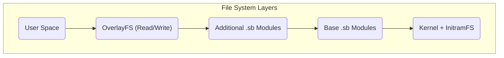

# Arsitektur Sistem MiniOS

Dokumen ini memberikan gambaran teknis tentang arsitektur MiniOS. Penjelasan mencakup bagaimana komponen sistem saling berinteraksi untuk menciptakan distribusi Live Linux yang portabel.

## Ikhtisar

MiniOS didasarkan pada arsitektur modular dengan menggunakan sistem file berlapis dan modul SquashFS. Struktur ini memastikan fleksibilitas, portabilitas, serta kemampuan untuk mempertahankan data saat dijalankan dari media yang dapat dilepas.

## Komponen Utama

### 1. Sistem Boot

- **Bootloader:** ISOLINUX/SYSLINUX untuk Legacy BIOS dan GRUB untuk UEFI.
- **Proses Boot:** Bootloader menjalankan kernel dan `initramfs`, yang menginisialisasi perangkat keras dan me-mount sistem file, setelah itu lingkungan grafis akan dimulai.

### 2. Arsitektur Sistem File

Sistem menggunakan struktur berlapis, di mana setiap lapisan menjalankan fungsinya.



**Deskripsi Lapisan:**
1.  **Lapisan Boot:** Berisi kernel Linux dan `initramfs`.
2.  **Lapisan Dasar:** Inti MiniOS dalam bentuk modul SquashFS terkompresi.
3.  **Lapisan Modul:** Perangkat lunak tambahan dalam bentuk file SquashFS terpisah.
4.  **Lapisan Overlay:** Memungkinkan penyimpanan perubahan pengguna.

### 3. Sistem Modular

**Modul SquashFS (.sb):**
- **01-kernel.sb:** Kernel Linux dan driver.
- **02-firmware.sb:** Firmware untuk perangkat keras.
- **03-gui-base.sb:** Komponen antarmuka grafis dasar.
- **04-desktop.sb:** Lingkungan desktop.
- **05-apps.sb:** Paket aplikasi.

**Pemrosesan Modul:**
- Modul dimuat sesuai urutan nomornya.
- Setiap modul di-mount sebagai lapisan "read-only".
- Modul dengan nomor lebih tinggi dapat menimpa file dari modul dengan nomor lebih rendah.

## Arsitektur Runtime

### Komponen Sistem Live

- **`live-config`:** Bertanggung jawab untuk penyiapan awal perangkat keras dan pembuatan user `live`.
- **Sistem Persistensi:** Memungkinkan data disimpan antar sesi.

**Struktur Penyimpanan di USB Drive:**
```text
/minios/
├── boot/      # Kernel and boot files
├── modules/   # SquashFS modules
└── changes/   # Storage for persistent data
```
