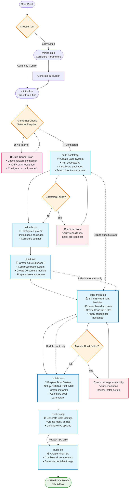

# Membangun MiniOS

Panduan ini membahas proses lengkap untuk membangun MiniOS, termasuk pembuatan sistem, pengembangan modul, dan opsi konfigurasi lanjutan.

## Ringkasan

MiniOS menggunakan sistem build modular di mana sistem operasi dibangun dari modul-modul individual dalam format SquashFS. Setiap modul berisi paket perangkat lunak atau komponen tertentu, dan dimuat secara berurutan untuk membentuk sistem yang lengkap.

## Memulai

### Prasyarat

- Versi terbaru Debian atau Ubuntu untuk proses build
- Ruang disk yang cukup (disarankan: minimal 20GB ruang kosong)
- Koneksi internet untuk mengunduh paket
- Paket yang diperlukan tercantum di `linux-live/prerequisites.list`

### Instalasi Prasyarat

File `prerequisites.list` menggunakan format condinapt dengan penanda kondisi. Instal paket yang diperlukan secara manual:

```bash
sudo apt-get update
sudo apt-get install sudo binutils debootstrap squashfs-tools xz-utils lz4 zstd xorriso mtools rsync curl
sudo apt-get install grub-efi-amd64-bin grub-pc-bin
```

Sebagai alternatif, Anda dapat menggunakan condinapt untuk memproses daftar prasyarat jika tersedia di sistem Anda.

## Alat Build

MiniOS menyediakan dua alat utama untuk proses build:

### minios-cmd (Direkomendasikan)

Utilitas command-line yang memudahkan konfigurasi dan inisiasi build. Alat ini menyediakan antarmuka yang ramah pengguna untuk mengatur berbagai parameter build:

- Distribusi target (buster, bookworm, trixie, dll.)
- Arsitektur (amd64, i386)
- Lingkungan desktop (core, flux, xfce, lxqt)
- Varian paket (minimum, standard, toolbox, ultra)
- Opsi kernel
- Pengaturan lokal dan zona waktu

**Penggunaan:**
```bash
# Build with default configuration
minios-cmd -d bookworm -a amd64 -de xfce -pv standard

# Build with custom options
minios-cmd -d bookworm -a amd64 -de xfce -pv toolbox -c zstd -l en_US -tz "Europe/Prague"
```

Untuk informasi penggunaan lebih detail, lihat [dokumentasi minios-cmd](https://github.com/minios-linux/minios-live/blob/master/docs/minios-cmd.md).

### minios-live (Lanjutan)

Skrip build inti yang mengatur proses build langkah demi langkah:

- Menyiapkan lingkungan build
- Menginstal sistem dasar
- Mengintegrasikan lingkungan desktop yang dipilih
- Membuat filesystem SquashFS
- Mengkonfigurasi proses boot
- Menghasilkan image ISO bootable

**Penggunaan:**
```bash
# Complete build
./minios-live -

# Specific stages
./minios-live build-bootstrap
./minios-live build-chroot - build-live
```

Untuk informasi penggunaan lebih detail, lihat [dokumentasi minios-live](https://github.com/minios-linux/minios-live/blob/master/docs/minios-live.md).

## Struktur Proyek

Sistem build MiniOS diorganisasikan sebagai berikut:

```plaintext
minios-live/
├── linux-live/                 # Core scripts and build libraries
│   ├── bootfiles/              # Files and templates for booting (GRUB, ISOLINUX, EFI, etc.)
│   ├── environments/           # Environment descriptions and settings
│   ├── initramfs/              # Scripts for creating initramfs
│   ├── scripts/                # Module scripts and templates
│   ├── build-initramfs         # Script for separate initramfs build
│   ├── build.conf              # Main build configuration file
│   ├── condinapt               # Script/tool for working with package lists
│   ├── install-chroot          # Script for installing into the chroot environment
│   ├── minioslib               # Core Bash function library
│   └── prerequisites.list      # List of required packages for installation on the host for building
├── tools/                      # Auxiliary build scripts
├── minios-cmd                  # CLI utility for setting build parameters
└── minios-live                 # Main script for building MiniOS
```

## Proses Build

Proses build mengikuti urutan tahapan yang terstruktur:



### Penjelasan Tahapan Build

1. **`build-bootstrap`** - Membuat sistem dasar minimal menggunakan debootstrap
2. **`build-chroot`** - Menginstal paket dan mengkonfigurasi sistem dalam lingkungan chroot
3. **`build-live`** - Membuat image SquashFS utama dengan sistem inti
4. **`build-modules`** - Membangun modul SquashFS tambahan untuk perangkat lunak ekstra
5. **`build-boot`** - Menyiapkan bootloader dan file kernel
6. **`build-config`** - Menghasilkan file konfigurasi boot
7. **`build-iso`** - Membuat image ISO bootable final

### Opsi Build

#### Build Sistem Lengkap

```bash
# Full automated build
./minios-live -
# or
./minios-live build-bootstrap - build-iso
```

#### Build Inkremental

```bash
# Run only bootstrap stage
./minios-live build-bootstrap

# Run from chroot to live stages
./minios-live build-chroot - build-live

# Run from modules to completion
./minios-live build-modules -

# Build only ISO from existing data
./minios-live build-iso
```

## Sistem Konfigurasi

### File Konfigurasi Build

#### Konfigurasi Utama: `linux-live/build.conf`

Ini adalah file konfigurasi utama yang menentukan:
- **Pengaturan distribusi**: Distribusi target (buster, bookworm, trixie, sid)
- **Arsitektur**: amd64, i386, i386-pae (khusus bookworm dan sebelumnya; trixie dan sid hanya mendukung amd64)
- **Lingkungan desktop**: core, flux, xfce, lxqt
- **Varian paket**: minimum, standard, toolbox, ultra
- **Kompresi**: xz, lzo, gz, lz4, zstd
- **Pengaturan kernel**: tipe, dukungan AUFS, kompilasi DKMS
- **Pengaturan lokal**: bahasa, zona waktu, layout keyboard

#### Konfigurasi Runtime: `minios_build.conf`

Dibuat secara otomatis selama proses build dan berisi pengaturan runtime khusus untuk lingkungan chroot.

### Varian Paket

MiniOS mendukung berbagai varian paket yang menentukan perangkat lunak apa saja yang disertakan:

- **minimum**: Hanya paket esensial
- **standard**: Aplikasi desktop standar
- **toolbox**: Alat pengembangan dan utilitas lanjutan
- **ultra**: Paket perangkat lunak lengkap dengan aplikasi tambahan

Pemilihan paket dikontrol menggunakan penanda kondisi di file `packages.list`:
```
# Install only in toolbox and ultra variants
firefox +pv=toolbox +pv=ultra

# Install only in minimum variant
basic-tool +pv=minimum
```

## Sistem Modul

### Struktur Modul

Sistem build menggunakan struktur modul bernomor yang terletak di `linux-live/scripts/`:

```
00-core/          # Base system packages
01-kernel/        # Linux kernel
02-firmware/      # Hardware firmware
03-gui-base/      # Basic GUI libraries
04-xfce-desktop/  # Desktop environment
05-apps/          # Desktop applications
10-example/       # Example module template
```

### Komponen Modul

Setiap direktori modul berisi:

- **`packages.list`**: Daftar paket yang akan diinstal dengan penanda kondisi
- **`install`**: Skrip Bash yang dijalankan saat build modul
- **`rootcopy-install/`**: File yang disalin ke sistem saat build
- **`rootcopy-postinstall/`**: File yang disalin setelah instalasi paket
- **`skip_conditions.conf`**: Kondisi untuk melewati build modul
- **`patches/`**: Patch yang diterapkan sebelum build (tidak tersedia untuk 00-core)

### Contoh Template Modul

Modul **`10-example/`** berfungsi sebagai template untuk membuat modul baru. Modul ini berisi:

- `packages.list` lengkap dengan contoh penanda kondisi
- Skrip `install` dasar yang menunjukkan penggunaan condinapt dengan benar
- Contoh direktori `rootcopy-install/` dan `rootcopy-postinstall/`
- Komentar dokumentasi yang menjelaskan setiap komponen

**Untuk membuat modul baru**: Salin direktori `10-example` dan modifikasi sesuai kebutuhan Anda:
```bash
cp -r linux-live/scripts/10-example linux-live/scripts/06-my-module
```

Template ini digunakan di seluruh dokumentasi ini dan merupakan titik awal terbaik untuk modul kustom.

### Pemuatan Modul Berdasarkan Lingkungan

Sistem modul bekerja melalui konfigurasi lingkungan di `linux-live/environments/`. Setiap direktori lingkungan berisi symbolic link ke modul-modul yang harus disertakan untuk lingkungan desktop dan varian paket tertentu.

#### Lingkungan yang Tersedia

```bash
linux-live/environments/
├── core/          # Core system (no desktop)
├── flux/          # Flux desktop environment
├── lxqt/          # LXQt desktop environment
├── xfce/          # XFCE desktop environment
└── xfce-debug/    # XFCE with debug modules
```

Setiap direktori lingkungan berisi symbolic link ke direktori modul di `linux-live/scripts/`:

```bash
# Example: XFCE environment
linux-live/environments/xfce/
├── 01-kernel -> ../../scripts/01-kernel
├── 02-firmware -> ../../scripts/02-firmware
├── 03-gui-base -> ../../scripts/03-gui-base
├── 04-xfce-desktop -> ../../scripts/04-xfce-desktop
├── 05-apps -> ../../scripts/05-apps
└── 06-firefox -> ../../scripts/10-firefox
```

#### Membangun Modul

Untuk membangun modul, gunakan perintah `build-modules`:

```bash
# Build all unbuilt modules for the current environment
./minios-live build-modules

# This will build all modules that:
# 1. Are linked in the current environment directory
# 2. Haven't been built yet
# 3. Meet the skip conditions (if any)
```

### Skrip Instalasi Modul

Skrip `install` di setiap modul:
- Melakukan source `/minioslib` untuk fungsi umum
- Melakukan source `/minios_build.conf` untuk konfigurasi build
- Menyiapkan pilihan debconf untuk konfigurasi paket otomatis
- Melakukan konfigurasi kustom dan modifikasi file
- Menggunakan warna konsol untuk format output

Contoh struktur:
```bash
#!/bin/bash
set -e          # exit on error
set -o pipefail # exit on pipeline error
set -u          # treat unset variable as error

. /minioslib
. /minios_build.conf

SCRIPT_DIR="$(dirname "$(readlink -f "$0")")"
console_colors

# Debconf pre-configurations
DEBCONF_SETTINGS=(
    "package-name package-name/option boolean true"
)

# Apply debconf settings
for SETTING in "${DEBCONF_SETTINGS[@]}"; do
    echo "${SETTING}" | debconf-set-selections -v
done

# Custom installation and configuration logic
# ...
```

## Manajemen Paket dengan CondinAPT

CondinAPT adalah sistem instalasi paket bersyarat milik MiniOS yang menangani pemilihan paket berdasarkan parameter build seperti lingkungan desktop, distribusi, dan varian paket.

### Penggunaan Dasar

Setiap modul berisi file `packages.list` dengan spesifikasi paket bersyarat:

```bash
# Basic syntax examples
package-name                    # Always install
package-name +pv=toolbox       # Install only for toolbox variant
package-name +de=xfce          # Install only for XFCE desktop
package-name -pv=minimum       # Install except for minimum variant
preferred-pkg || fallback-pkg  # Try first, use second if unavailable
```

### Menggunakan CondinAPT di Skrip Modul

Penggunaan standar pada skrip instalasi modul:

```bash
# Load MiniOS library and install packages
. /minioslib || exit 1
/linux-live/condinapt \
    -l "$CWD/packages.list" \
    -c /linux-live/build.conf \
    -m /linux-live/condinapt.map
```

### Dokumentasi Lengkap

Untuk dokumentasi CondinAPT yang komprehensif termasuk sintaks lanjutan, filter, priority queue, mode debugging, dan contoh nyata, lihat: **[CondinAPT.md](/development/CondinAPT.md)**

### Filter Kondisi Umum

- `+pv=variant` - Varian paket (minimum, standard, toolbox, ultra)
- `+d=distribution` - Distribusi (bookworm, trixie, jammy, noble)
- `+de=desktop` - Lingkungan desktop (core, flux, xfce, lxqt)
- `+da=architecture` - Arsitektur (amd64, i386)
- `+dt=type` - Tipe distribusi (debian, ubuntu)

## Membangun ISO Pertama Anda

### Mulai Cepat

1. **Clone repositori dan persiapkan:**
```bash
git clone https://github.com/minios-linux/minios-live.git
cd minios-live
```

2. **Instal prasyarat:**
```bash
sudo apt-get update
sudo apt-get install sudo binutils debootstrap squashfs-tools xz-utils lz4 zstd xorriso mtools rsync grub-efi-amd64-bin grub-pc-bin
```

3. **Build dengan minios-cmd (direkomendasikan):**
```bash
./minios-cmd -d bookworm -a amd64 -de xfce -pv standard
```

4. **Atau build dengan minios-live:**
```bash
./minios-live -
```

### Kustomisasi Build Anda

1. **Salin dan edit konfigurasi:**
```bash
cp linux-live/build.conf linux-live/build-custom.conf
# Edit build-custom.conf with your preferences
```

2. **Build dengan konfigurasi kustom:**
```bash
BUILD_CONF=linux-live/build-custom.conf ./minios-live -
```

## Kustomisasi Lanjutan

### Membuat Lingkungan Kustom

Anda dapat membuat lingkungan desktop baru sepenuhnya dengan membuat direktori lingkungan baru dan mengonfigurasi modul yang sesuai. Berikut cara membuat lingkungan GNOME sebagai contoh:

1. **Buat direktori lingkungan:**
```bash
mkdir -p linux-live/environments/gnome
```

2. **Buat modul desktop dasar (04-gnome-desktop):**
```bash
# Start with the example template for a clean base
cp -r linux-live/scripts/10-example linux-live/scripts/04-gnome-desktop

# Configure GNOME-specific packages
cat > linux-live/scripts/04-gnome-desktop/packages.list << EOF
# Base GNOME desktop packages
gdm3
gnome-shell
gnome-session
gnome-settings-daemon
gnome-control-center
nautilus
gnome-terminal

# Standard GNOME applications
gnome-calculator +pv=standard +pv=toolbox +pv=ultra
gnome-text-editor +pv=standard +pv=toolbox +pv=ultra
eog +pv=standard +pv=toolbox +pv=ultra
evince +pv=standard +pv=toolbox +pv=ultra

# Additional GNOME tools
gnome-tweaks +pv=toolbox +pv=ultra
gnome-extensions-app +pv=toolbox +pv=ultra
dconf-editor +pv=toolbox +pv=ultra
EOF

# Create a custom install script for GNOME-specific configuration
cat > linux-live/scripts/04-gnome-desktop/install << 'EOF'
#!/bin/bash
set -e
set -o pipefail
set -u

. /minioslib
. /minios_build.conf

SCRIPT_DIR="$(dirname "$(readlink -f "$0")")"

# Install packages using condinapt
/condinapt -l "${SCRIPT_DIR}/packages.list" -c "${SCRIPT_DIR}/minios_build.conf" -m "${SCRIPT_DIR}/condinapt.conf"
if [ $? -ne 0 ]; then
    echo "Failed to install packages."
    exit 1
fi

# Set GNOME as default session
echo 'gnome' > /etc/skel/.dmrc
echo '[Desktop]' > /etc/skel/.dmrc
echo 'Session=gnome' >> /etc/skel/.dmrc

EOF
chmod +x linux-live/scripts/04-gnome-desktop/install
```

3. **Buat modul aplikasi GNOME (05-gnome-apps):**
```bash
cp -r linux-live/scripts/10-example linux-live/scripts/05-gnome-apps

cat > linux-live/scripts/05-gnome-apps/packages.list << EOF
# GNOME Applications
gnome-software +pv=standard +pv=toolbox +pv=ultra
gnome-system-monitor +pv=standard +pv=toolbox +pv=ultra
gnome-disk-utility +pv=standard +pv=toolbox +pv=ultra
gnome-screenshot +pv=standard +pv=toolbox +pv=ultra
gnome-calendar +pv=toolbox +pv=ultra
gnome-weather +pv=toolbox +pv=ultra
gnome-maps +pv=ultra
rhythmbox +pv=toolbox +pv=ultra
totem +pv=toolbox +pv=ultra
EOF

# Create a custom install script for GNOME applications
cat > linux-live/scripts/05-gnome-apps/install << 'EOF'
#!/bin/bash
set -e
set -o pipefail
set -u

. /minioslib
. /minios_build.conf

SCRIPT_DIR="$(dirname "$(readlink -f "$0")")"

# Install packages using condinapt
/condinapt -l "${SCRIPT_DIR}/packages.list" -c "${SCRIPT_DIR}/minios_build.conf" -m "${SCRIPT_DIR}/condinapt.conf"
if [ $? -ne 0 ]; then
    echo "Failed to install packages."
    exit 1
fi

# Configure default applications for GNOME
mkdir -p /etc/skel/.config

# Set default applications
cat > /etc/skel/.config/mimeapps.list << 'MIME_EOF'
[Default Applications]
text/plain=gnome-text-editor.desktop
image/jpeg=eog.desktop
image/png=eog.desktop
application/pdf=evince.desktop
video/mp4=totem.desktop
audio/mpeg=rhythmbox.desktop
MIME_EOF

EOF
chmod +x linux-live/scripts/05-gnome-apps/install
```

4. **Link modul ke lingkungan GNOME:**
```bash
# Link base system modules (same for all environments)
ln -s ../../scripts/01-kernel linux-live/environments/gnome/01-kernel
ln -s ../../scripts/02-firmware linux-live/environments/gnome/02-firmware
ln -s ../../scripts/03-gui-base linux-live/environments/gnome/03-gui-base

# Link GNOME-specific modules
ln -s ../../scripts/04-gnome-desktop linux-live/environments/gnome/04-gnome-desktop
ln -s ../../scripts/05-gnome-apps linux-live/environments/gnome/05-gnome-apps

# Link additional modules as needed
ln -s ../../scripts/10-firefox linux-live/environments/gnome/06-firefox
```

5. **Konfigurasi build untuk lingkungan GNOME:**
```bash
# Copy and modify build configuration
cp linux-live/build.conf linux-live/build-gnome.conf
sed -i 's/DESKTOP_ENVIRONMENT=".*"/DESKTOP_ENVIRONMENT="gnome"/' linux-live/build-gnome.conf
sed -i 's/PACKAGE_VARIANT=".*"/PACKAGE_VARIANT="standard"/' linux-live/build-gnome.conf

# Build the GNOME system
BUILD_CONF=linux-live/build-gnome.conf ./minios-live -
```

### Praktik Terbaik Struktur Lingkungan

Saat membuat lingkungan kustom:

- **Modul dasar** (01-03): Biasanya sama untuk semua lingkungan
- **Modul desktop** (04): Berisi paket dan konfigurasi inti desktop environment
- **Modul aplikasi** (05): Aplikasi khusus desktop
- **Modul opsional** (06+): Paket perangkat lunak tambahan

**Konvensi penamaan modul:**
- Gunakan format `04-{desktop}-desktop` untuk modul desktop utama
- Gunakan `05-{desktop}-apps` atau `05-apps` untuk aplikasi
- Nomori modul tambahan secara berurutan (06, 07, 08, dst.)

**Pertimbangan konfigurasi:**
- Setiap lingkungan membutuhkan skip condition yang sesuai di modul
- Paket khusus desktop sebaiknya menggunakan kondisi `+de={environment}`
- Uji secara menyeluruh dengan berbagai varian paket (minimum, standard, toolbox, ultra)

### Menambahkan Modul Kustom

1. **Buat modul baru menggunakan template:**
```bash
cp -r linux-live/scripts/10-example linux-live/scripts/06-custom-module
```

2. **Edit packages.list:**
```bash
# Edit linux-live/scripts/06-custom-module/packages.list
# Add your packages with appropriate conditional markers
```

3. **Kustomisasi skrip install:**
```bash
# Edit linux-live/scripts/06-custom-module/install
# Add custom configuration and setup commands
```

4. **Link modul ke lingkungan Anda:**
```bash
ln -s ../../scripts/06-custom-module linux-live/environments/xfce/06-custom-module
```

5. **Build modul-modul:**
```bash
./minios-live build-modules
```

## Pemecahan Masalah

### Masalah Umum

1. **Build gagal dimulai - Koneksi internet diperlukan:**
   - **Masalah**: `minios-live` melakukan pengecekan koneksi internet secara wajib saat startup
   - **Solusi**: Pastikan koneksi internet stabil sebelum memulai build
   - **Cek**: Verifikasi resolusi DNS: `nslookup deb.debian.org`
   - **Proxy**: Konfigurasi pengaturan proxy jika berada di belakang firewall perusahaan
   - **Catatan**: Build tidak dapat dilanjutkan tanpa akses internet

2. **Build gagal saat bootstrap:**
   - Pastikan repository distribusi target tersedia
   - Pastikan prasyarat sudah terpasang
   - Tes: `wget -q --spider http://deb.debian.org`

3. **Error saat build modul:**
   - Cek ketersediaan paket di distribusi target
   - Verifikasi sintaks marker kondisional
   - Tinjau skrip instalasi untuk mencari error

4. **Paket hilang:**
   - Periksa kondisi condinapt
   - Verifikasi nama paket untuk distribusi target
   - Tinjau pengaturan varian paket

5. **Masalah booting:**
   - Periksa konfigurasi GRUB
   - Verifikasi pembuatan kernel dan initramfs
   - Tinjau file bootloader

### Mode Debug

Aktifkan output debug dengan mengatur tingkat verbosity pada konfigurasi build Anda:

**Opsi 1: Edit build.conf**
```bash
# Edit linux-live/build.conf and set:
VERBOSITY_LEVEL=2   # Very verbose output with detailed tracing
# or
VERBOSITY_LEVEL=1   # Verbose output (default)
# or
VERBOSITY_LEVEL=0   # Minimal output
```

**Opsi 2: Buat konfigurasi kustom dengan pengaturan debug**
```bash
cp linux-live/build.conf linux-live/build-debug.conf
sed -i 's/VERBOSITY_LEVEL=.*/VERBOSITY_LEVEL=2/' linux-live/build-debug.conf

# Enable additional debug options
sed -i 's/DEBUG_SSH_KEYS="false"/DEBUG_SSH_KEYS="true"/' linux-live/build-debug.conf
sed -i 's/DEBUG_SET_ROOT_PASSWORD="false"/DEBUG_SET_ROOT_PASSWORD="true"/' linux-live/build-debug.conf

# Build with debug configuration
BUILD_CONF=linux-live/build-debug.conf ./minios-live -
```

**Tingkat verbosity:**
- `0`: Output minimal - hanya pesan penting
- `1`: Output verbose - informasi build standar (default)
- `2`: Output sangat verbose - pelacakan detail dengan bash debugging aktif

### File Log

Log build disimpan di:
- `build/log/` - Log build umum

### Mendapatkan Bantuan

- Cek [wiki resmi](https://github.com/minios-linux/minios-live/wiki)
- Tinjau isu yang sudah ada di GitHub
- Bergabung dengan forum komunitas di [minios.dev](https://minios.dev)

## Dokumentasi Terkait

- **[Membuat Modul](/development/Creating-Modules.md)** - Pelajari cara membuat modul SquashFS kustom dengan software tambahan
- **[Membangun Ulang ISO](/development/Rebuilding-ISO.md)** - Kemasi ulang sistem live yang sedang berjalan menjadi ISO bootable menggunakan `sb2iso`
- **[CondinAPT](/development/CondinAPT.md)** - Pahami sistem manajemen paket kondisional yang digunakan dalam proses build
