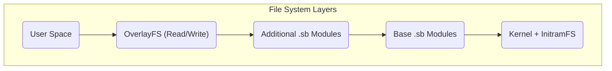

# Architettura di Sistema di MiniOS

Questo documento fornisce una panoramica tecnica dell’architettura di MiniOS. Spiega come i componenti del sistema interagiscono per creare una distribuzione Live Linux portatile.

## Panoramica

MiniOS si basa su un’architettura modulare che utilizza un file system multilivello e moduli SquashFS. Questa struttura garantisce flessibilità, portabilità e la possibilità di preservare i dati quando si lavora da supporti rimovibili.

## Componenti Principali

### 1. Sistema di Boot

- **Bootloader:** ISOLINUX/SYSLINUX per BIOS Legacy e GRUB per UEFI.
- **Processo di Avvio:** Il bootloader avvia il kernel e `initramfs`, che inizializzano l’hardware e montano i file system, dopodiché si avvia l’ambiente grafico.

### 2. Architettura del File System

Il sistema utilizza una struttura multilivello, dove ogni livello svolge una funzione specifica.



**Descrizione dei Livelli:**
1.  **Livello Boot:** Contiene il kernel Linux e `initramfs`.
2.  **Livello Base:** Il cuore di MiniOS sotto forma di moduli SquashFS compressi.
3.  **Livelli Modulo:** Software aggiuntivo sotto forma di file SquashFS separati.
4.  **Livello Overlay:** Permette di salvare le modifiche dell’utente.

### 3. Sistema Modulare

**Moduli SquashFS (.sb):**
- **01-kernel.sb:** Kernel Linux e driver.
- **02-firmware.sb:** Firmware per l’hardware.
- **03-gui-base.sb:** Componenti base dell’interfaccia grafica.
- **04-desktop.sb:** Ambiente desktop.
- **05-apps.sb:** Suite di applicazioni.

**Caricamento dei Moduli:**
- I moduli vengono caricati in base al loro numero progressivo.
- Ogni modulo viene montato come livello “sola lettura”.
- I moduli con numero più alto possono sovrascrivere file dei moduli con numero più basso.

## Architettura in Esecuzione

### Componenti del Sistema Live

- **`live-config`:** Responsabile della configurazione iniziale dell’hardware e della creazione dell’utente `live`.
- **Sistema di Persistenza:** Permette di salvare i dati tra una sessione e l’altra.

**Struttura di Archiviazione su Chiavetta USB:**
```text
/minios/
├── boot/      # Kernel and boot files
├── modules/   # SquashFS modules
└── changes/   # Storage for persistent data
```
