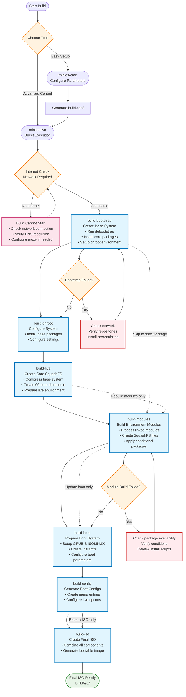

# Compilare MiniOS

Questa guida copre l'intero processo di compilazione di MiniOS, inclusa la creazione del sistema, lo sviluppo dei moduli e le opzioni avanzate di configurazione.

## Panoramica

MiniOS utilizza un sistema di build modulare in cui il sistema operativo viene costruito a partire da singoli moduli in formato SquashFS. Ogni modulo contiene specifici pacchetti software o componenti, che vengono caricati in ordine sequenziale per formare il sistema completo.

## Per iniziare

### Prerequisiti

- Ultima versione di Debian o Ubuntu per la compilazione
- Spazio su disco sufficiente (consigliato: almeno 20GB liberi)
- Connessione Internet per scaricare i pacchetti
- Pacchetti richiesti elencati in `linux-live/prerequisites.list`

### Installazione dei prerequisiti

Il file `prerequisites.list` utilizza il formato condinapt con marcatori condizionali. Installa manualmente i pacchetti richiesti:

```bash
sudo apt-get update
sudo apt-get install sudo binutils debootstrap squashfs-tools xz-utils lz4 zstd xorriso mtools rsync curl
sudo apt-get install grub-efi-amd64-bin grub-pc-bin
```

In alternativa, puoi utilizzare condinapt per processare la lista dei prerequisiti se disponibile sul tuo sistema.

## Strumenti di Build

MiniOS fornisce due strumenti principali per la compilazione:

### minios-cmd (Consigliato)

Un'utilità da riga di comando che semplifica la configurazione e l'avvio delle build. Offre un'interfaccia intuitiva per impostare vari parametri di build:

- Distribuzione di destinazione (buster, bookworm, trixie, ecc.)
- Architettura (amd64, i386)
- Ambiente desktop (core, flux, xfce, lxqt)
- Variante pacchetti (minimum, standard, toolbox, ultra)
- Fornitore kernel, serie kernel MiniOS, modalità payload e build DKMS opzionali
- Impostazioni di lingua e fuso orario

**Utilizzo:**
```bash
# Build with default configuration
minios-cmd -d bookworm -a amd64 -de xfce -pv standard

# Build with custom options
minios-cmd -d bookworm -a amd64 -de xfce -pv toolbox -c zstd -l en_US -tz "Europe/Prague"

# Build with the AUFS-enabled MiniOS kernel and optional DKMS drivers
minios-cmd -d bookworm -a amd64 -de xfce -pv standard -mk -dkms
```

Per informazioni dettagliate sull'utilizzo, consulta la [documentazione di minios-cmd](https://github.com/minios-linux/minios-live/blob/master/docs/minios-cmd.md).

### minios-live (Avanzato)

Lo script principale che orchestra il processo di build passo-passo:

- Configurazione dell'ambiente di compilazione
- Installazione del sistema base
- Integrazione dell'ambiente desktop scelto
- Creazione del filesystem SquashFS
- Configurazione del processo di avvio
- Generazione dell'immagine ISO avviabile

**Utilizzo:**
```bash
# Complete build
./minios-live -

# Specific stages
./minios-live build-bootstrap
./minios-live build-chroot - build-live
```

Per informazioni dettagliate sull'utilizzo, consulta la [documentazione di minios-live](https://github.com/minios-linux/minios-live/blob/master/docs/minios-live.md).

## Struttura del progetto

Il sistema di build di MiniOS è organizzato come segue:

```plaintext
minios-live/
├── linux-live/                 # Core scripts and build libraries
│   ├── bootfiles/              # Files and templates for booting (GRUB, ISOLINUX, EFI, etc.)
│   ├── environments/           # Environment descriptions and settings
│   ├── initramfs/              # Scripts for creating initramfs
│   ├── scripts/                # Module scripts and templates
│   ├── build-initramfs         # Script for separate initramfs build
│   ├── build.conf              # Main build configuration file
│   ├── condinapt               # Script/tool for working with package lists
│   ├── install-chroot          # Script for installing into the chroot environment
│   ├── minioslib               # Core Bash function library
│   └── prerequisites.list      # List of required packages for installation on the host for building
├── tools/                      # Auxiliary build scripts
├── minios-cmd                  # CLI utility for setting build parameters
└── minios-live                 # Main script for building MiniOS
```

## Processo di build

Il processo di build segue una sequenza strutturata di fasi:



### Spiegazione delle fasi di build

1. **`build-bootstrap`** - Crea il sistema base minimale utilizzando debootstrap
2. **`build-chroot`** - Installa i pacchetti e configura il sistema nell'ambiente chroot
3. **`build-live`** - Crea l'immagine principale SquashFS con il sistema core
4. **`build-modules`** - Costruisce moduli SquashFS aggiuntivi per software extra
5. **`build-boot`** - Prepara i file del bootloader e del kernel
6. **`build-config`** - Genera i file di configurazione di avvio
7. **`build-iso`** - Crea l'immagine ISO finale avviabile

### Opzioni di build

#### Build completa del sistema

```bash
# Full automated build
./minios-live -
# or
./minios-live build-bootstrap - build-iso
```

#### Build incrementali

```bash
# Run only bootstrap stage
./minios-live build-bootstrap

# Run from chroot to live stages
./minios-live build-chroot - build-live

# Run from modules to completion
./minios-live build-modules -

# Build only ISO from existing data
./minios-live build-iso
```

## Sistema di configurazione

### File di configurazione della build

#### Configurazione principale: `linux-live/build.conf`

Questo è il file di configurazione principale che definisce:
- **Impostazioni della distribuzione**: Distribuzione di destinazione (buster, bookworm, trixie, sid)
- **Architettura**: amd64, i386, i386-pae (solo per bookworm e versioni precedenti; trixie e sid supportano solo amd64)
- **Ambiente desktop**: core, flux, xfce, lxqt
- **Variante pacchetti**: minimum, standard, toolbox, ultra
- **Compressione**: xz, lzo, gz, lz4, zstd
- **Impostazioni kernel**: fornitore della distribuzione o MiniOS, serie MiniOS, payload runtime o completo, e compilazione DKMS opzionale
- **Impostazioni locali**: lingua, fuso orario, layout tastiera

#### Configurazione runtime: `minios_build.conf`

Generato automaticamente durante il processo di build e contiene impostazioni specifiche per l'ambiente chroot in fase di esecuzione.

AUFS è fornito da `KERNEL_PROVIDER=minios`; non è un'opzione kernel separata e attuale.
I kernel della distribuzione vengono acquisiti tramite una chiusura di pacchetti APT firmata e isolata. Se DKMS è abilitato, le intestazioni corrispondenti vengono acquisite insieme al kernel e utilizzate solo durante la compilazione dei moduli esterni. Consulta
[Comandi di build](/development/Build-Commands.md#kernel-selection) per le opzioni del frontend e le regole del payload.

### Varianti di pacchetto

MiniOS supporta diverse varianti di pacchetto che determinano quali software sono inclusi:

- **minimum**: Solo pacchetti essenziali
- **standard**: Applicazioni desktop standard
- **toolbox**: Strumenti di sviluppo e utility avanzate
- **ultra**: Suite software completa con applicazioni aggiuntive

La selezione dei pacchetti è controllata tramite marcatori condizionali nei file `packages.list`:
```
# Install only in toolbox and ultra variants
firefox +pv=toolbox +pv=ultra

# Install only in minimum variant
basic-tool +pv=minimum
```

## Sistema dei moduli

### Struttura dei moduli

Il sistema di build utilizza una struttura di moduli numerati situata in `linux-live/scripts/`:

```
00-core/          # Base system packages
01-kernel/        # Linux kernel
02-firmware/      # Hardware firmware
03-gui-base/      # Basic GUI libraries
04-xfce-desktop/  # Desktop environment
05-apps/          # Desktop applications
10-example/       # Example module template
```

### Componenti del modulo

Ogni directory di modulo contiene:

- **`packages.list`**: Elenco dei pacchetti da installare con marcatori condizionali
- **`install`**: Script Bash eseguito durante la build del modulo
- **`rootcopy-install/`**: File copiati nel sistema durante la build
- **`rootcopy-postinstall/`**: File copiati dopo l'installazione dei pacchetti
- **`.minios-ownership`**: Manifest opzionale di proprietà all'interno di una directory `rootcopy-*` per file che richiedono un proprietario non-root
- **`skip_conditions.conf`**: Condizioni per saltare la build del modulo
- **`patches/`**: Patch applicate prima della build (non disponibile per 00-core)

I file in `rootcopy-install/` e `rootcopy-postinstall/` vengono copiati come template di build. La proprietà dei file nel checkout host non viene mantenuta; normalmente i file diventano `root:root` nell'albero di destinazione. Se un file o una directory necessita di un proprietario non-root, crea `.minios-ownership` nella directory rootcopy corrispondente:

```text
owner:group relative/path
```

I percorsi sono relativi a quella directory rootcopy. I percorsi assoluti e quelli che contengono `../` vengono rifiutati. Il proprietario e il gruppo devono già esistere quando il manifest viene applicato. Se vengono creati da un pacchetto installato successivamente, usa `rootcopy-postinstall/` oppure imposta la proprietà in `install`/`postinstall`.

### Esempio di template modulo

Il modulo **`10-example/`** funge da template per la creazione di nuovi moduli. Contiene:

- Un file `packages.list` completo con esempi di marcatori condizionali
- Uno script di base `install` che mostra il corretto utilizzo di condinapt
- Esempi di directory `rootcopy-install/` e `rootcopy-postinstall/`
- Commenti di documentazione che spiegano ogni componente

**Per creare un nuovo modulo**: Copia la directory `10-example` e modificala secondo le tue esigenze:
```bash
cp -r linux-live/scripts/10-example linux-live/scripts/06-my-module
```

Questo template viene utilizzato in tutta la documentazione e rappresenta il miglior punto di partenza per moduli personalizzati.

### Caricamento moduli basato sull'ambiente

Il sistema dei moduli funziona tramite configurazioni di ambiente in `linux-live/environments/`. Ogni directory di ambiente contiene link simbolici ai moduli che devono essere inclusi per quello specifico ambiente desktop e variante di pacchetto.

#### Ambienti disponibili

```bash
linux-live/environments/
├── core/          # Core system (no desktop)
├── flux/          # Flux desktop environment
├── lxqt/          # LXQt desktop environment
├── xfce/          # XFCE desktop environment
└── xfce-debug/    # XFCE with debug modules
```

Ogni directory di ambiente contiene link simbolici alle directory dei moduli in `linux-live/scripts/`:

```bash
# Example: XFCE environment
linux-live/environments/xfce/
├── 01-kernel -> ../../scripts/01-kernel
├── 02-firmware -> ../../scripts/02-firmware
├── 03-gui-base -> ../../scripts/03-gui-base
├── 04-xfce-desktop -> ../../scripts/04-xfce-desktop
├── 05-apps -> ../../scripts/05-apps
└── 06-firefox -> ../../scripts/10-firefox
```

#### Build dei moduli

Per costruire i moduli, utilizza il comando `build-modules`:

```bash
# Build all unbuilt modules for the current environment
./minios-live build-modules

# This will build all modules that:
# 1. Are linked in the current environment directory
# 2. Haven't been built yet
# 3. Meet the skip conditions (if any)
```

### Script di installazione dei moduli

Lo script `install` in ogni modulo:
- Include `/minioslib` per le funzioni comuni
- Include `/minios_build.conf` per la configurazione della build
- Imposta le selezioni debconf per la configurazione automatica dei pacchetti
- Esegue configurazioni personalizzate e modifiche ai file
- Utilizza colori sulla console per formattare l'output

Struttura di esempio:
```bash
#!/bin/bash
set -e          # exit on error
set -o pipefail # exit on pipeline error
set -u          # treat unset variable as error

. /minioslib
. /minios_build.conf

SCRIPT_DIR="$(dirname "$(readlink -f "$0")")"
console_colors

# Debconf pre-configurations
DEBCONF_SETTINGS=(
    "package-name package-name/option boolean true"
)

# Apply debconf settings
for SETTING in "${DEBCONF_SETTINGS[@]}"; do
    echo "${SETTING}" | debconf-set-selections -v
done

# Custom installation and configuration logic
# ...
```

## Gestione dei pacchetti con CondinAPT

CondinAPT è il sistema di installazione condizionale dei pacchetti di MiniOS che gestisce la selezione dei pacchetti in base a parametri di build come ambiente desktop, distribuzione e variante di pacchetto.

### Utilizzo di base

Ogni modulo contiene un file `packages.list` con specifiche condizionali dei pacchetti:

```bash
# Basic syntax examples
package-name                    # Always install
package-name +pv=toolbox       # Install only for toolbox variant
package-name +de=xfce          # Install only for XFCE desktop
package-name -pv=minimum       # Install except for minimum variant
preferred-pkg || fallback-pkg  # Try first, use second if unavailable
```

### Utilizzo di CondinAPT negli script dei moduli

Utilizzo standard negli script di installazione dei moduli:

```bash
# Load MiniOS library and install packages
. /minioslib || exit 1
/linux-live/condinapt \
    -l "$CWD/packages.list" \
    -c /linux-live/build.conf \
    -m /linux-live/condinapt.map
```

### Documentazione completa

Per la documentazione completa di CondinAPT, inclusa sintassi avanzata, filtri, code di priorità, modalità di debug ed esempi reali, consulta: **[CondinAPT.md](/development/CondinAPT.md)**

### Filtri di condizione comuni

- `+pv=variant` - Variante pacchetti (minimum, standard, toolbox, ultra)
- `+d=distribution` - Distribuzione (bookworm, trixie, jammy, noble)
- `+de=desktop` - Ambiente desktop (core, flux, xfce, lxqt)
- `+da=architecture` - Architettura (amd64, i386)
- `+dp=profile` - Famiglia pacchetti (debian, ubuntu)

## Creare la tua prima ISO

### Guida rapida

1. **Clona il repository e prepara:**
```bash
git clone https://github.com/minios-linux/minios-live.git
cd minios-live
```

2. **Installa i prerequisiti:**
```bash
sudo apt-get update
sudo apt-get install sudo binutils debootstrap squashfs-tools xz-utils lz4 zstd xorriso mtools rsync grub-efi-amd64-bin grub-pc-bin
```

3. **Build con minios-cmd (consigliato):**
```bash
./minios-cmd -d bookworm -a amd64 -de xfce -pv standard
```

4. **Oppure build con minios-live:**
```bash
./minios-live -
```

### Personalizzazione della build

1. **Copia e modifica la configurazione:**
```bash
cp linux-live/build.conf linux-live/build-custom.conf
# Edit build-custom.conf with your preferences
```

2. **Build con configurazione personalizzata:**
```bash
BUILD_CONF=linux-live/build-custom.conf ./minios-live -
```

## Personalizzazione avanzata

### Creazione di ambienti personalizzati

Puoi creare nuovi ambienti desktop creando una nuova directory ambiente e configurando i moduli appropriati. Ecco come creare un ambiente GNOME come esempio:

1. **Crea la directory dell'ambiente:**
```bash
mkdir -p linux-live/environments/gnome
```

2. **Crea il modulo desktop base (04-gnome-desktop):**
```bash
# Start with the example template for a clean base
cp -r linux-live/scripts/10-example linux-live/scripts/04-gnome-desktop

# Configure GNOME-specific packages
cat > linux-live/scripts/04-gnome-desktop/packages.list << EOF
# Base GNOME desktop packages
gdm3
gnome-shell
gnome-session
gnome-settings-daemon
gnome-control-center
nautilus
gnome-terminal

# Standard GNOME applications
gnome-calculator +pv=standard +pv=toolbox +pv=ultra
gnome-text-editor +pv=standard +pv=toolbox +pv=ultra
eog +pv=standard +pv=toolbox +pv=ultra
evince +pv=standard +pv=toolbox +pv=ultra

# Additional GNOME tools
gnome-tweaks +pv=toolbox +pv=ultra
gnome-extensions-app +pv=toolbox +pv=ultra
dconf-editor +pv=toolbox +pv=ultra
EOF

# Create a custom install script for GNOME-specific configuration
cat > linux-live/scripts/04-gnome-desktop/install << 'EOF'
#!/bin/bash
set -e
set -o pipefail
set -u

. /minioslib
. /minios_build.conf

SCRIPT_DIR="$(dirname "$(readlink -f "$0")")"

# Install packages using condinapt
/condinapt -l "${SCRIPT_DIR}/packages.list" -c "${SCRIPT_DIR}/minios_build.conf" -m "${SCRIPT_DIR}/condinapt.conf"
if [ $? -ne 0 ]; then
    echo "Failed to install packages."
    exit 1
fi

# Set GNOME as default session
echo 'gnome' > /etc/skel/.dmrc
echo '[Desktop]' > /etc/skel/.dmrc
echo 'Session=gnome' >> /etc/skel/.dmrc

EOF
chmod +x linux-live/scripts/04-gnome-desktop/install
```

3. **Crea il modulo applicazioni GNOME (05-gnome-apps):**
```bash
cp -r linux-live/scripts/10-example linux-live/scripts/05-gnome-apps

cat > linux-live/scripts/05-gnome-apps/packages.list << EOF
# GNOME Applications
gnome-software +pv=standard +pv=toolbox +pv=ultra
gnome-system-monitor +pv=standard +pv=toolbox +pv=ultra
gnome-disk-utility +pv=standard +pv=toolbox +pv=ultra
gnome-screenshot +pv=standard +pv=toolbox +pv=ultra
gnome-calendar +pv=toolbox +pv=ultra
gnome-weather +pv=toolbox +pv=ultra
gnome-maps +pv=ultra
rhythmbox +pv=toolbox +pv=ultra
totem +pv=toolbox +pv=ultra
EOF

# Create a custom install script for GNOME applications
cat > linux-live/scripts/05-gnome-apps/install << 'EOF'
#!/bin/bash
set -e
set -o pipefail
set -u

. /minioslib
. /minios_build.conf

SCRIPT_DIR="$(dirname "$(readlink -f "$0")")"

# Install packages using condinapt
/condinapt -l "${SCRIPT_DIR}/packages.list" -c "${SCRIPT_DIR}/minios_build.conf" -m "${SCRIPT_DIR}/condinapt.conf"
if [ $? -ne 0 ]; then
    echo "Failed to install packages."
    exit 1
fi

# Configure default applications for GNOME
mkdir -p /etc/skel/.config

# Set default applications
cat > /etc/skel/.config/mimeapps.list << 'MIME_EOF'
[Default Applications]
text/plain=gnome-text-editor.desktop
image/jpeg=eog.desktop
image/png=eog.desktop
application/pdf=evince.desktop
video/mp4=totem.desktop
audio/mpeg=rhythmbox.desktop
MIME_EOF

EOF
chmod +x linux-live/scripts/05-gnome-apps/install
```

4. **Collega i moduli all'ambiente GNOME:**
```bash
# Link base system modules (same for all environments)
ln -s ../../scripts/01-kernel linux-live/environments/gnome/01-kernel
ln -s ../../scripts/02-firmware linux-live/environments/gnome/02-firmware
ln -s ../../scripts/03-gui-base linux-live/environments/gnome/03-gui-base

# Link GNOME-specific modules
ln -s ../../scripts/04-gnome-desktop linux-live/environments/gnome/04-gnome-desktop
ln -s ../../scripts/05-gnome-apps linux-live/environments/gnome/05-gnome-apps

# Link additional modules as needed
ln -s ../../scripts/10-firefox linux-live/environments/gnome/06-firefox
```

5. **Configura la build per l'ambiente GNOME:**
```bash
# Copy and modify build configuration
cp linux-live/build.conf linux-live/build-gnome.conf
sed -i 's/DESKTOP_ENVIRONMENT=".*"/DESKTOP_ENVIRONMENT="gnome"/' linux-live/build-gnome.conf
sed -i 's/PACKAGE_VARIANT=".*"/PACKAGE_VARIANT="standard"/' linux-live/build-gnome.conf

# Build the GNOME system
BUILD_CONF=linux-live/build-gnome.conf ./minios-live -
```

### Best practice per la struttura degli ambienti

Quando crei ambienti personalizzati:

- **Moduli base** (01-03): Di solito uguali per tutti gli ambienti
- **Modulo desktop** (04): Contiene i pacchetti e la configurazione core dell'ambiente desktop
- **Modulo apps** (05): Applicazioni specifiche dell'ambiente desktop
- **Moduli opzionali** (06+): Pacchetti software aggiuntivi

**Convenzione di denominazione dei moduli:**
- Usa il formato `04-{desktop}-desktop` per il modulo desktop principale
- Usa `05-{desktop}-apps` o `05-apps` per le applicazioni
- Numerare i moduli aggiuntivi in sequenza (06, 07, 08, ecc.)

**Considerazioni sulla configurazione:**
- Ogni ambiente necessita di condizioni di skip adeguate nei moduli
- I pacchetti specifici del desktop dovrebbero usare le condizioni `+de={environment}`
- Test approfonditi con le diverse varianti di pacchetto (minimum, standard, toolbox, ultra)

### Aggiunta di moduli personalizzati

1. **Crea un nuovo modulo utilizzando il template:**
```bash
cp -r linux-live/scripts/10-example linux-live/scripts/06-custom-module
```

2. **Modifica il packages.list:**
```bash
# Edit linux-live/scripts/06-custom-module/packages.list
# Add your packages with appropriate conditional markers
```

3. **Personalizza lo script di installazione:**
```bash
# Edit linux-live/scripts/06-custom-module/install
# Add custom configuration and setup commands
```

4. **Collega il modulo al tuo ambiente:**
```bash
ln -s ../../scripts/06-custom-module linux-live/environments/xfce/06-custom-module
```

5. **Costruisci i moduli:**
```bash
./minios-live build-modules
```

## Risoluzione dei problemi

### Problemi comuni

1. **La build non parte - Connessione Internet necessaria:**
   - **Problema**: `minios-live` esegue un controllo obbligatorio della connessione Internet all'avvio
   - **Soluzione**: Assicurati di avere una connessione Internet stabile prima di avviare la build
   - **Verifica**: Controlla la risoluzione DNS: `nslookup deb.debian.org`
   - **Proxy**: Configura le impostazioni proxy se sei dietro un firewall aziendale
   - **Nota**: La build non può procedere senza accesso a Internet

2. **La build fallisce durante il bootstrap:**
   - Verifica che i repository della distribuzione di destinazione siano disponibili
   - Assicurati che i prerequisiti siano installati
   - Test: `wget -q --spider http://deb.debian.org`

3. **Errori nella build dei moduli:**
   - Controlla la disponibilità dei pacchetti nella distribuzione di destinazione
   - Verifica la sintassi dei marcatori condizionali
   - Controlla lo script di installazione per eventuali errori

4. **Pacchetti mancanti:**
   - Controlla le condizioni di condinapt
   - Verifica i nomi dei pacchetti per la distribuzione di destinazione
   - Controlla le impostazioni della variante di pacchetto

5. **Problemi di avvio:**
   - Controlla la configurazione di GRUB
   - Verifica la generazione di kernel e initramfs
   - Controlla i file del bootloader

### Modalità debug

Abilita l'output di debug impostando il livello di verbosità nella configurazione della build:

**Opzione 1: Modifica build.conf**
```bash
# Edit linux-live/build.conf and set:
VERBOSITY_LEVEL=2   # Very verbose output with detailed tracing
# or
VERBOSITY_LEVEL=1   # Verbose output (default)
# or
VERBOSITY_LEVEL=0   # Minimal output
```

**Opzione 2: Crea una configurazione personalizzata con impostazioni di debug**
```bash
cp linux-live/build.conf linux-live/build-debug.conf
sed -i 's/VERBOSITY_LEVEL=.*/VERBOSITY_LEVEL=2/' linux-live/build-debug.conf

# Enable additional debug options
sed -i 's/DEBUG_SSH_KEYS="false"/DEBUG_SSH_KEYS="true"/' linux-live/build-debug.conf
sed -i 's/DEBUG_SET_ROOT_PASSWORD="false"/DEBUG_SET_ROOT_PASSWORD="true"/' linux-live/build-debug.conf

# Build with debug configuration
BUILD_CONF=linux-live/build-debug.conf ./minios-live -
```

**Livelli di verbosità:**
- `0`: Output minimo - solo messaggi essenziali
- `1`: Output verboso - informazioni standard sulla build (predefinito)
- `2`: Output molto dettagliato - tracciamento completo con debug bash abilitato

### File di log

I log della build sono salvati in:
- `build/log/` - Log generali della build

### Supporto e assistenza

- Consulta la [wiki ufficiale](https://github.com/minios-linux/minios-live/wiki)
- Controlla le issue esistenti su GitHub
- Partecipa ai forum della community su [minios.dev](https://minios.dev)

## Documentazione correlata

- **[Creazione dei moduli](/development/Creating-Modules.md)** - Scopri come creare moduli SquashFS personalizzati con software aggiuntivo
- **[Composizione delle immagini ISO](/development/Rebuilding-ISO.md)** - Remasterizza un sistema MiniOS esistente con `minios-image-compose`
- **[CondinAPT](/development/CondinAPT.md)** - Comprendi il sistema di gestione condizionale dei pacchetti utilizzato nelle build
