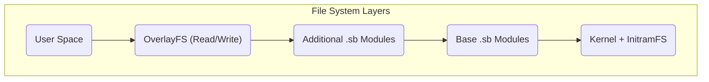

# Arquitetura do Sistema MiniOS

Este documento fornece uma visão técnica da arquitetura do MiniOS. Ele explica como os componentes do sistema interagem para criar uma distribuição Linux Live portátil.

## Visão Geral

O MiniOS é baseado em uma arquitetura modular que utiliza um sistema de arquivos em camadas e módulos SquashFS. Essa estrutura garante flexibilidade, portabilidade e a capacidade de preservar dados ao trabalhar a partir de mídias removíveis.

## Componentes Principais

### 1. Sistema de Boot

- **Bootloaders:** ISOLINUX/SYSLINUX para BIOS Legacy e GRUB para UEFI.
- **Processo de Boot:** O bootloader inicia o kernel e o `initramfs`, que inicializa o hardware e monta os sistemas de arquivos, após o que o ambiente gráfico é iniciado.

### 2. Arquitetura do Sistema de Arquivos

O sistema utiliza uma estrutura em múltiplas camadas, onde cada camada desempenha sua função.



**Descrição das Camadas:**
1.  **Camada de Boot:** Contém o kernel Linux e o `initramfs`.
2.  **Camada Base:** O núcleo do MiniOS em forma de módulos SquashFS compactados.
3.  **Camadas de Módulos:** Softwares adicionais em arquivos SquashFS separados.
4.  **Camada de Overlay:** Permite salvar alterações do usuário.

### 3. Sistema Modular

**Módulos SquashFS (.sb):**
- **01-kernel.sb:** Kernel Linux e drivers.
- **02-firmware.sb:** Firmware para hardware.
- **03-gui-base.sb:** Componentes básicos da interface gráfica.
- **04-desktop.sb:** Ambiente de desktop.
- **05-apps.sb:** Pacote de aplicativos.

**Carregamento dos Módulos:**
- Os módulos são carregados de acordo com sua numeração.
- Cada módulo é montado como uma camada "somente leitura".
- Módulos com numeração maior podem sobrescrever arquivos de módulos com numeração menor.

## Arquitetura em Tempo de Execução

### Componentes do Sistema Live

- **`live-config`:** Responsável pela configuração inicial do hardware e criação do usuário `live`.
- **Sistema de Persistência:** Permite salvar dados entre as sessões.

**Estrutura de Armazenamento no Pen Drive USB:**
```text
/minios/
├── boot/      # Kernel and boot files
├── modules/   # SquashFS modules
└── changes/   # Storage for persistent data
```
