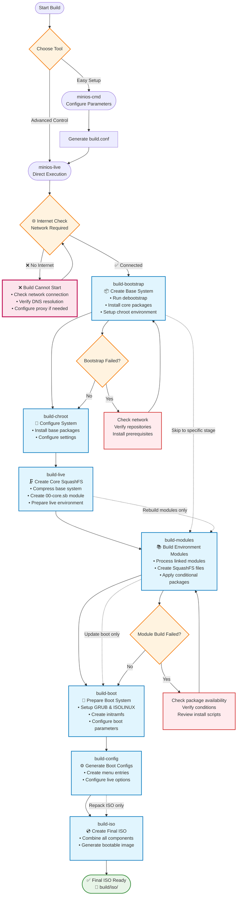

# Compilando o MiniOS

Este guia cobre todo o processo de compilação do MiniOS, incluindo a construção do sistema, desenvolvimento de módulos e opções avançadas de configuração.

## Visão Geral

O MiniOS utiliza um sistema de compilação modular, onde o sistema operacional é construído a partir de módulos individuais no formato SquashFS. Cada módulo contém pacotes ou componentes de software específicos e são carregados em ordem sequencial para formar o sistema completo.

## Primeiros Passos

### Pré-requisitos

- Versão mais recente do Debian ou Ubuntu para compilação
- Espaço em disco suficiente (recomendado: mais de 20GB livres)
- Conexão com a internet para baixar pacotes
- Pacotes necessários listados em `linux-live/prerequisites.list`

### Instalando os Pré-requisitos

O arquivo `prerequisites.list` utiliza o formato condinapt com marcadores condicionais. Instale os pacotes necessários manualmente:

```bash
sudo apt-get update
sudo apt-get install sudo binutils debootstrap squashfs-tools xz-utils lz4 zstd xorriso mtools rsync curl
sudo apt-get install grub-efi-amd64-bin grub-pc-bin
```

Alternativamente, você pode usar o condinapt para processar a lista de pré-requisitos, se disponível no seu sistema.

## Ferramentas de Compilação

O MiniOS oferece duas principais ferramentas para compilação:

### minios-cmd (Recomendado)

Uma ferramenta de linha de comando que simplifica a configuração e o início das compilações. Oferece uma interface amigável para definir vários parâmetros de compilação:

- Distribuição alvo (buster, bookworm, trixie, etc.)
- Arquitetura (amd64, i386)
- Ambiente desktop (core, flux, xfce, lxqt)
- Variante de pacotes (minimum, standard, toolbox, ultra)
- Opções do kernel
- Configurações de localidade e fuso horário

**Uso:**
```bash
# Build with default configuration
minios-cmd -d bookworm -a amd64 -de xfce -pv standard

# Build with custom options
minios-cmd -d bookworm -a amd64 -de xfce -pv toolbox -c zstd -l en_US -tz "Europe/Prague"
```

Para informações detalhadas de uso, consulte a [documentação do minios-cmd](https://github.com/minios-linux/minios-live/blob/master/docs/minios-cmd.md).

### minios-live (Avançado)

O script principal de compilação que orquestra o processo de construção passo a passo:

- Preparação do ambiente de compilação
- Instalação do sistema base
- Integração do ambiente desktop escolhido
- Criação do sistema de arquivos SquashFS
- Configuração do processo de boot
- Geração da imagem ISO inicializável

**Uso:**
```bash
# Complete build
./minios-live -

# Specific stages
./minios-live build-bootstrap
./minios-live build-chroot - build-live
```

Para informações detalhadas de uso, consulte a [documentação do minios-live](https://github.com/minios-linux/minios-live/blob/master/docs/minios-live.md).

## Estrutura do Projeto

O sistema de compilação do MiniOS está organizado da seguinte forma:

```plaintext
minios-live/
├── linux-live/                 # Core scripts and build libraries
│   ├── bootfiles/              # Files and templates for booting (GRUB, ISOLINUX, EFI, etc.)
│   ├── environments/           # Environment descriptions and settings
│   ├── initramfs/              # Scripts for creating initramfs
│   ├── scripts/                # Module scripts and templates
│   ├── build-initramfs         # Script for separate initramfs build
│   ├── build.conf              # Main build configuration file
│   ├── condinapt               # Script/tool for working with package lists
│   ├── install-chroot          # Script for installing into the chroot environment
│   ├── minioslib               # Core Bash function library
│   └── prerequisites.list      # List of required packages for installation on the host for building
├── tools/                      # Auxiliary build scripts
├── minios-cmd                  # CLI utility for setting build parameters
└── minios-live                 # Main script for building MiniOS
```

## Processo de Compilação

O processo de compilação segue uma sequência estruturada de etapas:



### Etapas da Compilação Explicadas

1. **`build-bootstrap`** - Cria o sistema base mínimo usando o debootstrap
2. **`build-chroot`** - Instala pacotes e configura o sistema no ambiente chroot
3. **`build-live`** - Cria a imagem principal SquashFS com o sistema principal
4. **`build-modules`** - Compila módulos SquashFS adicionais para softwares extras
5. **`build-boot`** - Prepara arquivos do bootloader e do kernel
6. **`build-config`** - Gera arquivos de configuração de boot
7. **`build-iso`** - Cria a imagem ISO inicializável final

### Opções de Compilação

#### Compilação Completa do Sistema

```bash
# Full automated build
./minios-live -
# or
./minios-live build-bootstrap - build-iso
```

#### Compilações Incrementais

```bash
# Run only bootstrap stage
./minios-live build-bootstrap

# Run from chroot to live stages
./minios-live build-chroot - build-live

# Run from modules to completion
./minios-live build-modules -

# Build only ISO from existing data
./minios-live build-iso
```

## Sistema de Configuração

### Arquivos de Configuração da Compilação

#### Configuração Principal: `linux-live/build.conf`

Este é o arquivo de configuração principal que define:
- **Configurações de distribuição**: Distribuição alvo (buster, bookworm, trixie, sid)
- **Arquitetura**: amd64, i386, i386-pae (apenas bookworm e anteriores; trixie e sid suportam apenas amd64)
- **Ambiente desktop**: core, flux, xfce, lxqt
- **Variante de pacotes**: minimum, standard, toolbox, ultra
- **Compressão**: xz, lzo, gz, lz4, zstd
- **Configurações do kernel**: tipo, suporte a AUFS, compilação DKMS
- **Configurações de localidade**: idioma, fuso horário, layout do teclado

#### Configuração de Execução: `minios_build.conf`

Gerado automaticamente durante o processo de compilação e contém configurações específicas de execução para o ambiente chroot.

### Variantes de Pacotes

O MiniOS suporta diferentes variantes de pacotes que determinam quais softwares são incluídos:

- **minimum**: Apenas pacotes essenciais
- **standard**: Aplicativos desktop padrão
- **toolbox**: Ferramentas de desenvolvimento e utilitários avançados
- **ultra**: Pacote completo de softwares com aplicativos adicionais

A seleção de pacotes é controlada usando marcadores condicionais nos arquivos `packages.list`:
```
# Install only in toolbox and ultra variants
firefox +pv=toolbox +pv=ultra

# Install only in minimum variant
basic-tool +pv=minimum
```

## Sistema de Módulos

### Estrutura dos Módulos

O sistema de compilação utiliza uma estrutura de módulos numerados localizada em `linux-live/scripts/`:

```
00-core/          # Base system packages
01-kernel/        # Linux kernel
02-firmware/      # Hardware firmware
03-gui-base/      # Basic GUI libraries
04-xfce-desktop/  # Desktop environment
05-apps/          # Desktop applications
10-example/       # Example module template
```

### Componentes do Módulo

Cada diretório de módulo contém:

- **`packages.list`**: Lista de pacotes para instalar com marcadores condicionais
- **`install`**: Script Bash executado durante a compilação do módulo
- **`rootcopy-install/`**: Arquivos copiados para o sistema durante a compilação
- **`rootcopy-postinstall/`**: Arquivos copiados após a instalação dos pacotes
- **`skip_conditions.conf`**: Condições para pular a compilação do módulo
- **`patches/`**: Patches aplicados antes da compilação (não disponível para o 00-core)

### Exemplo de Template de Módulo

O módulo **`10-example/`** serve como template para criação de novos módulos. Ele contém:

- Um `packages.list` completo com exemplos de marcadores condicionais
- Um script `install` básico mostrando o uso correto do condinapt
- Diretórios de exemplo `rootcopy-install/` e `rootcopy-postinstall/`
- Comentários de documentação explicando cada componente

**Para criar um novo módulo**: Copie o diretório `10-example` e modifique conforme suas necessidades:
```bash
cp -r linux-live/scripts/10-example linux-live/scripts/06-my-module
```

Este template é utilizado ao longo desta documentação e fornece o melhor ponto de partida para módulos personalizados.

### Carregamento de Módulos por Ambiente

O sistema de módulos funciona através de configurações de ambiente em `linux-live/environments/`. Cada diretório de ambiente contém links simbólicos para os módulos que devem ser incluídos para aquele ambiente desktop e variante de pacotes específicos.

#### Ambientes Disponíveis

```bash
linux-live/environments/
├── core/          # Core system (no desktop)
├── flux/          # Flux desktop environment
├── lxqt/          # LXQt desktop environment
├── xfce/          # XFCE desktop environment
└── xfce-debug/    # XFCE with debug modules
```

Cada diretório de ambiente contém links simbólicos para diretórios de módulos em `linux-live/scripts/`:

```bash
# Example: XFCE environment
linux-live/environments/xfce/
├── 01-kernel -> ../../scripts/01-kernel
├── 02-firmware -> ../../scripts/02-firmware
├── 03-gui-base -> ../../scripts/03-gui-base
├── 04-xfce-desktop -> ../../scripts/04-xfce-desktop
├── 05-apps -> ../../scripts/05-apps
└── 06-firefox -> ../../scripts/10-firefox
```

#### Compilando Módulos

Para compilar os módulos, utilize o comando `build-modules`:

```bash
# Build all unbuilt modules for the current environment
./minios-live build-modules

# This will build all modules that:
# 1. Are linked in the current environment directory
# 2. Haven't been built yet
# 3. Meet the skip conditions (if any)
```

### Scripts de Instalação dos Módulos

O script `install` de cada módulo:
- Faz o source de `/minioslib` para funções comuns
- Faz o source de `/minios_build.conf` para configuração da compilação
- Define seleções do debconf para configuração automatizada de pacotes
- Realiza configurações personalizadas e modificações de arquivos
- Utiliza cores no console para formatação da saída

Exemplo de estrutura:
```bash
#!/bin/bash
set -e          # exit on error
set -o pipefail # exit on pipeline error
set -u          # treat unset variable as error

. /minioslib
. /minios_build.conf

SCRIPT_DIR="$(dirname "$(readlink -f "$0")")"
console_colors

# Debconf pre-configurations
DEBCONF_SETTINGS=(
    "package-name package-name/option boolean true"
)

# Apply debconf settings
for SETTING in "${DEBCONF_SETTINGS[@]}"; do
    echo "${SETTING}" | debconf-set-selections -v
done

# Custom installation and configuration logic
# ...
```

## Gerenciamento de Pacotes com CondinAPT

O CondinAPT é o sistema de instalação condicional de pacotes do MiniOS, que gerencia a seleção de pacotes com base em parâmetros de compilação como ambiente desktop, distribuição e variante de pacotes.

### Uso Básico

Cada módulo contém um arquivo `packages.list` com especificações condicionais de pacotes:

```bash
# Basic syntax examples
package-name                    # Always install
package-name +pv=toolbox       # Install only for toolbox variant
package-name +de=xfce          # Install only for XFCE desktop
package-name -pv=minimum       # Install except for minimum variant
preferred-pkg || fallback-pkg  # Try first, use second if unavailable
```

### Usando o CondinAPT em Scripts de Módulo

Uso padrão em scripts de instalação de módulos:

```bash
# Load MiniOS library and install packages
. /minioslib || exit 1
/linux-live/condinapt \
    -l "$CWD/packages.list" \
    -c /linux-live/build.conf \
    -m /linux-live/condinapt.map
```

### Documentação Completa

Para uma documentação completa do CondinAPT, incluindo sintaxe avançada, filtros, filas de prioridade, modos de depuração e exemplos reais, consulte: **[CondinAPT.md](/development/CondinAPT.md)**

### Filtros de Condição Comuns

- `+pv=variant` - Variante de pacotes (minimum, standard, toolbox, ultra)
- `+d=distribution` - Distribuição (bookworm, trixie, jammy, noble)
- `+de=desktop` - Ambiente desktop (core, flux, xfce, lxqt)
- `+da=architecture` - Arquitetura (amd64, i386)
- `+dt=type` - Tipo de distribuição (debian, ubuntu)

## Construindo Sua Primeira ISO

### Início Rápido

1. **Clone o repositório e prepare:**
```bash
git clone https://github.com/minios-linux/minios-live.git
cd minios-live
```

2. **Instale os pré-requisitos:**
```bash
sudo apt-get update
sudo apt-get install sudo binutils debootstrap squashfs-tools xz-utils lz4 zstd xorriso mtools rsync grub-efi-amd64-bin grub-pc-bin
```

3. **Compile com minios-cmd (recomendado):**
```bash
./minios-cmd -d bookworm -a amd64 -de xfce -pv standard
```

4. **Ou compile com minios-live:**
```bash
./minios-live -
```

### Personalizando Sua Compilação

1. **Copie e edite a configuração:**
```bash
cp linux-live/build.conf linux-live/build-custom.conf
# Edit build-custom.conf with your preferences
```

2. **Compile com a configuração personalizada:**
```bash
BUILD_CONF=linux-live/build-custom.conf ./minios-live -
```

## Customização Avançada

### Criando Ambientes Personalizados

Você pode criar ambientes desktop totalmente novos criando um novo diretório de ambiente e configurando os módulos apropriados. Veja como criar um ambiente GNOME como exemplo:

1. **Crie o diretório do ambiente:**
```bash
mkdir -p linux-live/environments/gnome
```

2. **Crie o módulo base do desktop (04-gnome-desktop):**
```bash
# Start with the example template for a clean base
cp -r linux-live/scripts/10-example linux-live/scripts/04-gnome-desktop

# Configure GNOME-specific packages
cat > linux-live/scripts/04-gnome-desktop/packages.list << EOF
# Base GNOME desktop packages
gdm3
gnome-shell
gnome-session
gnome-settings-daemon
gnome-control-center
nautilus
gnome-terminal

# Standard GNOME applications
gnome-calculator +pv=standard +pv=toolbox +pv=ultra
gnome-text-editor +pv=standard +pv=toolbox +pv=ultra
eog +pv=standard +pv=toolbox +pv=ultra
evince +pv=standard +pv=toolbox +pv=ultra

# Additional GNOME tools
gnome-tweaks +pv=toolbox +pv=ultra
gnome-extensions-app +pv=toolbox +pv=ultra
dconf-editor +pv=toolbox +pv=ultra
EOF

# Create a custom install script for GNOME-specific configuration
cat > linux-live/scripts/04-gnome-desktop/install << 'EOF'
#!/bin/bash
set -e
set -o pipefail
set -u

. /minioslib
. /minios_build.conf

SCRIPT_DIR="$(dirname "$(readlink -f "$0")")"

# Install packages using condinapt
/condinapt -l "${SCRIPT_DIR}/packages.list" -c "${SCRIPT_DIR}/minios_build.conf" -m "${SCRIPT_DIR}/condinapt.conf"
if [ $? -ne 0 ]; then
    echo "Failed to install packages."
    exit 1
fi

# Set GNOME as default session
echo 'gnome' > /etc/skel/.dmrc
echo '[Desktop]' > /etc/skel/.dmrc
echo 'Session=gnome' >> /etc/skel/.dmrc

EOF
chmod +x linux-live/scripts/04-gnome-desktop/install
```

3. **Crie o módulo de aplicativos GNOME (05-gnome-apps):**
```bash
cp -r linux-live/scripts/10-example linux-live/scripts/05-gnome-apps

cat > linux-live/scripts/05-gnome-apps/packages.list << EOF
# GNOME Applications
gnome-software +pv=standard +pv=toolbox +pv=ultra
gnome-system-monitor +pv=standard +pv=toolbox +pv=ultra
gnome-disk-utility +pv=standard +pv=toolbox +pv=ultra
gnome-screenshot +pv=standard +pv=toolbox +pv=ultra
gnome-calendar +pv=toolbox +pv=ultra
gnome-weather +pv=toolbox +pv=ultra
gnome-maps +pv=ultra
rhythmbox +pv=toolbox +pv=ultra
totem +pv=toolbox +pv=ultra
EOF

# Create a custom install script for GNOME applications
cat > linux-live/scripts/05-gnome-apps/install << 'EOF'
#!/bin/bash
set -e
set -o pipefail
set -u

. /minioslib
. /minios_build.conf

SCRIPT_DIR="$(dirname "$(readlink -f "$0")")"

# Install packages using condinapt
/condinapt -l "${SCRIPT_DIR}/packages.list" -c "${SCRIPT_DIR}/minios_build.conf" -m "${SCRIPT_DIR}/condinapt.conf"
if [ $? -ne 0 ]; then
    echo "Failed to install packages."
    exit 1
fi

# Configure default applications for GNOME
mkdir -p /etc/skel/.config

# Set default applications
cat > /etc/skel/.config/mimeapps.list << 'MIME_EOF'
[Default Applications]
text/plain=gnome-text-editor.desktop
image/jpeg=eog.desktop
image/png=eog.desktop
application/pdf=evince.desktop
video/mp4=totem.desktop
audio/mpeg=rhythmbox.desktop
MIME_EOF

EOF
chmod +x linux-live/scripts/05-gnome-apps/install
```

4. **Vincule os módulos ao ambiente GNOME:**
```bash
# Link base system modules (same for all environments)
ln -s ../../scripts/01-kernel linux-live/environments/gnome/01-kernel
ln -s ../../scripts/02-firmware linux-live/environments/gnome/02-firmware
ln -s ../../scripts/03-gui-base linux-live/environments/gnome/03-gui-base

# Link GNOME-specific modules
ln -s ../../scripts/04-gnome-desktop linux-live/environments/gnome/04-gnome-desktop
ln -s ../../scripts/05-gnome-apps linux-live/environments/gnome/05-gnome-apps

# Link additional modules as needed
ln -s ../../scripts/10-firefox linux-live/environments/gnome/06-firefox
```

5. **Configure a compilação para o ambiente GNOME:**
```bash
# Copy and modify build configuration
cp linux-live/build.conf linux-live/build-gnome.conf
sed -i 's/DESKTOP_ENVIRONMENT=".*"/DESKTOP_ENVIRONMENT="gnome"/' linux-live/build-gnome.conf
sed -i 's/PACKAGE_VARIANT=".*"/PACKAGE_VARIANT="standard"/' linux-live/build-gnome.conf

# Build the GNOME system
BUILD_CONF=linux-live/build-gnome.conf ./minios-live -
```

### Melhores Práticas para Estrutura de Ambientes

Ao criar ambientes personalizados:

- **Módulos base** (01-03): Normalmente os mesmos para todos os ambientes
- **Módulo desktop** (04): Contém os pacotes e configurações principais do ambiente desktop
- **Módulo de aplicativos** (05): Aplicativos específicos do desktop
- **Módulos opcionais** (06+): Pacotes de softwares adicionais

**Convenção de nomes de módulos:**
- Use o formato `04-{desktop}-desktop` para o módulo principal do desktop
- Use `05-{desktop}-apps` ou `05-apps` para aplicativos
- Numere módulos adicionais sequencialmente (06, 07, 08, etc.)

**Considerações de configuração:**
- Cada ambiente precisa de condições de pulo apropriadas nos módulos
- Pacotes específicos do desktop devem usar condições `+de={environment}`
- Teste cuidadosamente com diferentes variantes de pacotes (minimum, standard, toolbox, ultra)

### Adicionando Módulos Personalizados

1. **Crie um novo módulo usando o template:**
```bash
cp -r linux-live/scripts/10-example linux-live/scripts/06-custom-module
```

2. **Edite o packages.list:**
```bash
# Edit linux-live/scripts/06-custom-module/packages.list
# Add your packages with appropriate conditional markers
```

3. **Personalize o script de instalação:**
```bash
# Edit linux-live/scripts/06-custom-module/install
# Add custom configuration and setup commands
```

4. **Vincule o módulo ao seu ambiente:**
```bash
ln -s ../../scripts/06-custom-module linux-live/environments/xfce/06-custom-module
```

5. **Compile os módulos:**
```bash
./minios-live build-modules
```

## Solução de Problemas

### Problemas Comuns

1. **Falha ao iniciar a build - Conexão com a internet obrigatória:**
   - **Problema**: O `minios-live` realiza uma verificação obrigatória de conexão com a internet ao iniciar
   - **Solução**: Garanta uma conexão estável com a internet antes de iniciar a build
   - **Verificação**: Teste a resolução de DNS: `nslookup deb.debian.org`
   - **Proxy**: Configure as definições de proxy se estiver atrás de um firewall corporativo
   - **Observação**: A build não pode prosseguir sem acesso à internet

2. **Falha na build durante o bootstrap:**
   - Verifique se os repositórios da distribuição de destino estão disponíveis
   - Certifique-se de que as dependências estão instaladas
   - Teste: `wget -q --spider http://deb.debian.org`

3. **Erros na build de módulos:**
   - Verifique a disponibilidade do pacote na distribuição de destino
   - Confirme a sintaxe dos marcadores condicionais
   - Revise o script de instalação para identificar erros

4. **Pacotes ausentes:**
   - Verifique as condições do condinapt
   - Confirme os nomes dos pacotes para a distribuição de destino
   - Revise as configurações de variantes de pacotes

5. **Problemas de boot:**
   - Verifique a configuração do GRUB
   - Confirme a geração do kernel e do initramfs
   - Revise os arquivos do bootloader

### Modo de Depuração

Ative a saída de depuração ajustando o nível de verbosidade na configuração da sua build:

**Opção 1: Edite o build.conf**
```bash
# Edit linux-live/build.conf and set:
VERBOSITY_LEVEL=2   # Very verbose output with detailed tracing
# or
VERBOSITY_LEVEL=1   # Verbose output (default)
# or
VERBOSITY_LEVEL=0   # Minimal output
```

**Opção 2: Crie uma configuração personalizada com definições de depuração**
```bash
cp linux-live/build.conf linux-live/build-debug.conf
sed -i 's/VERBOSITY_LEVEL=.*/VERBOSITY_LEVEL=2/' linux-live/build-debug.conf

# Enable additional debug options
sed -i 's/DEBUG_SSH_KEYS="false"/DEBUG_SSH_KEYS="true"/' linux-live/build-debug.conf
sed -i 's/DEBUG_SET_ROOT_PASSWORD="false"/DEBUG_SET_ROOT_PASSWORD="true"/' linux-live/build-debug.conf

# Build with debug configuration
BUILD_CONF=linux-live/build-debug.conf ./minios-live -
```

**Níveis de verbosidade:**
- `0`: Saída mínima - apenas mensagens essenciais
- `1`: Saída detalhada - informações padrão da build (padrão)
- `2`: Saída muito detalhada - rastreamento completo com depuração bash ativada

### Arquivos de Log

Os logs da build são armazenados em:
- `build/log/` - Logs gerais da build

### Obtendo Ajuda

- Consulte o [wiki oficial](https://github.com/minios-linux/minios-live/wiki)
- Revise os issues existentes no GitHub
- Participe dos fóruns da comunidade em [minios.dev](https://minios.dev)

## Documentação Relacionada

- **[Criando Módulos](/development/Creating-Modules.md)** - Aprenda a criar módulos SquashFS personalizados com softwares adicionais
- **[Reconstruindo ISO](/development/Rebuilding-ISO.md)** - Reempacote seu sistema live em execução em uma ISO inicializável usando o `sb2iso`
- **[CondinAPT](/development/CondinAPT.md)** - Entenda o sistema de gerenciamento condicional de pacotes utilizado nas builds
