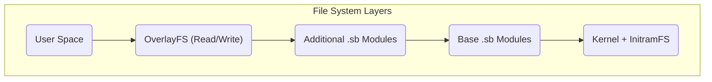

# Архитектура системы MiniOS

В этом документе представлен технический обзор архитектуры MiniOS. Описывается, как взаимодействуют системные компоненты для создания переносимого Live-дистрибутива Linux.

## Обзор

MiniOS построен на модульной архитектуре с использованием многоуровневой файловой системы и модулей SquashFS. Такая структура обеспечивает гибкость, портативность и возможность сохранять данные при работе с переносимых носителей.

## Ключевые компоненты

### 1. Система загрузки

- **Загрузчики:** ISOLINUX/SYSLINUX для Legacy BIOS и GRUB для UEFI.
- **Процесс загрузки:** Загрузчик запускает ядро и `initramfs`, которые инициализируют оборудование и монтируют файловые системы, после чего стартует графическая среда.

### 2. Архитектура файловой системы

Система использует многоуровневую структуру, где каждый уровень выполняет свою функцию.



**Описание уровней:**
1.  **Загрузочный уровень:** Содержит ядро Linux и `initramfs`.
2.  **Базовый уровень:** Ядро MiniOS в виде сжатых модулей SquashFS.
3.  **Модули:** Дополнительное ПО в виде отдельных файлов SquashFS.
4.  **Overlay-уровень:** Позволяет сохранять изменения пользователя.

### 3. Модульная система

**Модули SquashFS (.sb):**
- **01-kernel.sb:** Ядро Linux и драйверы.
- **02-firmware.sb:** Прошивки для оборудования.
- **03-gui-base.sb:** Базовые компоненты графического интерфейса.
- **04-desktop.sb:** Окружение рабочего стола.
- **05-apps.sb:** Набор приложений.

**Загрузка модулей:**
- Модули загружаются в порядке их нумерации.
- Каждый модуль монтируется как слой "только для чтения".
- Модули с большим номером могут переопределять файлы из модулей с меньшим номером.

## Архитектура выполнения

### Компоненты Live-системы

- **`live-config`:** Отвечает за начальную настройку оборудования и создание пользователя `live`.
- **Система сохранения данных:** Позволяет сохранять данные между сессиями.

**Структура хранения на USB-накопителе:**
```text
/minios/
├── boot/      # Kernel and boot files
├── modules/   # SquashFS modules
└── changes/   # Storage for persistent data
```
