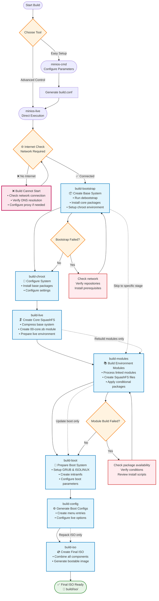

# Сборка MiniOS

В этом руководстве описан полный процесс сборки MiniOS, включая сборку системы, разработку модулей и расширенные параметры конфигурации.

## Обзор

MiniOS использует модульную систему сборки, где операционная система формируется из отдельных модулей в формате SquashFS. Каждый модуль содержит определённые программные пакеты или компоненты, которые загружаются поочерёдно для создания полной системы.

## Начало работы

### Требования

- Последняя версия Debian или Ubuntu для сборки
- Достаточно места на диске (рекомендуется: 20ГБ+ свободного пространства)
- Интернет-соединение для загрузки пакетов
- Необходимые пакеты перечислены в `linux-live/prerequisites.list`

### Установка зависимостей

Файл `prerequisites.list` использует формат condinapt с условными маркерами. Установите необходимые пакеты вручную:

```bash
sudo apt-get update
sudo apt-get install sudo binutils debootstrap squashfs-tools xz-utils lz4 zstd xorriso mtools rsync curl
sudo apt-get install grub-efi-amd64-bin grub-pc-bin
```

Либо используйте condinapt для обработки списка зависимостей, если он доступен в вашей системе.

## Инструменты сборки

MiniOS предоставляет два основных инструмента для сборки:

### minios-cmd (рекомендуется)

Утилита командной строки, упрощающая настройку и запуск сборки. Предлагает удобный интерфейс для задания различных параметров:

- Целевая дистрибуция (buster, bookworm, trixie и др.)
- Архитектура (amd64, i386)
- Окружение рабочего стола (core, flux, xfce, lxqt)
- Вариант пакетов (minimum, standard, toolbox, ultra)
- Параметры ядра
- Настройки локали и часового пояса

**Использование:**
```bash
# Build with default configuration
minios-cmd -d bookworm -a amd64 -de xfce -pv standard

# Build with custom options
minios-cmd -d bookworm -a amd64 -de xfce -pv toolbox -c zstd -l en_US -tz "Europe/Prague"
```

Подробную информацию смотрите в [документации minios-cmd](https://github.com/minios-linux/minios-live/blob/master/docs/minios-cmd.md).

### minios-live (для продвинутых пользователей)

Основной скрипт сборки, который организует пошаговый процесс:

- Подготовка среды сборки
- Установка базовой системы
- Интеграция выбранного окружения рабочего стола
- Создание файловой системы SquashFS
- Настройка процесса загрузки
- Генерация загрузочного ISO-образа

**Использование:**
```bash
# Complete build
./minios-live -

# Specific stages
./minios-live build-bootstrap
./minios-live build-chroot - build-live
```

Подробную информацию смотрите в [документации minios-live](https://github.com/minios-linux/minios-live/blob/master/docs/minios-live.md).

## Структура проекта

Система сборки MiniOS организована следующим образом:

```plaintext
minios-live/
├── linux-live/                 # Core scripts and build libraries
│   ├── bootfiles/              # Files and templates for booting (GRUB, ISOLINUX, EFI, etc.)
│   ├── environments/           # Environment descriptions and settings
│   ├── initramfs/              # Scripts for creating initramfs
│   ├── scripts/                # Module scripts and templates
│   ├── build-initramfs         # Script for separate initramfs build
│   ├── build.conf              # Main build configuration file
│   ├── condinapt               # Script/tool for working with package lists
│   ├── install-chroot          # Script for installing into the chroot environment
│   ├── minioslib               # Core Bash function library
│   └── prerequisites.list      # List of required packages for installation on the host for building
├── tools/                      # Auxiliary build scripts
├── minios-cmd                  # CLI utility for setting build parameters
└── minios-live                 # Main script for building MiniOS
```

## Процесс сборки

Процесс сборки выполняется в определённой последовательности этапов:



### Описание этапов сборки

1. **`build-bootstrap`** — создание минимальной базовой системы с помощью debootstrap
2. **`build-chroot`** — установка пакетов и настройка системы в chroot-окружении
3. **`build-live`** — создание основного образа SquashFS с ядром системы
4. **`build-modules`** — сборка дополнительных модулей SquashFS для дополнительного ПО
5. **`build-boot`** — подготовка файлов загрузчика и ядра
6. **`build-config`** — генерация файлов конфигурации загрузки
7. **`build-iso`** — создание финального загрузочного ISO-образа

### Параметры сборки

#### Полная сборка системы

```bash
# Full automated build
./minios-live -
# or
./minios-live build-bootstrap - build-iso
```

#### Инкрементальная сборка

```bash
# Run only bootstrap stage
./minios-live build-bootstrap

# Run from chroot to live stages
./minios-live build-chroot - build-live

# Run from modules to completion
./minios-live build-modules -

# Build only ISO from existing data
./minios-live build-iso
```

## Система конфигурации

### Файлы конфигурации сборки

#### Основная конфигурация: `linux-live/build.conf`

Это основной конфигурационный файл, который определяет:
- **Настройки дистрибуции**: целевая дистрибуция (buster, bookworm, trixie, sid)
- **Архитектура**: amd64, i386, i386-pae (только для bookworm и ниже; trixie и sid поддерживают только amd64)
- **Окружение рабочего стола**: core, flux, xfce, lxqt
- **Вариант пакетов**: minimum, standard, toolbox, ultra
- **Сжатие**: xz, lzo, gz, lz4, zstd
- **Параметры ядра**: тип, поддержка AUFS, компиляция DKMS
- **Настройки локали**: язык, часовой пояс, раскладка клавиатуры

#### Конфигурация во время сборки: `minios_build.conf`

Генерируется автоматически в процессе сборки и содержит параметры, специфичные для среды chroot.

### Варианты пакетов

MiniOS поддерживает разные варианты пакетов, определяющие, какое ПО будет включено:

- **minimum**: только необходимые пакеты
- **standard**: стандартные приложения рабочего стола
- **toolbox**: инструменты для разработки и расширенные утилиты
- **ultra**: полный набор программ с дополнительными приложениями

Выбор пакетов управляется с помощью условных маркеров в файлах `packages.list`:
```
# Install only in toolbox and ultra variants
firefox +pv=toolbox +pv=ultra

# Install only in minimum variant
basic-tool +pv=minimum
```

## Система модулей

### Структура модулей

Система сборки использует пронумерованную структуру модулей, расположенных в `linux-live/scripts/`:

```
00-core/          # Base system packages
01-kernel/        # Linux kernel
02-firmware/      # Hardware firmware
03-gui-base/      # Basic GUI libraries
04-xfce-desktop/  # Desktop environment
05-apps/          # Desktop applications
10-example/       # Example module template
```

### Компоненты модуля

Каждая директория модуля содержит:

- **`packages.list`**: список пакетов для установки с условными маркерами
- **`install`**: bash-скрипт, выполняемый при сборке модуля
- **`rootcopy-install/`**: файлы, копируемые в систему во время сборки
- **`rootcopy-postinstall/`**: файлы, копируемые после установки пакетов
- **`skip_conditions.conf`**: условия для пропуска сборки модуля
- **`patches/`**: патчи, применяемые до сборки (недоступно для 00-core)

### Пример шаблона модуля

Модуль **`10-example/`** служит шаблоном для создания новых модулей. Он содержит:

- Полный `packages.list` с примерами условных маркеров
- Базовый скрипт `install`, демонстрирующий правильное использование condinapt
- Примеры директорий `rootcopy-install/` и `rootcopy-postinstall/`
- Комментарии с документацией по каждому компоненту

**Для создания нового модуля**: скопируйте директорию `10-example` и измените её под свои задачи:
```bash
cp -r linux-live/scripts/10-example linux-live/scripts/06-my-module
```

Этот шаблон используется на протяжении всей документации и является лучшей отправной точкой для пользовательских модулей.

### Загрузка модулей на основе среды

Система модулей работает через конфигурации окружений в `linux-live/environments/`. Каждая директория окружения содержит символьные ссылки на модули, которые должны быть включены для данного рабочего стола и варианта пакетов.

#### Доступные окружения

```bash
linux-live/environments/
├── core/          # Core system (no desktop)
├── flux/          # Flux desktop environment
├── lxqt/          # LXQt desktop environment
├── xfce/          # XFCE desktop environment
└── xfce-debug/    # XFCE with debug modules
```

Каждая директория окружения содержит символьные ссылки на директории модулей в `linux-live/scripts/`:

```bash
# Example: XFCE environment
linux-live/environments/xfce/
├── 01-kernel -> ../../scripts/01-kernel
├── 02-firmware -> ../../scripts/02-firmware
├── 03-gui-base -> ../../scripts/03-gui-base
├── 04-xfce-desktop -> ../../scripts/04-xfce-desktop
├── 05-apps -> ../../scripts/05-apps
└── 06-firefox -> ../../scripts/10-firefox
```

#### Сборка модулей

Для сборки модулей используйте команду `build-modules`:

```bash
# Build all unbuilt modules for the current environment
./minios-live build-modules

# This will build all modules that:
# 1. Are linked in the current environment directory
# 2. Haven't been built yet
# 3. Meet the skip conditions (if any)
```

### Скрипты установки модулей

Скрипт `install` в каждом модуле:
- Подключает `/minioslib` для общих функций
- Подключает `/minios_build.conf` для параметров сборки
- Настраивает debconf для автоматической конфигурации пакетов
- Выполняет пользовательскую настройку и модификацию файлов
- Использует цвета консоли для форматирования вывода

Пример структуры:
```bash
#!/bin/bash
set -e          # exit on error
set -o pipefail # exit on pipeline error
set -u          # treat unset variable as error

. /minioslib
. /minios_build.conf

SCRIPT_DIR="$(dirname "$(readlink -f "$0")")"
console_colors

# Debconf pre-configurations
DEBCONF_SETTINGS=(
    "package-name package-name/option boolean true"
)

# Apply debconf settings
for SETTING in "${DEBCONF_SETTINGS[@]}"; do
    echo "${SETTING}" | debconf-set-selections -v
done

# Custom installation and configuration logic
# ...
```

## Управление пакетами с помощью CondinAPT

CondinAPT — это система условной установки пакетов в MiniOS, которая выбирает пакеты в зависимости от параметров сборки, таких как окружение рабочего стола, дистрибуция и вариант пакетов.

### Основное использование

Каждый модуль содержит файл `packages.list` с условными спецификациями пакетов:

```bash
# Basic syntax examples
package-name                    # Always install
package-name +pv=toolbox       # Install only for toolbox variant
package-name +de=xfce          # Install only for XFCE desktop
package-name -pv=minimum       # Install except for minimum variant
preferred-pkg || fallback-pkg  # Try first, use second if unavailable
```

### Использование CondinAPT в скриптах модулей

Стандартное использование в скриптах установки модулей:

```bash
# Load MiniOS library and install packages
. /minioslib || exit 1
/linux-live/condinapt \
    -l "$CWD/packages.list" \
    -c /linux-live/build.conf \
    -m /linux-live/condinapt.map
```

### Полная документация

Для подробной документации по CondinAPT, включая расширенный синтаксис, фильтры, очереди приоритетов, режимы отладки и реальные примеры, смотрите: **[CondinAPT.md](/development/CondinAPT.md)**

### Часто используемые фильтры условий

- `+pv=variant` — вариант пакетов (minimum, standard, toolbox, ultra)
- `+d=distribution` — дистрибуция (bookworm, trixie, jammy, noble)
- `+de=desktop` — окружение рабочего стола (core, flux, xfce, lxqt)
- `+da=architecture` — архитектура (amd64, i386)
- `+dt=type` — тип дистрибуции (debian, ubuntu)

## Сборка первого ISO-образа

### Быстрый старт

1. **Клонируйте репозиторий и подготовьте окружение:**
```bash
git clone https://github.com/minios-linux/minios-live.git
cd minios-live
```

2. **Установите зависимости:**
```bash
sudo apt-get update
sudo apt-get install sudo binutils debootstrap squashfs-tools xz-utils lz4 zstd xorriso mtools rsync grub-efi-amd64-bin grub-pc-bin
```

3. **Соберите с помощью minios-cmd (рекомендуется):**
```bash
./minios-cmd -d bookworm -a amd64 -de xfce -pv standard
```

4. **Или соберите с помощью minios-live:**
```bash
./minios-live -
```

### Кастомизация сборки

1. **Скопируйте и отредактируйте конфигурацию:**
```bash
cp linux-live/build.conf linux-live/build-custom.conf
# Edit build-custom.conf with your preferences
```

2. **Соберите с пользовательской конфигурацией:**
```bash
BUILD_CONF=linux-live/build-custom.conf ./minios-live -
```

## Расширенная настройка

### Создание пользовательских окружений

Вы можете создавать полностью новые окружения рабочего стола, создавая новую директорию окружения и настраивая соответствующие модули. Пример создания окружения GNOME:

1. **Создайте директорию окружения:**
```bash
mkdir -p linux-live/environments/gnome
```

2. **Создайте базовый модуль рабочего стола (04-gnome-desktop):**
```bash
# Start with the example template for a clean base
cp -r linux-live/scripts/10-example linux-live/scripts/04-gnome-desktop

# Configure GNOME-specific packages
cat > linux-live/scripts/04-gnome-desktop/packages.list << EOF
# Base GNOME desktop packages
gdm3
gnome-shell
gnome-session
gnome-settings-daemon
gnome-control-center
nautilus
gnome-terminal

# Standard GNOME applications
gnome-calculator +pv=standard +pv=toolbox +pv=ultra
gnome-text-editor +pv=standard +pv=toolbox +pv=ultra
eog +pv=standard +pv=toolbox +pv=ultra
evince +pv=standard +pv=toolbox +pv=ultra

# Additional GNOME tools
gnome-tweaks +pv=toolbox +pv=ultra
gnome-extensions-app +pv=toolbox +pv=ultra
dconf-editor +pv=toolbox +pv=ultra
EOF

# Create a custom install script for GNOME-specific configuration
cat > linux-live/scripts/04-gnome-desktop/install << 'EOF'
#!/bin/bash
set -e
set -o pipefail
set -u

. /minioslib
. /minios_build.conf

SCRIPT_DIR="$(dirname "$(readlink -f "$0")")"

# Install packages using condinapt
/condinapt -l "${SCRIPT_DIR}/packages.list" -c "${SCRIPT_DIR}/minios_build.conf" -m "${SCRIPT_DIR}/condinapt.conf"
if [ $? -ne 0 ]; then
    echo "Failed to install packages."
    exit 1
fi

# Set GNOME as default session
echo 'gnome' > /etc/skel/.dmrc
echo '[Desktop]' > /etc/skel/.dmrc
echo 'Session=gnome' >> /etc/skel/.dmrc

EOF
chmod +x linux-live/scripts/04-gnome-desktop/install
```

3. **Создайте модуль приложений GNOME (05-gnome-apps):**
```bash
cp -r linux-live/scripts/10-example linux-live/scripts/05-gnome-apps

cat > linux-live/scripts/05-gnome-apps/packages.list << EOF
# GNOME Applications
gnome-software +pv=standard +pv=toolbox +pv=ultra
gnome-system-monitor +pv=standard +pv=toolbox +pv=ultra
gnome-disk-utility +pv=standard +pv=toolbox +pv=ultra
gnome-screenshot +pv=standard +pv=toolbox +pv=ultra
gnome-calendar +pv=toolbox +pv=ultra
gnome-weather +pv=toolbox +pv=ultra
gnome-maps +pv=ultra
rhythmbox +pv=toolbox +pv=ultra
totem +pv=toolbox +pv=ultra
EOF

# Create a custom install script for GNOME applications
cat > linux-live/scripts/05-gnome-apps/install << 'EOF'
#!/bin/bash
set -e
set -o pipefail
set -u

. /minioslib
. /minios_build.conf

SCRIPT_DIR="$(dirname "$(readlink -f "$0")")"

# Install packages using condinapt
/condinapt -l "${SCRIPT_DIR}/packages.list" -c "${SCRIPT_DIR}/minios_build.conf" -m "${SCRIPT_DIR}/condinapt.conf"
if [ $? -ne 0 ]; then
    echo "Failed to install packages."
    exit 1
fi

# Configure default applications for GNOME
mkdir -p /etc/skel/.config

# Set default applications
cat > /etc/skel/.config/mimeapps.list << 'MIME_EOF'
[Default Applications]
text/plain=gnome-text-editor.desktop
image/jpeg=eog.desktop
image/png=eog.desktop
application/pdf=evince.desktop
video/mp4=totem.desktop
audio/mpeg=rhythmbox.desktop
MIME_EOF

EOF
chmod +x linux-live/scripts/05-gnome-apps/install
```

4. **Свяжите модули с окружением GNOME:**
```bash
# Link base system modules (same for all environments)
ln -s ../../scripts/01-kernel linux-live/environments/gnome/01-kernel
ln -s ../../scripts/02-firmware linux-live/environments/gnome/02-firmware
ln -s ../../scripts/03-gui-base linux-live/environments/gnome/03-gui-base

# Link GNOME-specific modules
ln -s ../../scripts/04-gnome-desktop linux-live/environments/gnome/04-gnome-desktop
ln -s ../../scripts/05-gnome-apps linux-live/environments/gnome/05-gnome-apps

# Link additional modules as needed
ln -s ../../scripts/10-firefox linux-live/environments/gnome/06-firefox
```

5. **Настройте сборку для окружения GNOME:**
```bash
# Copy and modify build configuration
cp linux-live/build.conf linux-live/build-gnome.conf
sed -i 's/DESKTOP_ENVIRONMENT=".*"/DESKTOP_ENVIRONMENT="gnome"/' linux-live/build-gnome.conf
sed -i 's/PACKAGE_VARIANT=".*"/PACKAGE_VARIANT="standard"/' linux-live/build-gnome.conf

# Build the GNOME system
BUILD_CONF=linux-live/build-gnome.conf ./minios-live -
```

### Рекомендации по структуре окружения

При создании пользовательских окружений:

- **Базовые модули** (01-03): обычно одинаковы для всех окружений
- **Модуль рабочего стола** (04): содержит основные пакеты и настройки рабочего стола
- **Модуль приложений** (05): приложения, специфичные для рабочего стола
- **Дополнительные модули** (06+): дополнительное программное обеспечение

**Конвенция именования модулей:**
- Используйте формат `04-{desktop}-desktop` для основного модуля рабочего стола
- Используйте `05-{desktop}-apps` или `05-apps` для приложений
- Дополнительные модули нумеруйте по порядку (06, 07, 08 и т.д.)

**Конфигурационные особенности:**
- Для каждого окружения необходимы соответствующие условия пропуска в модулях
- Пакеты, специфичные для окружения, должны использовать условия `+de={environment}`
- Тестируйте тщательно с разными вариантами пакетов (minimum, standard, toolbox, ultra)

### Добавление пользовательских модулей

1. **Создайте новый модуль на основе шаблона:**
```bash
cp -r linux-live/scripts/10-example linux-live/scripts/06-custom-module
```

2. **Отредактируйте packages.list:**
```bash
# Edit linux-live/scripts/06-custom-module/packages.list
# Add your packages with appropriate conditional markers
```

3. **Настройте скрипт установки:**
```bash
# Edit linux-live/scripts/06-custom-module/install
# Add custom configuration and setup commands
```

4. **Свяжите модуль с вашим окружением:**
```bash
ln -s ../../scripts/06-custom-module linux-live/environments/xfce/06-custom-module
```

5. **Соберите модули:**
```bash
./minios-live build-modules
```

## Поиск и устранение неисправностей

### Частые проблемы

1. **Сборка не запускается — требуется подключение к интернету:**
   - **Проблема**: `minios-live` при запуске обязательно проверяет наличие интернет-соединения
   - **Решение**: Убедитесь, что интернет-соединение стабильно перед запуском сборки
   - **Проверка**: Проверьте разрешение DNS: `nslookup deb.debian.org`
   - **Прокси**: Настройте параметры прокси, если находитесь за корпоративным файерволом
   - **Примечание**: Без доступа к интернету сборка невозможна

2. **Сборка прерывается на этапе bootstrap:**
   - Проверьте доступность репозиториев целевого дистрибутива
   - Убедитесь, что все необходимые зависимости установлены
   - Тест: `wget -q --spider http://deb.debian.org`

3. **Ошибки сборки модулей:**
   - Проверьте наличие пакетов в целевом дистрибутиве
   - Проверьте синтаксис условных маркеров
   - Проверьте скрипт установки на наличие ошибок

4. **Отсутствуют пакеты:**
   - Проверьте условия condinapt
   - Убедитесь в правильности названий пакетов для целевого дистрибутива
   - Проверьте настройки вариантов пакетов

5. **Проблемы с загрузкой:**
   - Проверьте конфигурацию GRUB
   - Проверьте генерацию ядра и initramfs
   - Проверьте файлы загрузчика

### Режим отладки

Включите вывод отладочной информации, установив уровень подробности в конфигурации сборки:

**Вариант 1: Изменить build.conf**
```bash
# Edit linux-live/build.conf and set:
VERBOSITY_LEVEL=2   # Very verbose output with detailed tracing
# or
VERBOSITY_LEVEL=1   # Verbose output (default)
# or
VERBOSITY_LEVEL=0   # Minimal output
```

**Вариант 2: Создать собственный конфиг с отладочными настройками**
```bash
cp linux-live/build.conf linux-live/build-debug.conf
sed -i 's/VERBOSITY_LEVEL=.*/VERBOSITY_LEVEL=2/' linux-live/build-debug.conf

# Enable additional debug options
sed -i 's/DEBUG_SSH_KEYS="false"/DEBUG_SSH_KEYS="true"/' linux-live/build-debug.conf
sed -i 's/DEBUG_SET_ROOT_PASSWORD="false"/DEBUG_SET_ROOT_PASSWORD="true"/' linux-live/build-debug.conf

# Build with debug configuration
BUILD_CONF=linux-live/build-debug.conf ./minios-live -
```

**Уровни подробности:**
- `0`: Минимальный вывод — только основные сообщения
- `1`: Подробный вывод — стандартная информация о сборке (по умолчанию)
- `2`: Очень подробный вывод — детальная трассировка с включённой отладкой bash

### Файлы журналов

Логи сборки сохраняются в:
- `build/log/` — Общие логи сборки

### Получение помощи

- Ознакомьтесь с [официальной вики](https://github.com/minios-linux/minios-live/wiki)
- Просмотрите существующие задачи на GitHub
- Присоединяйтесь к сообществу на форуме [minios.dev](https://minios.dev)

## Связанная документация

- **[Создание модулей](/development/Creating-Modules.md)** — Узнайте, как создавать собственные SquashFS-модули с дополнительным ПО
- **[Пересборка ISO](/development/Rebuilding-ISO.md)** — Перепакуйте вашу работающую live-систему в загрузочный ISO с помощью `sb2iso`
- **[CondinAPT](/development/CondinAPT.md)** — Поймите, как работает система условного управления пакетами, используемая при сборке
